Test date: 2021 Feb 19

## should allow ownership transfers
[link to test...](http://github.com/ensdomains/ens/blob/f5c6357c01b907c17cff63a76f7760ed88775bab/test/TestENS.js#L19)

Tx: 0x6c51443cd1f78d60afa1e8347385ecc1fb3e195f0baada687ea02f2752b140dd

### diagram 1

[SVG :telescope:](https://www.planttext.com/api/plantuml/svg/PLBBRjim4BppAnREfKKQbBIUDbmZUXdffGcQt8iLISb2PCgWADHEqd_lHXQCkj6156TsXxkpPEosTsZTi6iPmy5rPjYLshB-kJ5xjBY3LjVQg1JbSssxmQYiQpiBLvjYKsG5OwlU7LkzPZ1-MurAMtYTZW1tdMrUEkEmJTgcDZjj72bMxXom8V8akH_iljKNn6Fpea7uP-m1bMfC3O9Fq9znNtsTYc3J_TzDtzHRrqDvX2SxL1NfCjUuLiFJmS0Tzjiby4Ce0-7xdbIYYc8LSgnGwDZp8oyEj9IYAZqj5a75IqI5OHnfvFDg7WNpKlXSAKQMIKUb5_S9O0ypscUCR7EDRFP8hHO_7d_gkkcTFVxYuXHp0SqO6xFWPls1Wklh9SZEq7bul-RJP_OXP4mRys-MmDXfMEpXdnAKTjYqFLjD8_jobVESSxv--mOq4og9VZ8osr8lO72dtu54AQjxuivvwxUnJLeFJbk3RNk4-zz6AqYaf8VXYE87KSHnbYQP7-SY3VsuY3paKOIb2lMyz0DHAFI2tFzF-DAc2s2KpLIKvs4aTB08QGGUHZ8kURRmoch3apHE5wcVfj8ZMUf_Se7TqaeF-oy0)

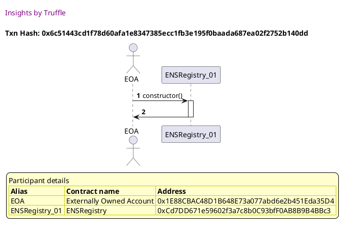

Tx: 0x3743c9ed98b061343ffedfa2fecf7a896586e3fa1c4172e26188b829b8b8873a

### diagram 2

[SVG :telescope:](https://www.planttext.com/api/plantuml/svg/xLHBRzim3BxhLn3PPKFNpQ_u4MH1RSTPUrcBjS0k1GhPebsZZXp8SfUqsNyVxRX1igB0W5sd0ocJr6Vo4od6pXhDbMwN5MEyrRLiboagrZoKSiKLNqA51KeHyUoXK7KhHLnNjO9tYsIHn0bZqqPlAfmnwDSzSe4AdeTFWFDQbK-rrBmAgxAGIvIQ47Ez3rYGSmUvQjMgmYF7TVc4O3fxsnKNefG5cCPW-jNhwUSX2JRy_q8sPN6l6qWtSAFQF2TSfajT8Toi9Pppvdu2njhs73iBK0H-QhYcxTXvZYBdLevPxd4_SCU-YtREpSmnFGijr_JzrBU2bAJlsPmHPPccr9FB47W38z8ZHhJfCYjNd4fDlbr_nw9ijDhS6UOkviWqOgm_1QUpLouuEPb0W_hofqJr_bRUikb0-yT1pxPVG6zM2AGbN_RwaLSjRRhmBTMliO4jo5gGZKes_d6z0DD5A6mwwBhBxg-nJSjsTXWVu1cCJmPy_P5Sq3s-AlujGkx-Ct9eEvt06v5zLtLkjXjXTdNGc08rBwlcWB-vCQTiElveKgbHQHFJ22hgy3sJuKkD-tEpRT_y9DSQbUHLjO7kTWI4MKRFXUvvC1FVZwCmTlov6RcEdz3m69x7K-6YbJfZCn7S7i-TFu2FX-V8qCF6mflFNS_4SU0QLcvpBwD9ZWCxpHT66FbH43bHbDa4I_KFBB0palJS_GO0)

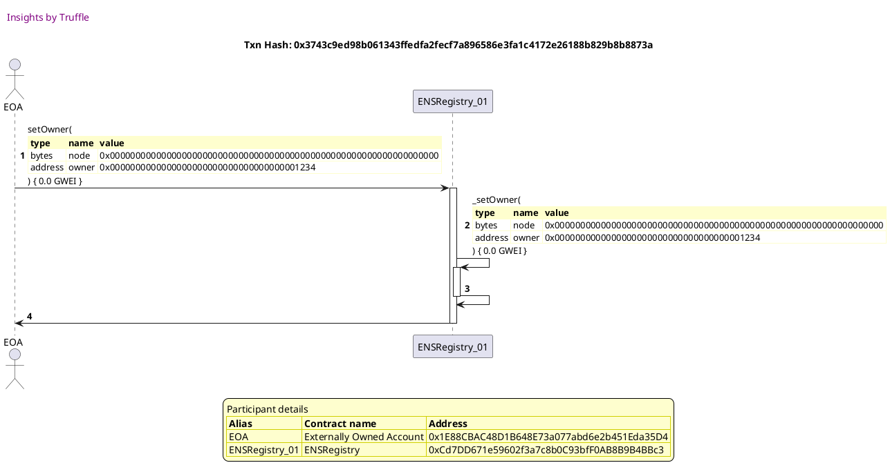

## should prohibit transfers by non-owners
[link to test...](http://github.com/ensdomains/ens/blob/f5c6357c01b907c17cff63a76f7760ed88775bab/test/TestENS.js#L32)

Tx: 0xb14d3dd11edb51795c13572cfa3f3a4a0aaa083e994989f9e12763ead2052810

### diagram 1

[SVG :telescope:](https://www.planttext.com/api/plantuml/svg/PL9DRzim3BthLn3fPKDNJF97P0TPq2Hsq5tMOkrze2tP4Uh8WInZITlzzx6E4Ioh3lfu91yVIJ5sstbqljyrZ67lMzll2krOzspi7XtkeD6rjcg5vNFjsjwgTTkq3gus-IPVvupDEtziz8B1iBOQbNRmEZu1xbfdNbhhiLasfhOxRJqnLlxii27ZYNBVktsZBmoFvaM3YCxO0ofbR0s2Zz2VuPn_7KMmCVztsvbwwpieZl3a-geYNkQDRpGy7IpSORUT0JyK8bAXKa9eLSH2fd4fmbW6POLX5MA4715v4keqZT8ahL8j0ZaDAKN0uo0X4TIoqfFq_7u9sC64pWcZjdbJcZrIgVcFnv-wDfrtnrzSd7mke0bZGnJSB3wOuFfw1cLhwTs_f_dqcNrm6SA6-9iPC7OQ5dluHuBI7atJiVauiYzN6SyuvuktRq0p8KbqMLEp7TK25dVw7LWgvNH7jdFSucqea_Q3ryvYqnpX_hVL2fPbIH_3auaVH9uawzLo7IMPM4sZ99SXSYcnK5CT554iSeLXd4N_4L-swG8OQ9DDcc8G5N8Jo8Ic9cKHSPadqLIkCemnZwiu3Nb6j5J_s0LsIpjzxBy0)

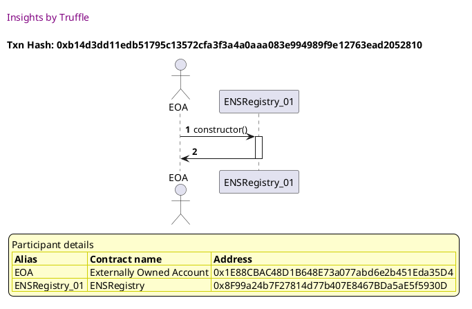

Tx: 0x30481d5f87a0e384b373e69be64bbda269039ee06063040e51468efe64500670

### diagram 2

[SVG :telescope:](https://www.planttext.com/api/plantuml/svg/fLJVJzim47xtNt43QThA64xZ_2Zg8lh37RmC16Xx6DFarDSIaJgLuq0BtV--QnegElOmQNxmENVdBtVVTmbZ9wLJrbMpd35LkS9KinGjA-yoCrTMpI37AHhTL-ExgIqgemT5NbZO7ycH74Z6kgLRvfWmgDSjAeqMdff7WDF2Pe-5SIhlvTdKpD0uGfouRSA8WXl8UMNdEUu4hh9714ziVHTAwynCmUEDwrTjkqTD4Qnv_vafi-cjAo5TmhMj9XF2PIvpESBrmi2fAc-FWIzyBc9F1vCuKXpzMAH-v6FOIJ4KQQfLE-nmluF8GnvIAiV04s6C4me7d8SHPqJPs57fyhm7geGzidkCQ7FPE9ihQbL-kRh4QLOwk_p9lKtEZckFiVeM72QlGd1mS0mbklC7W_RTZRbXtORs3urDLf_0BUS8P8sQrVPUvHKTrkahwjzX2IimXIOVjUpn_rlFm2I4nN8DNQohgx7_vRxNziK6upqy0V_8uVCtUKOwlcf-SVXztwB-KHDJCtHu3Dst3yeQ6e44kkFD859EqcfTog_oylfDgzKzglq9qqZQPFVAuLyutmmrktWXbKQdihnymV6G3wdYDSSqkoGT7GOqb9PmjsptdddOtajMzJZGld1eZShp9QmLrD0RZ-a3SXiTP1mF-hs1Y8TUFnInZ7p5eqYbEiHsAW9FQkK7G_47yEuuxJXgs7ZKwQYsIADHEuezeQCe5JoIiGYZ_b05IWQJeEFp8S5I_mqBx8Hs-W7y1W00)

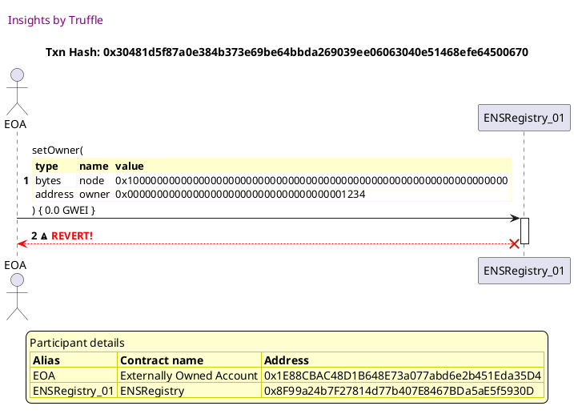

## should allow setting resolvers
[link to test...](http://github.com/ensdomains/ens/blob/f5c6357c01b907c17cff63a76f7760ed88775bab/test/TestENS.js#L38)

Tx: 0xa42b657a588e5d28cc3baa94b7c04a9505a072bdd1b792c71fd65bb2659fd059

### diagram 1

[SVG :telescope:](https://www.planttext.com/api/plantuml/svg/PLBBRjim4BppAnREfKKQb9H9FGpNY2NBI2zDqEHUa28j2w4fWw9GEqd_lHjPCEf61rASsHtkpfAGsov87_gT9KJseNNzJXbFkkV6xQMNEx2cDaxdidgkVTixNRIszN2rBjTbKH8oxyBHcWM1uTiQgOs7r_48SDVwvgLrGTgbRMgtCowWuYQS0zP8dYJtlTzRSq4yDYy663zZ3rBhnjN0w0Zz6VRvrx48Cjx_tNLDlGqTg2Cy-NwpGLqIcc0DF1qStCbkEmDwa3nIiKYaI5CZT9HMrLH9cN6LL9JBJ50XQH8fhPbAigXAs4R7Ggae5jb6Kv4HjAmAM7fvlmJPmGJt2K7RGbCrUucjbZyUVvgwwO8__gBi57C1JGWPik1cyO62w-iPLAt3S_z-pQVFv4F8a3Ratyo0aDEmoCC_9MWJP6CxCXz7zkLgHLUKqiNRDy2PO4duKw3P7di19tVc7LXgxKs7t3blyJQqYUiX6E-ajKUu_-sCXcLLuSC8ID43AzEqo9S5JrSiZtbQ9bFqC95AnoPINB1IowbOyV-4Bssw00PPpTEyoBd8c6QPZjDYolB8C3RbgzYKYYV6P56YKfJ5_aSNo2sk-B3_0W00)

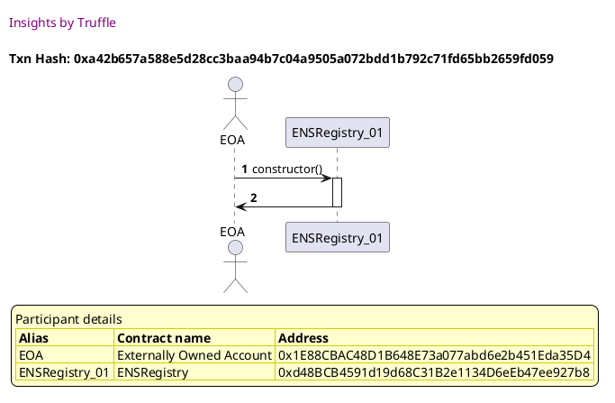

Tx: 0xa9f68036ee84a2bf277d2854b0022fc17860880c7d7d2cead22135d44599b5da

### diagram 2

[SVG :telescope:](https://www.planttext.com/api/plantuml/svg/fPDHJzim4CVV_IbEx6KJOxCJDt4HgsZJC7WP293sWZGvyRL4f4vbEq2X--uxqb3HyJ9fVl0vP_llkzzT63lsGRlGBch6T1iQsouATCpVLNQfdLv0ZNEqPgBBkxbhMckofcuSV3Z9J_8iP-p8XrMD8mRTk4LjqC5p_mbmshZggR51r-Ewcji5sa2Aix0zS4AR6ybbwvOrxcnSLKy8Gcvz5zgOoiv1yDxrkxD7N_iWMF_-cVNL_3PuA5PmxThPZ7HPg4ADSFreuLJxsqFWZteuInIF4qGbTLJCeZGraHh8WlCecfKYLGbNYfUf8Nz9qb4aue6HSZ0S5WEZ6I4h0uMUduz1UzWZkyS8MwZAQgafrVp7rINEAn_SwXSNcpCxhZt6kbjmC7gt1VlxX-0nNA9lwdjq7s_i3JlgoN_kxMZz3S9gYK3MwaLdxtNTqkBb-9eG1FIm1jiOyb7M_3_7gp3Lmg5_aNPzWFyiBw9ORcG-mJFmBno-_ypFg9hl47HOEZu7Xy3OfXdPnHl41eEkQly6p9HFwOqNCDHpX9mM6JMJerfj4OrVWz_U6wsxCjBy6D1PNTShE7-mQ61SbjJueSjEv4fbat4crLHC4gdoDDOyJNLX4emAEH2vqV5WAlyItcs37KSdQwIQP1FgAs74q2GgYyKaGY5YEKqmBsIAE8pIGf4ivTzJOCSqqu_x1m00)

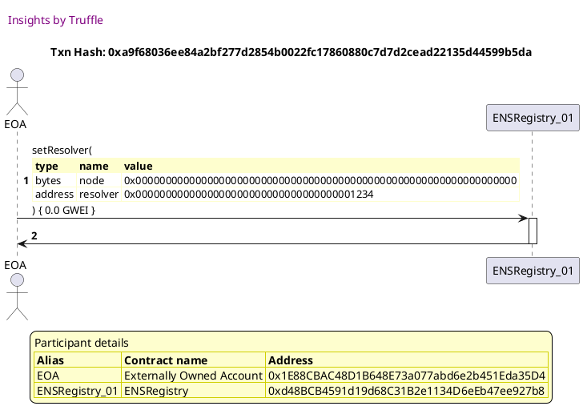

## should prevent setting resolvers by non-owners
[link to test...](http://github.com/ensdomains/ens/blob/f5c6357c01b907c17cff63a76f7760ed88775bab/test/TestENS.js#L51)

Tx: 0x1dc94cc358fc8f32e9dfb218459b5393e80cc8d1dba1c55e76935dab5bd6cfdd

### diagram 1

[SVG :telescope:](https://www.planttext.com/api/plantuml/svg/PLB1Rjim3BthAuZqig4h9aLsB0TPKCTnq5tMOkrza2NP4Uh8WInZITlz-rZ729RL1ybwZtmY7qN8RHUa3_sk8KJseNNzhZIUTC_MxQMNEsXCRPnUIVLS-xPtEc-RriFLfjWKUK78eWl7nYm93D_MI6qyl8v7WBlMsvVM1TbaZQtTphY0YbKu1soGF4dkUxzlp0NnQ5yCiEYCFKYjhQk1qH7wC-oBhsCHPBp_k-jilGqTb4TuydrLeIu9DZG6dWuExcItdGCzCAtII2aUYqg9YazDggjooaGKfsNCKsu4LKfefal9L1oRP9RoMCioBlLCLLeJj4m5BBsupq1sCC5zGj2sO9NTIsor-F7uqzIs2_xuYx9Jp0Kq8MJ8Wflb1mgkh-UWMeVd_lsQJv_9Xv0XRSY_cGCXfs6HXtzAq2P8stHaCOxiozMQhYcboxTlW3F1al0dHxCzzW9Eximxa6djJOVSEM_vDhI9wo4OxsJJ7E7-jpCQCgNmOGIaqD92Y7oLvP5OizKi4aN29KqIYOwPQHd5hD2In-leF-5Bcow0GRPIoLGdCnLJlKg5u9HnmKkPJPDAvsjTybcIvqnobCN-HnV8BQxuiFy2)

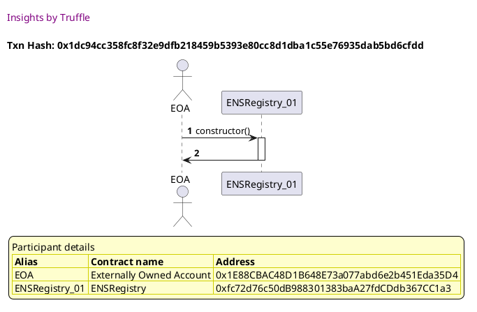

Tx: 0xc9a753773d29ffcc9342935086a97cd7e285c833b42be7c6403e03362f4f5d74

### diagram 2

[SVG :telescope:](https://www.planttext.com/api/plantuml/svg/fLHHJzim47xthxY1D6rbZ2HEuXHr4MqQ1Yy35RGzZ6boRAT4f4xbEAM5xh_lI4D5nnucpGy-v-xyvUwxBo7afBRSs6PM4i8RM-bcbYb3whj2pxdXCoZLL6avuk9kQgf6owGgAmFxf-bfcgI436gxAbLCe5stYajbuB5x13YhJF5GQSlBOLbCzKnfYuYvtIQSOd03EM_Cl5GxWQlYGO7hRtsNNCf2Jy5rEjUlrWwEkY98z_vpNHVJMrj3je9hq-GvuX9Rs5B1zLB36QzlZy5PYZvd0MMCIg-VvqBqgU_rQU148Uyp8Pdoea14b6Q-boacGj-Xog4qz78_3oJp2L8cB9QUNWo1rx27TeyWRROGnPnZg-cNgucQ5hKrgv-EkydPSUqHqjw2m_XL20uEZg5MTgBggbmey-v6tv11n_o7piRhJs1NSmLeDP-rTi7B1WzFwMkamAeQrg0hYJxisdN-Rpq3uooCgf-WJLTW2_yl4Av7_GtCUtW4vwC3dx-bvpZDLnGi3x_l6oL_jFIqF1qUm-3jFJSQXH33G6paY3bnhpT9lwQJwpUztk2ezST4AfnGiU1M_ONvZRJ9vOk1IMLvKTOlQ1uxOwpuYMPKC0uG3mbAqo3kbl3XCnNRU_6w5GNkIwkCvcMvWejxhIGCXS3Fo6v6aKPHCXecVZHsHw4VfOnoXp6UoL1vcH-ugUGq6Fj_0E-AQiVHmkQ2UPA58d3ag1z5r75fH3C-z5Wkax7CQCYInEKKOR7_ZWLoWZl-1du3)

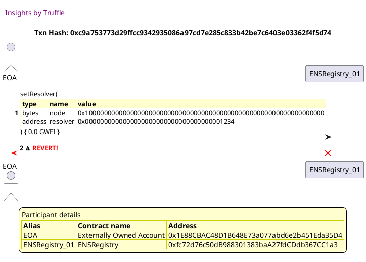

## should allow setting the TTL
[link to test...](http://github.com/ensdomains/ens/blob/f5c6357c01b907c17cff63a76f7760ed88775bab/test/TestENS.js#L57)

Tx: 0x4df70cebc3ab60d81aee8532de73bc216fa47f3b5a2272e059f1e8f78ebc4591

### diagram 1

[SVG :telescope:](https://www.planttext.com/api/plantuml/svg/PL9HRvim47xthpYrBvkwQZOOJACiAY54tSjQhNsV33u8AZ6HCLhITlzzLuAYPUN1nj_Tz_dkEpDsstlj_B1j6TE3x-omBT2n_hcnE-tq5bgiqPgbBfzhrmtMP5tRERXSv-iyoncRz_xGueB1-6rG6tJmEXq1xZhNl7JMwpPjczfkqNfIhFmfOKt1e-HkSBiMpmAFpGk2a2ViGHlJs1e4dw0_upx_EXN1flk_sxwfDxw7uW1FRgWgqcM-yIt2qzx2dUutC-1xQIh5IopAK1SnDudGY4aK1WPLM9I1Y2ijLHKMaGu25I2FRYg1IQKIeiZeHZ2ohFHKUdwVWkxXWlOBHhRvfcnscbhDVpp-nBhflJlyukAOSmPTC3Qou7hn8GHNLpCeEqlduVsQJv_PXvIHDlAlPy3OSLZiuPyI37hTj3sRJoFxShdYAyxvukqRq4oe9Fh9o6n7lO3LMtm7KcCSzXGxyHPlOvkqxZqwgzls0FU_BHf8ov8UXgSGtuiyIR9bciba9PQnJ78LQgwKBaoCGI4ZaHiTHYlvd_2vJMV0A1kBB8hJD3EHYjDbgKGQL86IIY5g5UOcYGF9Awb8blgVN62tjDB3_Wi0)

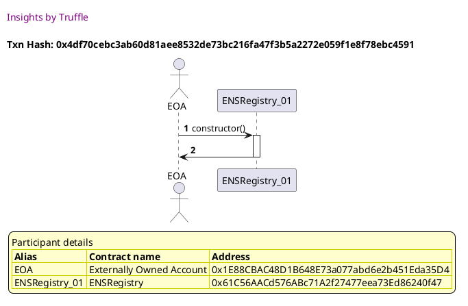

Tx: 0x4c401cc1df3e8b0d701665641362a847c965f802e7293c09646066c06c8c3437

### diagram 2

[SVG :telescope:](https://www.planttext.com/api/plantuml/svg/fLDHJzim47xthpXrBviOcvEuTa2i8atJWJGDD2hj1MboRQUDS9tASLWBtN_V4K95n-FySEVSdJ_x--v2o7aJf0_joX8Ysr2xTZKtdZHtbLjBBrTWpS8uFPRgRk7hrkcyjhM7TzDYMkG58MTDs5ep8j2jfP7QU7ZiFm4kQbyzr2v8czbguLR61KGimxvWYibdo7NhrzOS96wg1mCHsyUkfTQLMq14-z2VpfzzxXz1-lilNLCjbg61-HPclYrBn2MX2jR0REFWGZRBKw0RfXYDb8fqcPXqJhMW4UT3pgA4np9bGftmOPdIs8Zu957qX3DEELUKgrGbB1449LC1drvSPI0R6A0V49GjLAfQIwHQVB_vOHPL4_ps5usUQmv20qAwKt0yUfE2ewDJQ4oOpRwzltMtvAmN_MFlHxil4BPh0-YTN7N-NjeMDq_bEsGVJ0CxSBN661Ac_xbUWDiAkUqW18isuI-93_08z1E5hp-BIspD6puTnuxiyIaGyZnPvFgLNje4MTdc5TK9dU35JrHnW50_tEGu6Hw5tvFEjFQcmTp-t6ZNzGJj9XZlfBLRkFhjZ8PCAPpYqCaH5McQZxESfPDep5bQY4HI8UHSSnFFsJ0gj4o64_OFy65F3m8TB8_o8S-oN0y5pyPAH5bSne89OOmKIQ5J7ZDQCe6moBzNWPoZnR_mBm00)

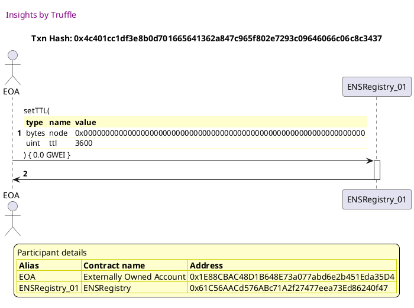

## should prevent setting the TTL by non-owners
[link to test...](http://github.com/ensdomains/ens/blob/f5c6357c01b907c17cff63a76f7760ed88775bab/test/TestENS.js#L68)

Tx: 0xf3b38e18c6dc2e5c0c27376feda43f14020b60eae3706c55df6a2679e8132f42

### diagram 1

[SVG :telescope:](https://www.planttext.com/api/plantuml/svg/PLBBRjim4BppAnREfKKQb1IfXmtNY2pBI2zDqEHUKE9A5a9H1aMXTfB-UnbPCEf61rASsHtkpfAGszv9wuPM4o87rvcXBT2I_hanUsbb2nfhD6ejo-VQTeDHMQSx2rVRV9jdEI7BtXqrhWYCtmwbGWklqn7WhhFDIsUSrAbkQjEYSLwnSkU0hITFall1xZLU48_D2m8JP-n1AjMO6XYTe3_Zllmw5K6c-x-RlgbtheVY24zsg2glIrpZDCBJmS2Tx7SBe8UA5pn1bfIHAWCCIre6CO-Z2fKKl6A21hI8A4haCOtAC5HL98CedcF2U529W7ZBIkTBp-zJa3tC_3uZtZRNbCrU-bRp7uy_iMvwPu-_A3l5N40pGiOik5bzeE3wUW5bP_nvUB_cqsVo8MHC6_Dl5a38QLZauPyI53hPw9uifv5zkThG3QLqzVOD_4nyIVudysPRtmiOsU8xa2fbiVVSEM_rDhRfruD3QwJMHxZ_RL11MfR-OJXFqGFBaoHRfvb8DcmTYIIFkQHnB0iLOL28aELAyd0Z_XE-jEa2ECb6N6Lf78H9i4xdwoIYUSG42mDHSKwB8ipdCXQ2UbdV_-G2kVMhVzX_0G00)

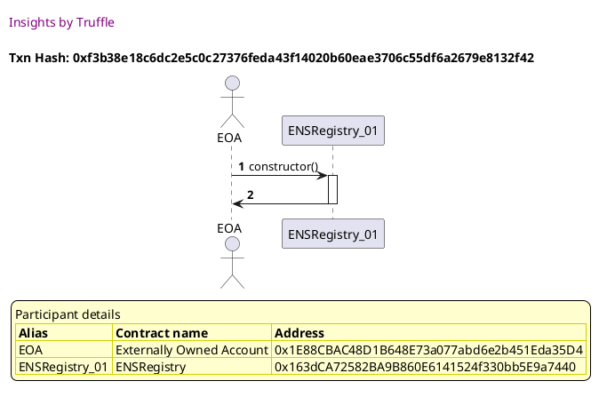

Tx: 0xa40b1bc1a57946c1259171f5452c6f7ebe736e284cef9b8579c0da3e46eea60e

### diagram 2

[SVG :telescope:](https://www.planttext.com/api/plantuml/svg/fLFVJzim47xtNt43QThAEfB6-T6gYqZRT21D0q6rFOnfSk9BYKYTod6WXUv_tv66YewzpGztpjtvYx_lpeoTL4PeKoyAnaHjIbKl4jIikitLKcYnW0BdgEH8fBTpNTPAZikYr70uZQVnE6PiM9brWI63PjsWaAZXiVq4E2rr_b0g8ugeoETgWSeGOcPs1LDARY6NjLuMk9UuoXyGRBwBNGWfSpK7ssf3lni_F6ulmTh_dwagdz-O2f8rp7ITPOJBJ6uAXDbAmQceRWPWhGIt4Zj9RU7wVUwbTi_jsxwTkTpjfLxcOuA-us4lu2bc_IIWgjIIma7k8GhF8amcKaDNZyyZ41KSa3zW99l9qtmfY6hyzUeIvtbbzFgNPMzhza87Z3Mde1k-Ii7HqG0gDBFPbtVNwfeDMz4_j3xSV0ApNYAGLsBH-3jHrBHvAjyGUuCLR42Lac94sBR-Rpq3rpbnsu0n1Ld7UqwyXqUmFbhm-NjyHgrvnMVL_N6eKVvik3QakmCOlhqNMb5NGnYcszcYch3JkOo_nPUpDvtEyBY9XqmYoPtV2OF_a74xf-pYXVeIZSYBweLm4sj2D9w4et6aRj1cJ7Ec2NSdOIIbnefoktFXfkamsPL1hKHHhE7yNg64A4tfJPYjk74GZ4VHc0SJU-Jn8FOTOVc-I2JDKC9TEwRPSIVyB-3z2TaBR64zHuuZl-S6lL7K7mMU5NisjzqUpnp7IX8txWkVSse18_wj2ko4BBtfFm00)

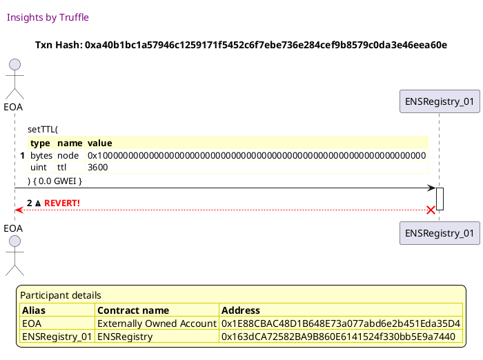

## should allow the creation of subnodes
[link to test...](http://github.com/ensdomains/ens/blob/f5c6357c01b907c17cff63a76f7760ed88775bab/test/TestENS.js#L72)

Tx: 0x444f8bcac1952e9d45189e553ca9fc7280b72cff5015fc0b6eff957a97adefeb

### diagram 1

[SVG :telescope:](https://www.planttext.com/api/plantuml/svg/PLBRRjim37tNLn3fouQkc9pufY0BcZWEkfUrMFi-oBeuGcKva6KiQRj_7-iOmRBgGHSUyf0y526tNU0-z8qbXFUXTNrJAK-wP-FstFC6hAgLasikdclVzauMhMqzN6tBRLcKX2owSBHgIM1OEyMbyl0wFW7kMczUMXUuNLbJkqQvW8mwd1ss29uezxtVMtK1F9eN1L5yjZrmAOsh8QAZwSzmBhwEHP0n_tVNcNeNEgYEyEHxhP6N11EiWgU3WplUxUP03t4SwxmIN4GicIecuoJAcKgIcU1CYsoQqogR2gqJ6YLQq2fLMhCauop3B5fL12KJ0KilxrV0EvZWEI4eMp32x3csMlvu_AbgqmL__4MZay-5QKB840KtomyGN5_FGRGEt_rxca-VoGUN8Mo8lva38QTXaOT_If0gS6CxiXX7zkLgGpUKqkNRDy2PO4buAL1iZxs0uurwDwoazAf3x1otV1lQnFqGb7VSsYFS_tPAmae8_1W18Ng8oZmlrgiYpZVHEetpCfjnccMyagcQLYXmAVaisSJ_4L_AT64OQ74KB1SiswOigKIgrpCMfH5BUI54mdZEOh4MBDT8Y_sFAf1RtF5Z_mK0)

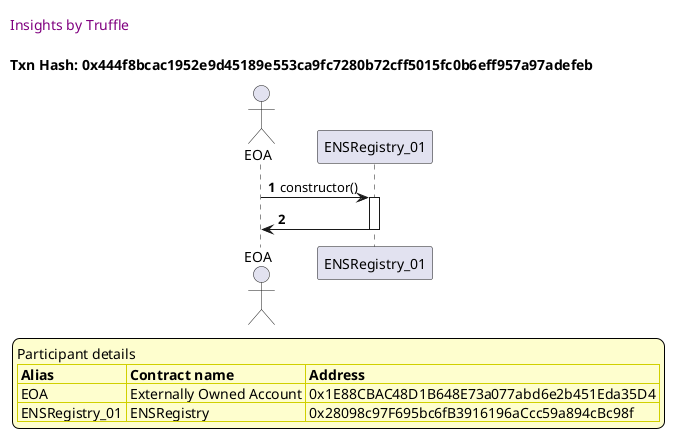

Tx: 0xf0ae9dd6851fd5105773337c61381b6c9953b9ac6dfa14458f9efeae1572a868

### diagram 2

[SVG :telescope:](https://www.planttext.com/api/plantuml/svg/nPHDRzGm48Rl_XLMkO2WOAyTVrIbwdvaWGkjQ2KkI6XiZxTHizbLua0Nod_7couhMiIfIEJWSMR6RyPFx27aj4lGfdvP4m9zMZNzqc5BkkkgMKCBIrhZ0fim0N-zQ5Tz4wQhUjNI9_DoNavBGewxjAdnXD3XkK88sDBlkrTAtwxQwjkgIL2FwshHBB59MJ6cVS8y1-yartsxhl5UuABwXfJBlUySGgYQ1ULiv_ensEDNkoB8xlllcgvQNAMEkWszRFiOiov9LQgHNjuqz2rqLqUKtKG6Q4DGfk0n59mLMWiXj5TS6EwKjxOGpe9N8GANiZ3HOaH0NkWH66L8HkPJBhqy6rFew46s1oHZIvMlrf2tMhw_-82BgaljvZFZTpdtN0U43AleuSaV8Vhy-H7jC5tqhba5FFlQOFlqK_E97E_elzZPazlND6tMIBDjO3dOBr3tUR9DlyqO4dRqbcvbic4tx97FG-4Q7DQ3ieo5CtoaZOrUCUMGE-6uiim4nqNq6Yo4g3teaP8y6XbquQHcoWOHTDmhvp_TOhVLNcttFMW7i6gafM6Q2oiALGI6Q0GRc-bewcPo1Z5omysTnZFwdRANZBxvMBxB1-KFkdyZ_ZaZ_vUihV01dMR6wK8MmIjbqDcHOLoh32PmBuIFmM1GaSbC2fZptXYm6PS4_Bz43W-Fw5yoXsERmnymzMr37uVh7w9wHiXTqoBdlrt5W0cgklkjmXcRvQEyhJ3tfdmrysIQcqwRx_I-rl4lwFjr9xV3TS_ZJSAsWRhUqErn2NJiVMwGQTW9BusPJiPJQMPyegGfjG2cDRYWSEHamSi0efZ91yBtsyKzno2RKLZZhPuhMpYluaHOhhXLCFM-i62iz1DlJSooUVyx2kGqZxd1_mG0)

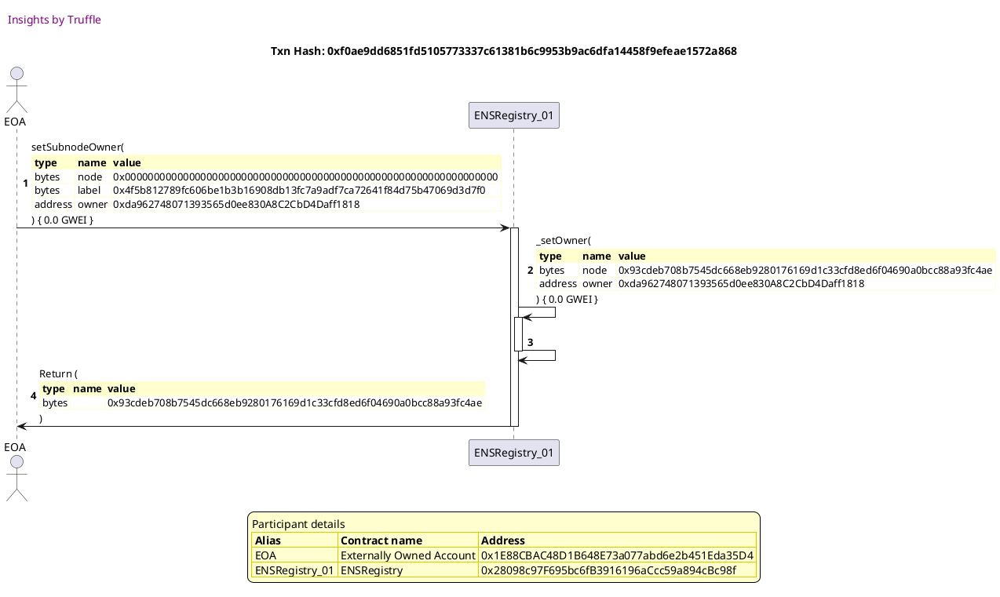

## should prohibit subnode creation by non-owners
[link to test...](http://github.com/ensdomains/ens/blob/f5c6357c01b907c17cff63a76f7760ed88775bab/test/TestENS.js#L84)

Tx: 0xae4d8b0aef59d237a086886148d1613ebedd3b79fcbfa3ee63e5817c54e22e73

### diagram 1

[SVG :telescope:](https://www.planttext.com/api/plantuml/svg/PL9HRvim47xthpYbBvkwQWO3Tg8iAY54tSjQhNsV33w8LJ2HCLhITlzzBa7Hil9Wu--x-tptdGcvxPsqRcWRGkJWEZEq1LhIFskpbrQsq62DHgrb-LpRRZ0gwvhEmjKst-PPJiYoTyS6LmJ6RuTIeONNwGXmrrdzqXadcxJHjMdHEAzOkNF0rfCdoVrWzmrU48_w1I68pjY3L4gR6W8wGN_6VVbrAe9CztytlQvtheVY24zsg2glIvns3SBJmS2Tx7SBe0U9aH85bLZ5SnKoBgb8X4Y2IAWW2HWMg1Gh-BmgYqeon8HXB09UnX668N96l6MbywNdzod87cP-dn5lczEbtalVQlxZyIVMkdVs-8i6fvWBQ4R8c0KtgmyKN5yleEoCFm_lrtpwJ3w4Z6bZ_iq223aDYppyKu929tNJa-KqiYzN6xgXbAxUle6VYI_9_sJUREjx0IDRV0TIfIpsdZldhTx6DlrwS6YDR9eZtFysg20jI_ymdAVe8SY5oDPf5ebDi4uYaNCcAUUoK0c6HHG7kP8itaJ_2L_QT06CidpDSquPogoAaf8dIHJ5ctd960j5iivJbXGOSiwyhEz_Se7S-jK_xBy0)

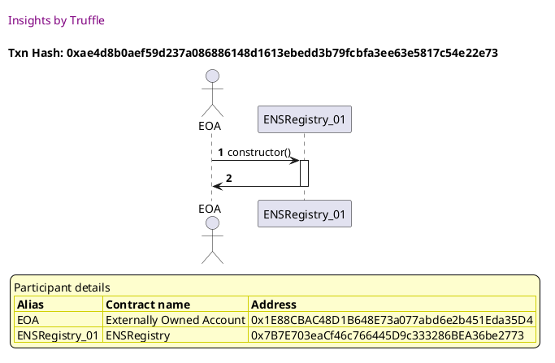

Tx: 0x98efae972b62ff2351cc1671383df3f67ead37ebcba04dfbcc0e0eaea00cfb2d

### diagram 2

[SVG :telescope:](https://www.planttext.com/api/plantuml/svg/fLHTJzim57tth_10cZOOmudJE45THMd3u6KWGDl3c2P_N9U8rAqS1rhe_ljkqwwYsrwc-S7NkRu-iSyvDY77TP0-DEEA4Dc4YMl62ZofxqitbLwEQGKZSEP4wlkHdpJE32RLnDFTq-Aq61I4TEimhw17QDlkG1hmz7dzIUdPn9TF4nTarQ_AaHk32uXemwRW52TNaDF6JolOchWkdu16oIPtAOqftOX6R9twqSRkuNeJPFt_SrUNexjGKpMdDxwn5d59A4C5z6Rcw9cixuuec-KPM0cvY5KQMnlpJgHrb8g8PznORbE1Q5o0qagon5YbDGC64YHZsghO4AHC1znwST6digOx67S8qXPANKub7hNuT7q5ex8EVlwTHQkQhTGE8UqgUj3xOuhkxn_H6i9rezp4mCMZ0__crjsIxfhzT-lOMtoWOJu5Yj79SHiVPDNWO5c-G1e2r7H1bp0Os8pzP_iTk98AgXOviHsLHR78SgjJbYg855THchFCg8XRBMGkZHLQYZXD8fibHdHK8bYQ6sw4tI2ZqXxg9VPaUUuMsyWyZKMICPGevvsqOnX0nba_6yG3DKo6qjeeYx8LnblwJDbxHZz-ASxHA7-mEplukkl1V6kPRoKuEABTru_IE_HOZtRrokbOqzlRkoe-5rSth_RskeTjlaSCeFZbWmpm5r5NjuPSll22WI3BgdwXtf0DaSkbUdWvq1iu6A3hFU9kTEp_uc6phhTe_ORzB81tighcTEaDG_jQumqD_yZL5l2sNxSIBQmu4OLW7EJ09gaMQPeadM6kEUTnbfuKVOwAnq9mXCNphraWnzZZ2_CJ)

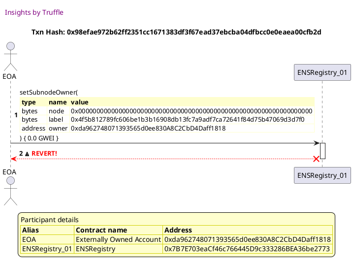

