Test date: 2021 Feb 19


## should allow setting the record
[link to test...](http://github.com/ensdomains/ens/blob/f5c6357c01b907c17cff63a76f7760ed88775bab/test/TestENSRegistryWithFallback.js#L18)

Tx: 0x50f5c312a695ef82a606d36d3576701af4737cbb670396a34fcd3984ecaa3f4b

### diagram 1

[SVG :telescope:](https://www.planttext.com/api/plantuml/svg/PL9jRziW4FxEhpYrNpPrrI0OlqHPLCT9r7rPgxNV9somWqfmXB6MjDr_tyMnecL5YEFU7kwUWv2xBaWV-gqbHFQXTVssr9vqByRjf9TRiBhHJYrazTBujdUgQ6thuNgzMg-A5I6pBXoidXCOraPBfJsyZIh0VUlDQ-k2jBarZTjg5n2n3kU0DJfFaBlUxwo-S3oPLmqiEjiUfLB6DS3eQFepoDdNiGWoll_TTQRPX0xA0ppxlguHbmGJh8RdlODxsMscGFU2rgBYR2BZJEWwHKbZnN6B94ueatMKyAGgIrHu5aiUrPNYMHhfIafUHoL1ogg0fQyUSf0TNA6y8aXRC9NPIMnrzUFffsvC5_pX5sMdc0lJ5I535jpEFxZWvcOALUjGxu_FVFfCFeGCQKF-xHG8EGsBFFvJWj916jkHsJYoBzTBkgIKpj-_0Su4Iy9BWMHxx0MStEgZ8LVAwmvzvxpv-z0cdlkWlPFM7k3XjzCAygh2Zn7GHVTHjg1P5DT9nFD2K2LgmHbB9eLAs8AcMh1Or6cM_WTyITE5OO1bNCHnZXE8c4fvmIQQYLZmoNePQxuiieaiq-FS41Rx7raWTtZYn_uB)


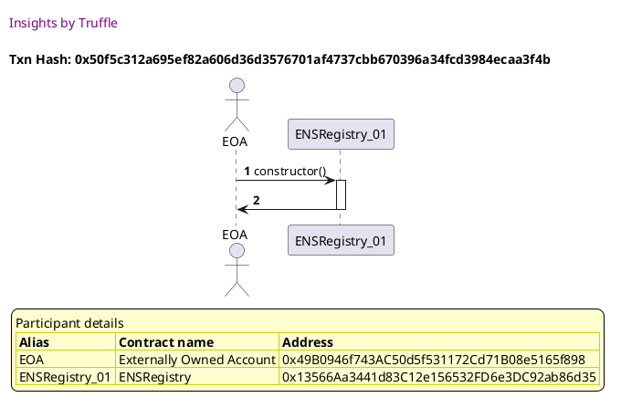

Tx: 0xc6d4c60c04e89997bf9eca932794a6a0b1dfb2e886bb2c9a6dcdb43fe792b3e4

### diagram 2

[SVG :telescope:](https://www.planttext.com/api/plantuml/svg/VLFHJjim57ttLron5n1ZSsB7YH6hIDDay3BGGE852JcnqqQuJkKuMmlTlyzD0sAJ80y-Zk_DyJtdtY1qtZbXNR_K28dUjQPVbigYxh4nAs754hIQAoEdedgSsxOtCcjrQ-5JaHTvbYDqrhcDLXC4mxDGGYeBp-Chm4LhcwVMEA5JtSpDKXdd6Mltcb3uu9vorTkLLly4Rfed1G5zFRiMKZPc3W4UZ_uCUFPrB0ADzr-QhfalN0Vb1cvjNzUU5xd6QGMtQmCNebkS0bvNJDAAuGfJbN3EuxBcgXASX36dWWbS1h8kGvKah2p3YWicArbIKgkOXoLH57dBAkTBpwzI41qSU3n0tZRNLCrAUAdvZvkVQjvqpcxk6hSeXDQbT_811_lyTyC720riS3BvC0sEZq-XQesFzRjI3k_DFJeRk_DvnCds6xZDIe578vO3_XAwzvjT-dP7uAoN0bjuQBNqWDS1YHXB1Q4qa0d9Wb054Oj8MCoO8hECXw9Cc2GH7BufxsZFU0JFWBzW-7wNN_eUVIXW43WeFJa5XFRZXgxVc2YL4utktiYQuHd6U2VBJvKtqc-o5mal0bCfhUfyxFMxoNPeb5_NJbdZYzZ0rM-Z9AHLvKVR3Refds9EMHrJacOHbb4TaI28mqp6mHGdAWfOL2Sy-O_u_KQ_6nokapdbCIOvON5AUJIbiu85b8K9ZoDSi2IAaZYlkIyRULz6Tz2vN_ql-nS0)


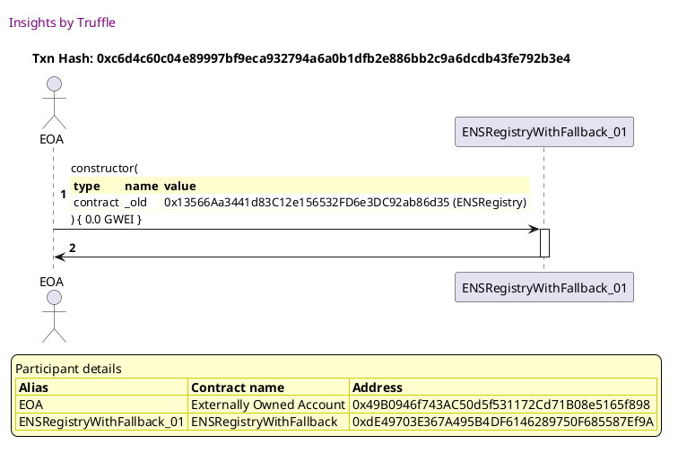

Tx: 0x399fcf95ef995c4a01116b9e089b14eb6faeda943ebf73855c28f6670270a611

### diagram 3

[SVG :telescope:](https://www.planttext.com/api/plantuml/svg/xPPTJzim58Rl_IiiThDfOxEJE8aHgqZJT21D0q4bRf2G4zjjHEfKYSCeTFzzfo6j650qj0zDstBXa_ZZFSvpd9o3q5vjHMMRQO6GQ6nfcccgAbHVv6OcAZ75XHeh8_iYknXNPMDaN1PbXLyCas4I9mZjrdPUg1x2xJLHGgeAttIF6E-NLNvT6YkAgCZ7PggC1KLjrnE6C7WhEMkgMQ6-6JZ9hnMcthhlI4YPcp6cfElwqjhTTzqcKEV_mDJvU69hdCxng6gq1braSrieFBeoU5_KanrChbpETQOvKvfpbdc2K4hzb2iIyfHwAlMrK59mprMf3joGiSm9jUy7n0c8y2b5W2opiFNaCCAYnbjWjn1WitcMpmIyQlBfv5YDyzfMyzFSJeQYA58WUKxexVoDmnjb7bdQJaUjSxpTUr8LltwzWsjbZrLMLlBbcJb3krqettIsjtYFxNocC5WZfgsz54K3Dylf2s1gLOqNs9GI-W0Z-S5h9Gp1hLIzb2u_6uZYKZkCP12wEdP3uQM9unBEes70CfSvH0nKoCD-aEcKFTG0KnQNdOn3tK7A8W9nZNJ0YAB9WBXPG7YO-YpKiUFAGHmELZ9D3jGNsDe2MjTVxV4Lli7aBS4VJfC3E7jFahuNYRlq3vUlzzV1VmBEOq0UFPhd_oATxpuwv__FpYPYsplu-KmVhFg5lbRnE-v-Iv6Hez77FpQGl_dl-JF1jsbmEHNTbYxew4ucbSgAlAZlC1-G0H1OCeSA1J8htCHGUbIGsTVqenMNzRhUeatwq5vPLHdOn1mlFqs9eoo3Cicsu3pU9zppTU2vKSo8P9gvb0PEB0FQ9w5Yr6SQFeLxmfkBXes3hJkPU3mWRkBwGUHnrlS6GvzwlXDo2DhGXm8c31BDeutk7hXuhYpWxg2ZFMYXglmA)


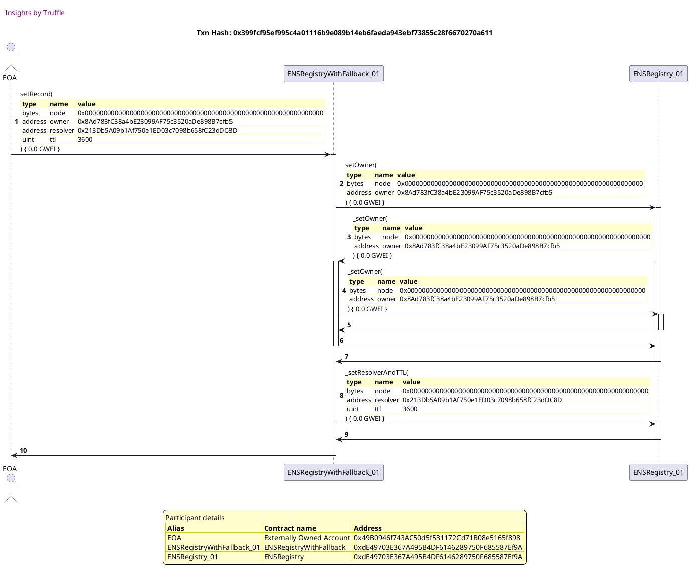


## should allow setting subnode records
[link to test...](http://github.com/ensdomains/ens/blob/f5c6357c01b907c17cff63a76f7760ed88775bab/test/TestENSRegistryWithFallback.js#L27)

Tx: 0x845bf058d45525f6b9254ddfacb81236a5298ebe0b650167ce5e5b43b430599e

### diagram 1

[SVG :telescope:](https://www.planttext.com/api/plantuml/svg/PL9DRzim3BthLn3fPKDRJ78aMmwoe4xgeBkinThx85ko8zIH0rd6ahRxxsCT8sXMGT077_d4HugGcoue7_fjGuZgG-lwRM4ywPwjsocljj2OsZYzLELpxTlUwLNRj1ukrlawN-M4pBjmQCo2m30sHcdZuNMy0jorthwqBgWcQspjjiO5PAp2oM6Du95or_jTOyw0H_jYWF6JxK5fRLqDZ8wclyC-_pOcGSRtVxZErflGGN609zzN5VAIO4DZu6dlu4vrcndGlUIYgAYGcWiHYIekqaXmhIjL5f95qrY9A9McCBI81MLnKXfXHC6dEAb8K-GagWoOUdwVWUfWWlk4ODc2BUrEeTJyv-ClKzik-CDloeu-PwO98KCKN2y-GN1vEOEoTNZltv_vyfLySXd2XlZh6H1oR1Pv-922Da7PfYFpiMLN5xVqbbAwUFiEs1DC2GyhBBP7BU3KrhmRCgszwH0xnItU1fcuxeFnJZND0Ux_EACXAqly604XkkVfagOyhX8-pLQ2Qb69AMD9jD89Mr9f18j59LFv7_5vcSuC0orbZ8j4YYGLIodAQHRnF8eJXaBYbEgqvAbC2faWBUeVgq1kSCMF_Gy0)


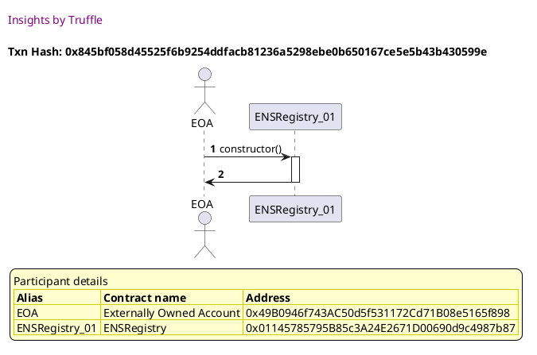

Tx: 0x00d7573d6544ea6f155225d949b99d145995ddbeeefbb5139982e345079d847e

### diagram 2

[SVG :telescope:](https://www.planttext.com/api/plantuml/svg/VLDHJzim47xthpYn5n1ZinixZYjMqJRfu6MWWSGB4d9Yfur8dIfnDWhTVzyr3QYRLFBWStoNpz_ttOMGYyRhshVBaX3T-igrozJMf7agt4hNUWcbdLjd9ZfxcjTLwyoqAgiQFisIMJ9D23bl_Bgq8mBTix3Qs1fU-rU0owekNYhdTJakYxbRMkSHCVVl1JDCxY1NRRqgxJ-9s-B50kFlPpVQcCBDWT7-w4yNpx_s94X__vLhYld2Dv2kuQvkynnnYIzyQU7ksS6bRXP3eC-K6YbaO4B1kTLXpeGO38HHNALA6SQ5KiAOr5gRfwbWWLBHm0PSKAbCn2LY4frvf9vSZq4tS8JnYA1jliYAbKQfoO_RdtPUDBvUtnT-CTDbcQAJZvJjwW-cZmZfqE1iz64Pd9uE8QiSvjejbUC7zq3E--vyxkDeymtyUcK1ezFBBlxIPOkRRVbc2-1hb08RUAnAWm7DOMY0Z8HKOXA9B1WFU3889Oif3HKrAkCgacaauNYFtiaEyGHUWNwXyFq-kS8UVIYW4zWfFHi28Rjn8pTx9XhhTL4sUx9YYYpeLXPE5Hg9c-cRX3U1OsDgss3k_RlHfciKhi_UrWv9hE7wjxC6nbc6e-qxtLnDgE9XBdamdWfgH2u2nkHWQYIRqCWA5eeyKj5_m8SRVJ3PNIVYM0OpPLaSwPY7ZDD99hKKWU9JdSIQKMGZPXglGrzwTyW5hlZB_WK0)


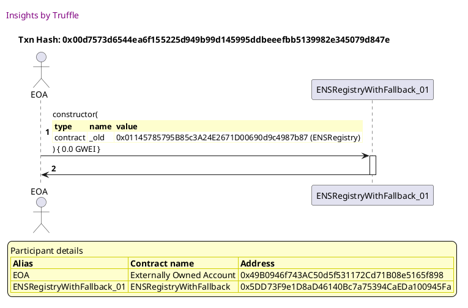

Tx: 0x8ef6eaaa91adccb16a6b6126b32251032a16c5a2e103c8ba3449c8aad4dda85c

### diagram 3

[SVG :telescope:](https://www.planttext.com/api/plantuml/svg/xLPDRzms4BthLn3ffK7gbXH5YZ9S8zhLRXEWQ0BRG2u1Wk7NMeXMMaXKuass_xqZMJPIssiuZH4KQ7NGKEBmpV3DY7fHzBmBq8P-NKKHzA6f-xLsRTIzB-iDjB0cbLkvsix0l5-rJL_RULCrBVbXkLWkveieEkh2jdB74HclSmVMjUJpz4Z8YwOjFpLrW2globMzTdL0H1-k7POuUGcvwTjDvVusSLf-SeGbr-zUWxLblIACJg_-7EtHBrCIqHJ_PTsLg_FG4RqbPstlFU96eGoL8sSNDNa1tVaXeHVAUUa086DWZT5CWjIInLBpE1QCyXYOD09YXsEZDF0aoOm2i8cre8I9a38JCFN5gvn0HvwWVH8XRQ4qvGPmgui_Ja_Sgkn2ktrJXlCbL9L69jzHTkc_Ttelp1rBH_Te34uEZkz59S-U7PBEXTDUrurr9yuqhVtnRVqsEfeg-jDaZtU_ah3TE8AsXlLeFq3Lus1mto6rmNLaHmOSDFI2VkDr4xW2xQeHEJDnxBtmCVDKAwOPuqvodrejBMI9TzPvndJCMAOJgfHMcPI9rnbmewLGLyZOFQth1kpcOurjCc2htAQA-pbNaEX5p6cMvSjK62vY2eLJcPgbncjn6mDDKtsOO6B62orocccM-rHGnnO5DarACpLauESnjyLS5LSmVObbtP4GXXroURNxf-GpeJzJyjkRnKjixdjBUQFKTvJtrR3B_wlxuEhUm_vTZD_vSRr3-X-LzyId2RL8Z3LS6YKuw2IcGbkBMnC-aIxDZ77M01VC6sczqLOPW_HmQ-LtOUV1lVcVPET1lNDmS4Y-djDRgnuSwyI5lgt9jzNX4Mlmz9ytrCbq4EUrFJlx_L_RMT_vV_6ONJSgYy4rkbI3qUiln8br0Sgg-uBpWXPuuW-Se-X3iOA3EQgv5iNIDVlv5I_Nwuvteux2-qLmROr9RCbmLbYI6uFACup49TcCPed4ul1yBgWLNd36qdXkKpQZoWacXSTlymRmVXssTt8C9ueYvSlCiK91aKYMq9b98HKyI-QmA81Hp4OiOM-uMo6-5XRfdaYFdkCTXVfV)


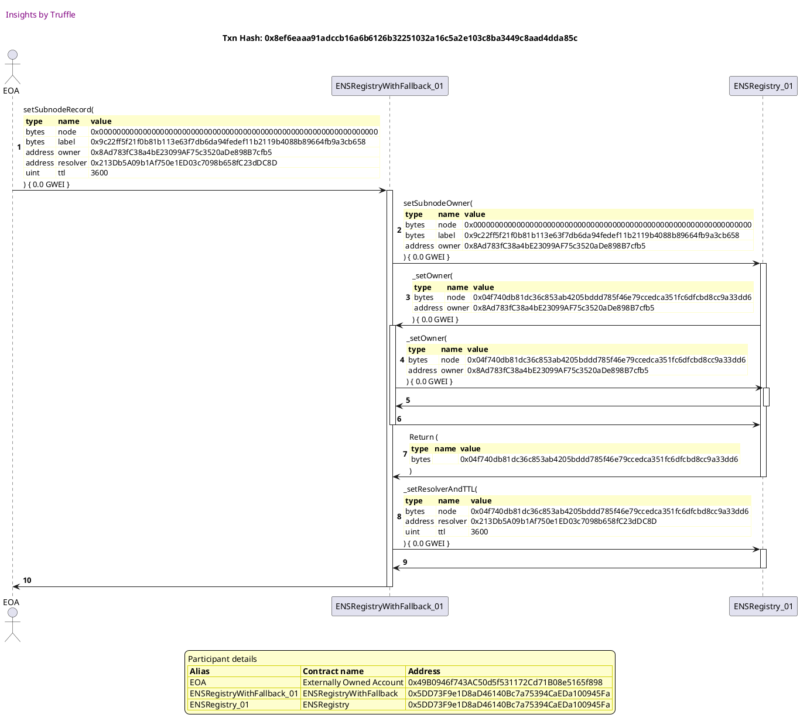


## should implement authorisations/operators
[link to test...](http://github.com/ensdomains/ens/blob/f5c6357c01b907c17cff63a76f7760ed88775bab/test/TestENSRegistryWithFallback.js#L36)

Tx: 0x5c3249184aaf97fd9c186ecf4752f819ba783483ba93151aa4ce1398c8b6135e

### diagram 1

[SVG :telescope:](https://www.planttext.com/api/plantuml/svg/PLBBRjim4BppAnREfKKQb1GfYpHS8xOi8xqqGPDxGV4X2v4fWw9GEqd_lOmi67MZ0odEx0vdTudGRHUa3_skGKZseNNzhZGUTS-rsqilTz2OoZYzakgvyctlTDushOUhJR4fyWAXUHUEZLaW6BwjaTfuU1sF07UjhrzQ5sIpREhAxOmBKT66Sy0caYV9VU_tZRaW7kiN0uITiGUfTUqg87Y4_Wpx_Eje0ettVtTTNMr31-KHddnlRTH5eGwDWQU3WplPRMU03wcY2HE4CocjoAmMYl2fKPPbQM8v4QNCE6MSbb9GaX8fcJA42gvuEIKqZPf8gX2j5_TBa1rCuZv1iMsXLlLUnbAB7uy_JLLtmHz_ONAAkO0c20rPSBFuGC7rzGnKw-AvVx_cqsVq8MH86_9lPe3GQLZeuHyBsWHPDnsQZoFxShN6QupnukqRn9b4I_4dZytsiHPmScVUWQNMtdIHE-SjteOoute8nZlPD4Uu_-sCXgLIyM64IE434oiisDHcZ2xp5ElKffIGBCbrHbQOcvHCKyi5_q_uiaqNm22RqoHZrYOOAve9haL9ivHemOeaOIlET9PIdgsZTHJh7xk0RkCQ7_PV)


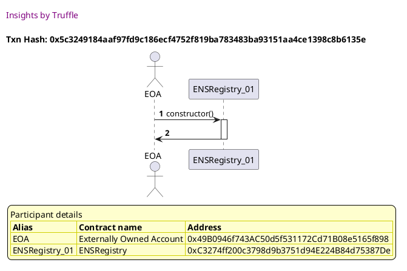

Tx: 0x638187c25e1426fd467df3836b02ccd4a7658e53ecfe40d36d31daae575a8c56

### diagram 2

[SVG :telescope:](https://www.planttext.com/api/plantuml/svg/VLDHJzim47xthpYn5n1ZisCxJYfMaRRfu6MWWSGB4d9Zfur8dIfnjXQw_xvh6X2RLFBWS_nTFj_ttOMGYyRhshVBaX3T-igrovcjIVDKk9MkzH9AExVEZ7JsDA-hrfbnLLOrV9gcqtIS4dBU-4rfXmIwPs6riJMyzAy0brLTF5VEwp8fYxbRMkUHCVTl2LC4zvIhjbwLzX_WjdYsmCJRsOqsfd1pOBG_-jF5ywzz4QI__yernNpX6vXjuAvkynnvYIzyQU5kxU1IDui1q7N88nQfB92MYI3CZGYLoNd4mnaDiim8hK8PMSbjbbj13GyDPqPhAvNKKIP3WfPb7ajFhnFG3HnXF29eco-oOgLHQlhZzgUT5uslD_U5NqnrMSxGoKVAzla7uID2EZOu6twO1gUd0yWgXrYxA-NumJsGyxuxd_iut7u3lrbPmEZqiek_TDdYPfU-tH7u6gN05Xwhqc2Wwp4FbCZpWDACgpWoyOmhoKmiqY0GeqWO9Nca9XQEtvLticSyWHUWNoXylq-li4SV2kW4TahF1a38Vjp8pJiJZVMwA9jtiYPqGYdToSAfGYDnCtwLy2emCQQs3M9ltmstNQDmNNjREonY0zU_dJMGP1cEjkzqYtX4On7cIl1aBAcHkUICgM1i51jH70SMoZoAe_-83pVw8DXTnqEhWZIG0HDi6aPPF9h89CmbJGpNWPvAWQDcH83NeI-zE-G2L_nb_m80)


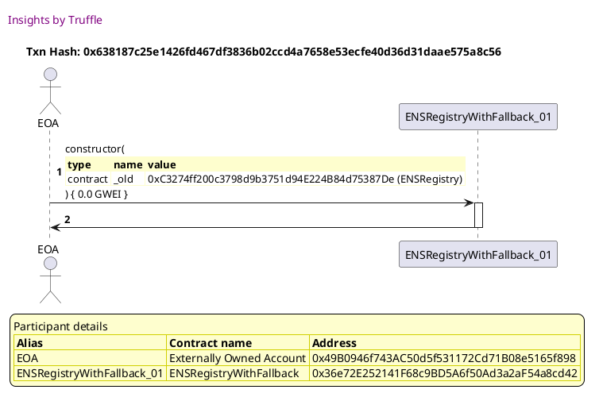

Tx: 0x5e72a64e7d3e7c25febf9ab72105cbf480485d6ac32ba717dba617d7a467a314

### diagram 3

[SVG :telescope:](https://www.planttext.com/api/plantuml/svg/VLDBJzmm4BxxLupefHMbTHwE4qHNP7UJmgMWWiG5gPh4pcw4DuaSfsLX-zyxXB2YbMWEdedd-NqpPkoqTsZTi36CuU3QPjWKshB-hcuwjBW1erUwKNCixrQs7HgrQ4rhuLsUvTaYO-oaTrkZPmp6RwrHQGkFqo_0MMlhXxPnQ59JhvgDRXnbhDpU8IVZSyfki9tHVnckwWSDNhY_kqIbwcO57f-kVe_ovFFK19lgdpTzlLgx7eejNDkXgYWlSxKp6gxl6pZ3VdqC_5vewMCKQga2BKjVLBge4Yoaxt5H5bKOyp0MAi8oy0kKdbG5HdHA32E90VL5b9MEMiykKi0U3aWUCABDrMNT8K7DlbrzrwkwTtPxKxjrZiOKnEGFxZtxlsa-O6pC1aUp_xh1uU4nzDgbNMVRdsZorgR6lBzjRjd9DAEFavpjle3RTXf8DhWP9KKCf3ovxu38jRhlOGTjfoq-0TiHIt6gP1nKYo36iCZyW2T9cajH1iBdkDHn4izbMHNY9KtHjeO2SUn8ArATVIdo0Hw1V-BmzIOxf-7z5zc8VAJWw1WOUzv3TlcANQKTrgP_XNJ9bvpp9wIqRiGmAGlQ8qjZscDENs3kusQxSO9qtZjj6sfY2nU_6kezBKlQUJVo42PpdeHH9SCWNGYkH2K2pvF-GablpcCjl4XKnCO_YT_UW3UDOxaWektCVE5xePT7SPdCboADAi5J5Q2FkGWnBbNeKpdYPMA7dT99R_aF)


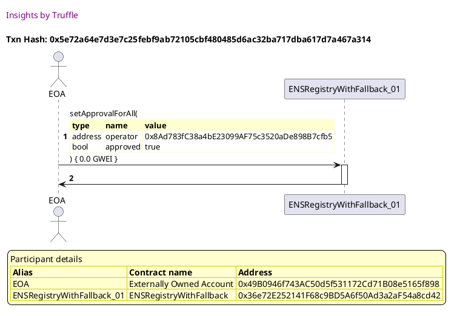

Tx: 0xa05058b5b58940e575ec831f46a29cf2b228c956946d6d4015c8f062123747eb

### diagram 4

[SVG :telescope:](https://www.planttext.com/api/plantuml/svg/xLLHJzim47xthpYnbqsCpN7Yn46i8ZJ9u6MWWSGB4d9Yfur8dIfnDWhTVzyr3HKRAsBYSSk3p_6TlxjyvtmcvB2rih7Th294ThOstIpJ3MblIZENZPn1fIVQg2EPtqoQkZDgN5Tr0s_I94t62I47hLrKUaIWVwPQAjt0_V0AS5mtvLrjhAoYgfoOcJOM4Gkx2KZHkOQSTysyqhyupiix3OwtMJkJIfLc0WuTbdxqzk3ZK0GPyf-OjfnCRGlP0YwQhYWGbzZILXekRWqSotQw3_HMKawvo7Z6HUXHpGEkS-4wXUTB5kO5onWJUSZzqFELhppgy5mKr6SESmClq1b1odABfIUd4SWMTj3k4AJDbdavb_YfoPVphtfIjhPPN9Psciggof39Q-giuxUwjyByOMiVJlhai3Tw5XLsT_UXrVRqkz7DsojpHGw6JhuVx6Zv2UnYhW6jaRFUVfDLXvDL-18fjRg59PXQuHgoI5_vF01ZRnlThg3hLNKzDdFSEECH3JCdAW9EjPF4rCq36ehCvw8OCrV5On6lCTx1FT0F53vV9YTuD9ubuYL4NVzdwYbJ_pOxBpexUtlxyBhJzqA4_ezVXPArIfEpHwAXj9LbrJxgJ4nZv6dL6HHZ516SZ55b6nInJO-Y1_Os-qRBNjzmlBMwCLZ40bPzLn3bETu8jcTOH2eGRZ5sXVIoXBaq3ACquBdB6PMn5g4u2l8Yuxy1RzV7hSu-dUlhW2MCCyTpKXzL-YZcaLzm6YbNCfboJufSUMnhkYSf_XOMwHv89uSuuWNw4m00)


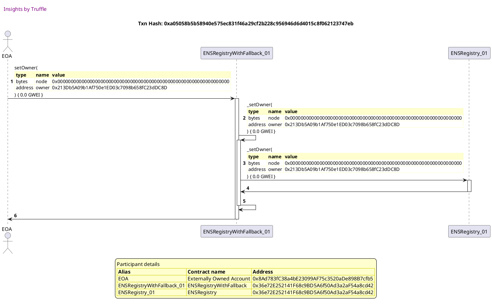


## should use fallback ttl if owner not set
[link to test...](http://github.com/ensdomains/ens/blob/f5c6357c01b907c17cff63a76f7760ed88775bab/test/TestENSRegistryWithFallback.js#L50)

Tx: 0x4f288b8f7f15a07a1e112db4379cddadbc4c747ca6c5151f3e65b67c79ac2c06

### diagram 1

[SVG :telescope:](https://www.planttext.com/api/plantuml/svg/PLBBRjim4BppAnREfKKIb9H5FGpNY1yoqaiJDBaN51yo4PaoA0gra_JVkvO58svq8CMPtU7kB0cvQuFmeTlMX8WkDAxRbjgJziMwdV1Y2xMkj5CB8LygttHEBPkwyN2rBjR5iY1aseP3hMS4-c-ZXT8UteOZm7tZxMlZWgZdjQtSLhk0YYQS0zP8dYHtdT_L-e9uigyQM7p67eLIrbN0w03zxVVfjw48Cjp_mxMsseGMoWCy-yuOr2N1Xbh3yzx1lMWt4w3xs4HPLcOcDOmBcWgc6OjK6O_JN2ebL2bZcSQf58daZ3CprWalarIckP2Hf0b1osJ0qek7EOWMHhYF2DeMhBGxWQqMFvz-wSgsmHz-KtQAkO16XFHPS3lxHC7rzGHau_3S7Q_vyfLy2kdJ-lpR2H1o6XPv_522qa7OkYNJOMGtLokwefJEthy3pWHBmfybcksn5t1Ygu_0N2clM-JEURFtlarSzq5x9-hw00z_d5Ombn8VHa0ABSqND8yJayRZ-P9JnGqVCvP6IvMo1SqqPmatMPxz9tnfqmNGowuNUinpex98guJ9X1-beuWBG_KwuygiOiPeaQCizZ-uGEvmnOVz3m00)


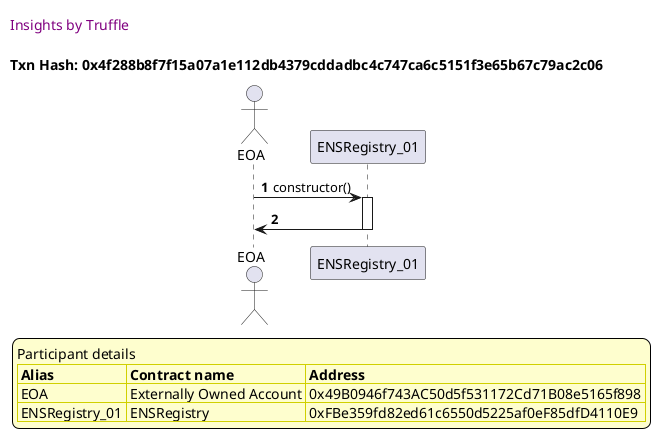

Tx: 0x6a6b6f578e0b69e35c6f33e81a8f80197440021a2c47538a8687ce86f6aa3124

### diagram 2

[SVG :telescope:](https://www.planttext.com/api/plantuml/svg/VLDDJzmm4BtxLupe1KHfxIHs74HNx4TIk1HKaBWW8IUsToEopYfnsbtO_lVEPWEYbI07Z-CtUPxtPaB8UUjLuxjbHOZgVEswPMuQqZwMRgKQjOJAp8tJ4rKypfkwStfQLtK3dx8qIwSf8MUjtrHcHA1_5aPfqy3py0fmKJVbK-sygiPLENTBupmoMl-Qa26ufrnrpQeo_m0tvPC15hsUNIkjIpS7HeUZFtqy-peKGORxBrrRpXU-XNm3jqrdBV8IN_hAmEtQmOLg5wT0rqA9N5WUIqDpaPYG5yA6eP5CIIifI-8eeZHWAYYYc8TIII7ZmaXXXL8X2oA2bXKUIq-lng1QEC1uGD0sNnRbIg7KzCVDJpClMzzixag_o5HLvUZa0sNx_7VX0q9wDZWPVPW6nyUdKDGEiMvNok6zkoTdGtS-3t6q_GP-ipA0qQbb7t-fgiFDBdsx8_0DIe4jFDILna3NsGGDIQoMWT625O9pgdaGS6MfoIJNTXOnHjC43j-KTxHdF89de5yeVBzBBx577mhe1VPAJqw1aFsuaUit9chZLLcrRsJDw8nIkfE5KuL6ucRw8k55u5ZhnhI8lNutslQDmdNjJUEmY0rS_NP6mxWeSBHzhpjA9ZI9X8sZS3pTQROyP2mEfZfc4oeDPu9RcSZ_YDzlzBjWVzrCAHwnSS0YBJ8PvBcsHShfM0I9JCEOSPbEMKe3l0vz6TmXvxZYB_iN)


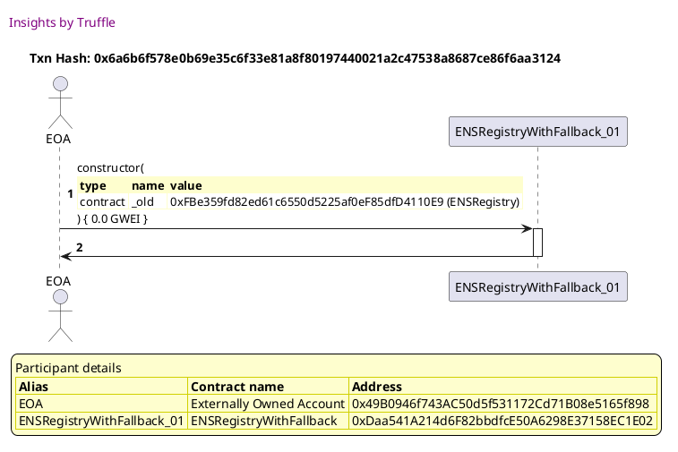

Tx: 0xba8a36505e586f04092ed957605aa2dfaa4994999365f5fdf9fa35264744ce17

### diagram 3

[SVG :telescope:](https://www.planttext.com/api/plantuml/svg/nPHHJzim4CVV_IaizZAqiTb97Dk8LRIb7RmC14XxGK9EV2uHgLibpjP2zzrtIRkA3l4mWRGeyZds-P_pp-SZvBWEfWhDj2J4D67ccsa65Qdl2pytbPdI4YRWxS3azvDgrdWxd9MpYhuRZyQZuOYGepeiI-WHsZrtO2nKz77pIUdfh2eUPZwOibyM4py57r3HXQt362VNalEccfUmCt5LF03boNRimbXR-0dbR3FqgxD7dpT1aCt_ptnTJEv2JRCblQuQvr2NX2AKGAyNdfwQ-kwGiaLcb8bJmGG8bJgMC1s1rKAcJ1WJMMTCeZM-6fsSSDPfPs8HfObCaXou98Wi3nZwwBnFJKttqEuHn1QAl9WRtEheszKbJ8ewLCjRnjS-EqDxX7Ihw47lsHJzyE6GrX2kcipFB9p_z52zl_4tv6X3_-F6zbPVQ5ZEWQBrPjhP7wPiiDEwhn13W9gkQ2k3XYtOAv-_XKkJGTaf9qvaYaTIQPUdBCs0Pt76KysKpNZiSccqiKxcHY97xbHYfSWIoL9jOolTLXbFkeAwrPwr-rvhwm7JIUfa4lU7Wbayb9Xp6Gsjv0EcG70y9wNLMcEVFbBsYT6ltqTdc2ZFwBv4_1QHloLh7USMCibK9aKYR9wc2Z8TASPbYc0ip-CuTrQ1RNCGIHcMvRbIHYEknC3_9N9mS4XVyEpI5gSl8JILfw_3zOQezWbP5oroyUGgMWYcAEid4Pwm4qpbDaAiJNWriJF4ebFXdTx6sly3VRkkj-gkExQB09KtPRcaRRfOsizpB93X7mzcHtYtNEmCTBBZ0SH28m4iL2dFKz5AHv4mZi5O2UjE4ixPIACixdz3WHnZYmN-Dm00)


Tx: 0xde85526f2e05fcabd1598e95e3ea3b4aa56418de810837eabc192a0a9907616a

### diagram 4

[SVG :telescope:](https://www.planttext.com/api/plantuml/svg/nPJVJzim4CVV_LTOx6LeOxEJEB4HgsXBEtWP293sWeJyurmYqhHAdAs5xd_V9UqgEiJ31DByu7FiypVdZyz7o74TT1MQQK68RiAiRAO6AbBVv-LSLtfA2vX0wGRQta-gMLEwuQoOLVJTU3GU3KU47DLXMK2FqAxTWNPGqSVD9wMdiof_c9L15_qYdvHJA0Cg-h1r6EFYMdBULFC2TXQkyWUWFDdENMZdyd92ETjC_UhiqUTD46Jp_xEopYTteQPcIQ-hndlK9I4F1T3hHKbFTNrtIDd2WHGYIdq4J7YhZUD2IL02Oj2nIRGMQS8bUd4cumoqiLn5cccbM9RoL1D4PWE6FZhlKrtJFRHx1B65tEPpZKSTVRkwX4bUXsfvo_ZQPsTgZv1k5pteFLkY7puSqXh2LMFAcOFpdoLKxs_A6tAqeVznOtkhBpGivq3HbdhQsH-wQ73GkgyGGu2QhcWhWuOjs2lRtyA5Db1qoeaNHl8eayhRbAK6k8aDJnMJpl3OsqmhxNncTHOXN2yJbmcJP2nLBdQPtohZJLTGjzgpzjnhRJLWAabzbiJzeM1EU15pdaL3b_41ao1uAhnKSgsnJnyf-yJer--ZCqoKPtHV8dwBoD-IjOgj0vCnQJAH26VJL89HaMIyJIBbk8rZwvq4btgM82dDZBLIQeMu4Wt_byZ1mI5zmRDBMro-XD1K9NqThZT4jK_8kcYHYoTFqK7GUL4_YV24dM0gjn5YRSAdYOCX5fqAt_GsrluVwDjzlLNttB5V1AXANHHBsgQBetrhiK26VxoO7U7TSh4pqScE1n0BXGGYHC1jAbhfA1BQCnXBuVn9mZaRAPJ5ysyea6FiiS3_1W00)


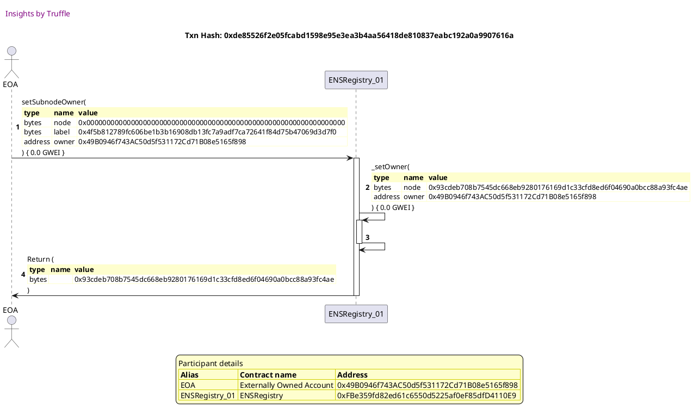

Tx: 0xa09b750629eb74bfd1c5e3d1bb73a0cacc69b13d51cdb177d0f626e29576216e

### diagram 5

[SVG :telescope:](https://www.planttext.com/api/plantuml/svg/PPDHRvim4CVV_IbEtSkchfiDsE0eYvgaPAqqhTKQQI-L9cER59MOo9YjQRFllYj1KRFou3DtzX___Zu8EM-3yg5RruIeBZIkMnVMa_QXSXlbrHfgkxBEp9H-MFccSsRUr8s7TujyaSzpGiPjsDPsGg1_xgqoriFpy0fmsVZggN51rTEwMhcrTG4Lot1OiC3YNdBJ-KrjZmgtrPC5bXnoDygOogs0qI7rju_ZpyCXoF3zAzTMg_lGGh65fU_A4dL9g49jOVdeu5ArzoEWZuhA8kLKHD8MQLAKXcbkOyEA8eqLrKfh8GiM6ywqALYQ6bgAIDX8ybH4JA0cKJhWqVFhAQWMJZ2U4BGjLBhQA4JDlz_-iAkg3NxxYxBzcgFK2I7zBZYRl2d1wUa8MXkMos_lxzmT6G-cVnpYPFS5mdPZ0QDJwpx-LdM7avVbEwGFjeKTkCPW3e5bh0sYqWon4swq49ajP9HHbWec9FB7iIvDPeqeQI8aLRJGEikKZ4kTg8DmLo7R3aAeSOm5fVl21tW6-ed2rv_v5LxD6vwUiOSz6m4X-yuYDw_yCZQegcvVeLxG2qhf2oes4Fg7apbsXaVZ3z1JOxnjiNRODzdrTuBZOx3UgRhUmlKVPmrCjSOk3hqTYPnHcOWoJUBfd5F3InupbaPpax8PpIndWfUPpFuJFhxJeqGlkvZPc4kqCK8VcHRyHJgAk2gfNMJSb1S9OpINA8lyWmla74Vy2_y1)


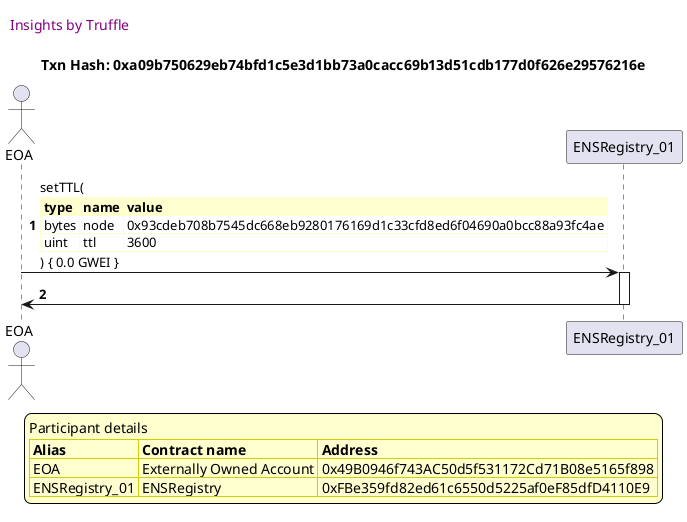


## should use fallback owner if owner not set
[link to test...](http://github.com/ensdomains/ens/blob/f5c6357c01b907c17cff63a76f7760ed88775bab/test/TestENSRegistryWithFallback.js#L57)

Tx: 0x1bf1019c6413d601e3780f09c5e23b20213abd06231c798f60764ac69acad1b3

### diagram 1

[SVG :telescope:](https://www.planttext.com/api/plantuml/svg/PLBBRjim4BppAnR9fKKQbDI3aWpNYAt8I2zDqEHUK2Gb4w4fWw9GEqd_lHjPCEf61rASsHtkpfAGcpu87uQj9KGCeNF3jjQUzC_6xOGNMx2wrKwjX7nkVJSuLNQsyt2vhjPLMH4oxyF1wWM1yTjeeRI7r-a8SDTvyzAv8EpIcjPjjGkes8HJm1h9e-Hky3khpuX7ywA19IViGIXbN0kCJj2VSPz_dOeWq_tVNM_QJUYXFi2J7ve6TKammMfusZku4_rc1dJFwePHLaYUi5XnodISvRIXXKnr5DSHZLWiQaLv53EP5Nd3QSOJ8NaXf52iZWbQ9WEMNjqlGVHmWVi5GTk2aMOdiDNgn-DFtPe--CCloeunPz058MCMN2y-K71rDGFPEJmFxzTy-am-X8nfO_xr30Wv3eiy_5E2qa4OsvFvDB8lbxVqbbAwUFi6E1Ci2NzADDjZB-34Lhy3IwMyxf4xvItUnZPntGVjdR3s0FU_dLQmb18VHa2AxfDYHOk4DraIBykKghH9OyQog5GPMz5SfuodJLxa_mcVstG6ZB8HJMcsaZ6NV5teCeuILgqPp-IAvpANECGYocgHeYpsFxb0Rd35X_qN)


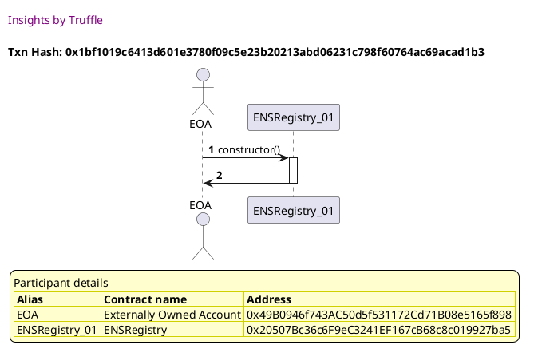

Tx: 0xdb7f1a6dde96864f7cfae534714de651855d22aa8a3d9427483390dc20faab44

### diagram 2

[SVG :telescope:](https://www.planttext.com/api/plantuml/svg/VLDTJzim57tthxXYBo36PYTsFYfMqQR9u6MWWSGB4d9ifurmdSfnjXQw_put3OXDAddmTNnkZkyvzmQXYzPnwxgbHeXthZ7TibGMjK-rMN7Bbw3LN1avvU9fRflEoApHZOLFHLxaMOxGUUisMeqHzCz2SQail0ol09UDhPyRuxYUw7fkbieuprYvjuJ2WtlALMTNMlq3tDRF2WXzExlXKjPc3WGFHt_wUFvrA08Dzr-PjfulN0lb1kviLrMU5xdQQGLtQmENl5sC0Azb6LU4HrAgD4eYMiMYueg5D2PKgeYHX34P19mdF9Gf3MAQX66AfGXmnNb9AVAM2UTBpwydm5iuyl48UTjSBUeLzrBp7xS_rRnkdTtSrsvHSArBx-GZ9llyW_0HGZqRd8q_J8FJqn68ndYisvLo_60UqFdGdSz376-_WTki5FXe-BAFlxZk_6QNljqHEEkbm1OU6orzmEi0CnnFHHY9g4XL5WQKv0M9OZ6D4f48JD8qY4lEuFXTUITxnXDu0Vm5m_Vx_Chtw4C1lS1UwTa84DgF6xfvPw9KZjUwVIThXcSOuvqiFrNUIB_9NYMy2fn8QLNhiRVlnjk-KNvTEsMDBs83rx-DaZ0Hme-swtNJT8fJ6bKn3ISPmv9LB2Ga3Z8PaobE52CHgv8q-O_uSACFWlrr4QUP2cZ2cKg3b5Up6Ivnd1A6ipXDy6Gcmw2eSkolyxuCxg0Bl_fVzYy0)


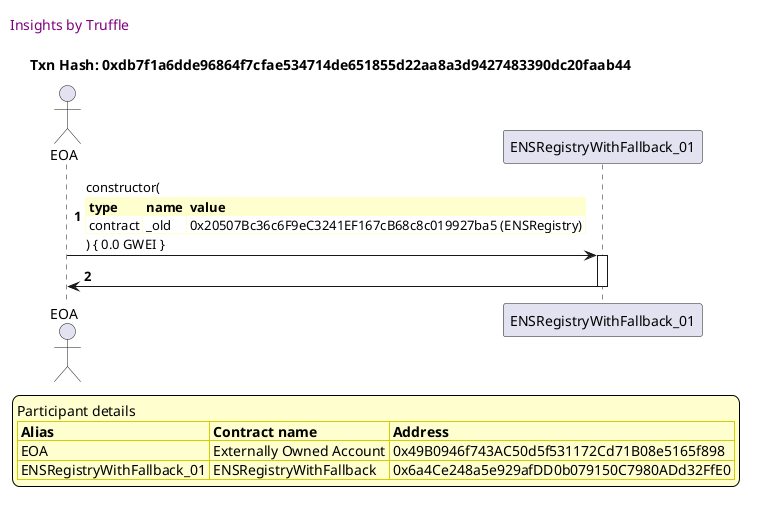

Tx: 0x0b2b2e39b453f2dce0fd287bd2b2de3cc5c0b9954a55239479d922cc14705360

### diagram 3

[SVG :telescope:](https://www.planttext.com/api/plantuml/svg/nPHBJnin4CVl_XGMlHIrjFRk-eKe8Wb9uL8G8FM2XFmCApRUQDVR4aY_UoUFHgI8GmLIVV1un-F_Zd-s1w6ZDkacTPCA8TsbEdOJunlKtfLngXizmPKV--ZwsjwDcxgBRb1NTOFVZOQZuM28q46RPfK_H7ZPRhrsli6Fwq-CJ-gcVAXZqbMlAiTnucC2nP0s0IEON4bEksPQ-Qs9o_B1OrfiVEVQkJAECILhrw-bFVYyJWAj_tyQst9ycrfiPlYgwK80NPJAL7byTH_nYMvlzp6v9oOpcS-LALWUCcSz2IwJmZXmEvzRoomnIh52CvRbgX3AgIopbXQ2i9mJ1CXiWjI7PpsiMxm3TWS1jbJQSgfXgyDlbnT-NBQfcTqGkehPSkqWj5o5zmwVJU4F7_PnwzDbPsBj_DdFw9ltr_4Q7QpfVrpRm_aNd6PJZy56FLdQ7xhgOB08dmE6v5iynmiPCB3pLxQ_XIjjVBLKBW8pacP2gc0vuSPJanlA5P7Eq3nOePLsGLWjCbxG80idc06UNBdSYR1HXfDkVBlGhXVxNcchFb453wB8UmD670iifrHa0oTedqZFA6T1AhdIsCMFc7mY-EltuIbSb6TqNo9-0yZVahNAhVD646a4AvYpd4jlL2O95Hp0E6hpt0OdlUE1541A4sEjb5e1haBx_qjaRsyVln2vlBOmVU5JrqJyEbnlY6eNeLNHGkTFdgBpIPTL-oJ3Ot8CLtcH8TGcU9em643HQU1DRtBj_O6-MNSuNpvtwE-JRwAkgXbUN1U7UzP2WKp_U31RmjlbOiknbCq88w9lSsxvIFb1dXLqEA9Ss3wNLbf2bSg4qGnaOVzh2kW8UYZmlm40)


Tx: 0xea65881cbe677bbe9b08b846300add52981b7bb7b9ce9a59c56677d551a56505

### diagram 4

[SVG :telescope:](https://www.planttext.com/api/plantuml/svg/xLHHJzim47xthpYnbqsCpMvYnqQieYtju6MWWRGN9EJOJeb8dSfnDWhTVzyrpIegnCFUbmUVStV-xE_pdGavRQ8EiLrKXEWsrhvTv2wGvg7qIntq0YetTzwEjNcOXxhrTb9NTO1ti-biEfaISjB4LUM61Bhltcdh0Zptlm3dTIYVQXzrDQhAkLyu7n6nYBk46GQtaCisB2kt5xWkdnomTEUxqjQMVWwCzgxVdJtvt1-2zFjV-AQStyS6yXNSXBOe49V4CbOERXuzdElc_XZeezE2IybCxaIMvRbJEPMvJ4L2AMx41qgo7FrPhenJcYl31IPQpfdcWbDEK38JyUZJon7e1WxG7X2KBPQcN6gaElrs_TtDooQ6rHrbsvmzrm4XtIeu6huAmU7XCJGkNlxoBho_zRVaf9VzOs-7woyGLqi7QBrUTFQdhbgSRDBNo3-w1jRWQui-fAmIOrsU8S-CfzmQ8QJBrK1IbWacb6KcIKnXfREYeAbGLDFS62crIWgJwXqmwXDSiu6kDwVhi5CrfYeLHPOcemcdbXSyOImRJ6p6nbGwpWGlf99RZ0_m3FGJXQy_fXTuZw_8loN8tNz5NlgEZk6DpAwgDc6oRM5ozQ8mhOkwh9eN-ftHCqhfHZ_iL2nKd4om1GDM-4x9qL-EktN3TLVyE3v65xokgXLiRiV2o1XyBk8_wh07lDyyUuuETa0vpSOc4KRCb9iaWvHDPqnaPYoaaOOofGPPhZd28lzU1NAA8pvtVm00)


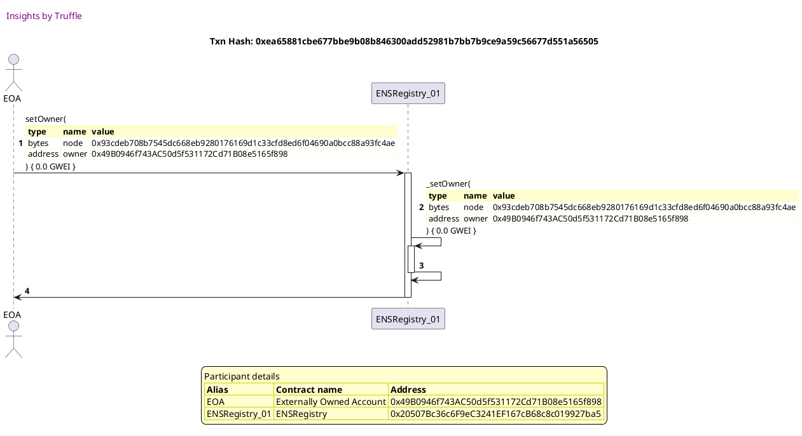


## should use fallback resolver if owner not set
[link to test...](http://github.com/ensdomains/ens/blob/f5c6357c01b907c17cff63a76f7760ed88775bab/test/TestENSRegistryWithFallback.js#L62)

Tx: 0x1c694015cc5853d418a9245a55984e3b33d604c0015a48b6f0a5eed1c9ad6733

### diagram 1

[SVG :telescope:](https://www.planttext.com/api/plantuml/svg/PLBBRjim4BppAnREfKKIb3H9FGpNYAp8I2zDqEHUq2Gb2v4fWw9GEqd_lHjPCE961rBSsHdkpfAGcoue7_fjGuZgG-lwxTfwqZtNRgUysa9ZA-lCKkddohUzCtdRj1ukLiMgo0j2vbquD7P1OFWsLXdhuNKy0jorldvfNL1DrjILsreNKB4CfuGLWaV9NUztZJq37kiN2qoSOW_AcDfLmEWO-ZliyszZ4MIy_uVhwceJEbWVuCdtPOcw9DIXiV2qTt2dkiqCw9xfA1MKIQrb8haHB57fL4WbPPe8ozUScuWAJJ55YMGTbLH9QmtJgJ9Hp3b1otJ0qelx35G74zmd16qBjQvt2bijVZx-ibNT1N_uJTanvomq8MHWmVNY4mINbpFGhSDp_txDbw_aKyf06_ZNCo3aE2poyA44OuEgcuxCnv5TNTpIMqhfukqxu4om9Fp9qMoFlO1JM_iUo8pnjaFin5ky3MtYkW_MEzKq1xZ_uwo1J6jy604XkXVfagOYAcF1irnI8ql96OkdkOdPaYPMiaYMIPhy9tnkqrbWaCqrBRZGI9XI4VEbCdBAMSuivP59Cnh5KcWk5SfY_wCBv0PNVDZ_0000)


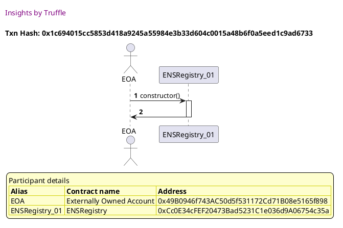

Tx: 0x9b67db9ec262918cea6913b8970876cc37a946e19ddf72b51a3cf0f0b50969ff

### diagram 2

[SVG :telescope:](https://www.planttext.com/api/plantuml/svg/VLDHRvim47xthpXrBwswRZPWm54NbL2ozcMjrafzgLGPsoIen4HWjgJD_likX4RPf9O7VyPtV7VVTuQGYzR9ndMBYX3PkTfsYzmqf7qkxL8sSW6LcHch9r8zpvgwipgjgxg1JzDicgKP8UUjMrTcJA1_vaPgqy3hy0fmLJVbIssTh9AgdDc5iGuP2xTFc69mHxdiccLb_WdSbIy6MB0_kvLQbtO6Z0v7Vtey_peqGORwrxOjPtFNGhw6-wOh2kGbhdILWVkLXIlPpaT0Lo8F8vqBexpG4onMHeQ2-Nai8Xf7eL9-94KG6YQqBY8lvqpwgg05pJaLeIWAWfOfXwrdDmd85euGZmZQvafLBYLApNxS_JIpidND-g5qywcigXoTVA9ib_zk-8YGdWtEnX-cmUdf25HjCTPjMpb-j8_aV9ZEvm77cs_Wrai3Y5OkUlmbgmuts_JDbi0rA0Ksy5HN6e6kKaKpFr38uD4WyYTISyzdAJFK3xL8Q1ZnGFbSml51UoSxnXDu1Vg5mlU7x1fdzA60Nc2lz6m4XEok6xazC54R9ykgFP1rIIyffLjPUAlGIDoaRnBU12PQDwR5sFwxyQOV5AuhPngBJQpXvhSr6XAby6gxNdSW9XIdNaI1dwISQbvmdx78ItN49ZGsd8MyY4Ny7_7xWtuts9VZNFX1LlXOI56VnobMuzE4UnCn2UA0CIyIZ7EEvT2NmHroWIl-idy1)


```plantuml


@startuml

autonumber
skinparam legendBackgroundColor #FEFECE

<style>
      header {
        HorizontalAlignment left
        FontColor purple
        FontSize 14
        Padding 10
      }
    </style>

header Insights by Truffle

title Txn Hash: 0x9b67db9ec262918cea6913b8970876cc37a946e19ddf72b51a3cf0f0b50969ff


actor EOA as "EOA"
participant ENSRegistryWithFallback_01 as "ENSRegistryWithFallback_01"

"EOA" -> "ENSRegistryWithFallback_01" ++: constructor(\n\
<#FEFECE,#FEFECE>|= type |= name |= value |\n\
| contract | _old | 0xCc0E34cFEF20473Bad5231C1e036d9A06754c35a (ENSRegistry) |\n\
) { 0.0 GWEI }
"ENSRegistryWithFallback_01" -> "EOA" --: 

legend
Participant details
<#FEFECE,#D0D000>|= Alias |= Contract name |= Address |
<#FEFECE>| EOA | Externally Owned Account | 0x49B0946f743AC50d5f531172Cd71B08e5165f898 |
<#FEFECE>| ENSRegistryWithFallback_01 | ENSRegistryWithFallback | 0x55934Ef30d5c0358C5315FA52B9B484112791555 |
endlegend

@enduml
```

Tx: 0x7066fc1eed1f6ab6139b689b382b854d36300149f1615c2ef2fbfe45923aaee7

### diagram 3

[SVG :telescope:](https://www.planttext.com/api/plantuml/svg/nPJVJzim4CVV_LTOx6LeOxFZn74GgoYb35u60gIz827_E9U8rAqIPskX-zztJRkA3l4mWJG_-9op_Stvu_CHSjX4NSTsN16YspW9xTX0JPhxCanrhSUqWX44TwJj_QYUjC4D9jMafkzEXYV3mP2GWoREA-WHshKxq0vg-hZ-fFHqKfSFan1rrQ_AKHX3YAZeusR12Kwk9ATjFQrWQ-AgV03AqutlGZjNXX7bREtwrTc3p-iWoFh_Pw4fHtUneMPEh-lMUzGbiOmLqEjPeAUwkTkdR9OpARtb08vxgOtaeZ1I5KQenAWiTK8AndXQU2vvPXFmYJSUqgn8XDO0EK5aDcBem_C-rGtTGRj345iiRJdLUDJXjwjB69LDhEUtZA_MRBbs2EbsqRtUiodwuSC-RI1UjIPC79p_352_lmatv61D_-FQzXPVQ9nFWQ8DUjpP7xfgSR1Sla0C4Hgwe4iPD6p6Njd-5gwqWQfJJdrc54zoLNWhcJJ0ZJ1S5amvmuMtkIwqyxdLUI9JxbNgyioaU1E54oxt6sMywHgQfVPaUUwLTd74YbJwF1NzGSPSvZF1UPuCNCwFc8ACoyohGgqqTkaZPPyO_VfzU8Q9yepkIyHl4VbRiYw4TM1ofaoUfPcpKYemHQ8OpoM2STmAORrJuAHdAPBIp5Yhb2uGLwhX_nBPszkdBwpiqXQdBo6sTQ2lm_M6g7O9MHKjSl7aAJg8kgoQ9n4UisDCvMM4M9lmQU9WW4MdnZUzYRN_1_fcNs_HFNViPn7geAjgJfVfucZVMYoGyHylPajukrniEJhPWML3aLhSaB0q5qVQPOdW0mvCI5VqcKHkLcGQPV7yQmha47iiyBy1)


```plantuml


@startuml

autonumber
skinparam legendBackgroundColor #FEFECE

<style>
      header {
        HorizontalAlignment left
        FontColor purple
        FontSize 14
        Padding 10
      }
    </style>

header Insights by Truffle

title Txn Hash: 0x7066fc1eed1f6ab6139b689b382b854d36300149f1615c2ef2fbfe45923aaee7


actor EOA as "EOA"
participant ENSRegistry_01 as "ENSRegistry_01"

"EOA" -> "ENSRegistry_01" ++: setSubnodeOwner(\n\
<#FEFECE,#FEFECE>|= type |= name |= value |\n\
| bytes | node | 0x0000000000000000000000000000000000000000000000000000000000000000 |\n\
| bytes | label | 0x4f5b812789fc606be1b3b16908db13fc7a9adf7ca72641f84d75b47069d3d7f0 |\n\
| address | owner | 0x49B0946f743AC50d5f531172Cd71B08e5165f898 |\n\
) { 0.0 GWEI }
"ENSRegistry_01" -> "ENSRegistry_01" ++: _setOwner(\n\
<#FEFECE,#FEFECE>|= type |= name |= value |\n\
| bytes | node | 0x93cdeb708b7545dc668eb9280176169d1c33cfd8ed6f04690a0bcc88a93fc4ae |\n\
| address | owner | 0x49B0946f743AC50d5f531172Cd71B08e5165f898 |\n\
) { 0.0 GWEI }
"ENSRegistry_01" -> "ENSRegistry_01" --: 
"ENSRegistry_01" -> "EOA" --: Return (\n\
<#FEFECE,#FEFECE>|= type |= name |= value |\n\
| bytes |  | 0x93cdeb708b7545dc668eb9280176169d1c33cfd8ed6f04690a0bcc88a93fc4ae |\n\
)

legend
Participant details
<#FEFECE,#D0D000>|= Alias |= Contract name |= Address |
<#FEFECE>| EOA | Externally Owned Account | 0x49B0946f743AC50d5f531172Cd71B08e5165f898 |
<#FEFECE>| ENSRegistry_01 | ENSRegistry | 0xCc0E34cFEF20473Bad5231C1e036d9A06754c35a |
endlegend

@enduml
```

Tx: 0x8f1f646e6d45e9b6605d357e75d5736016bb4eff901ca1c0be44fa7c0858cc2b

### diagram 4

[SVG :telescope:](https://www.planttext.com/api/plantuml/svg/bPDHJzim4CVV_IaizhA9iTcDxII8LRIX7RmC14XxGPeS-rmYKgTo74QX--uxqgoYucbvy3bdtpztlxiGSjf67MAth0dHNMnyjomXaFQXyYiTz9BMi01lfzeyB4BJULiqTHFeX_biFYjcX9oqSLt3cD3-kGTj8T2NuPNIyoPKpusFkfxKrS8lmKTKT75tOOw7MybL5rOrx1tSLCz0kTZvhhIrbLzGpWRNdzwUV1sI8CFtBtnRBUvZIyirlGsTSwXBOXLheBTFdfxhzlwOigVCSQU40cM5XBnKYacRo1HIQMMQACPLMGfmBcVSQ6vO2K8udHgMoSoOKKaGcOcO-knoGdLB3z0U4CGMArEjD9Ow-t5p3OkgZM7zY_7jdJtN0I5z53qQlpkYXuV7j8Lu3MrJFqBuUEVloCb0_lDWnvjlDAvNGD5wlUpjewuxtBnUto2222tTKDzOz67LUM8ib2dBobGAQOrI6PJvA6CyLLpbbfiaCSvcO9LZGkLCizAOBDDvuepGEs7iHO3sLJeC2VRo8f-oN2YNYcHII6QbamddwQYmAP-o32HNqcLvjfNvH5ye-yBezv-p2-pcEmGzbfxFqJ4bP3kCvEeDOWjHLtNx1imPEsEClOB1cKFak2bmc0BsQeTeyY_vNTnuqxSHrwS8mUkwNjFBtnuidHY3Wn__ixezuVqns7FqieLXiqGO31WnaIPJRUKeuGK7bYYRJvZ2Lfb4QfJ5-WSAv1HN_77_0W00)


```plantuml


@startuml

autonumber
skinparam legendBackgroundColor #FEFECE

<style>
      header {
        HorizontalAlignment left
        FontColor purple
        FontSize 14
        Padding 10
      }
    </style>

header Insights by Truffle

title Txn Hash: 0x8f1f646e6d45e9b6605d357e75d5736016bb4eff901ca1c0be44fa7c0858cc2b


actor EOA as "EOA"
participant ENSRegistry_01 as "ENSRegistry_01"

"EOA" -> "ENSRegistry_01" ++: setResolver(\n\
<#FEFECE,#FEFECE>|= type |= name |= value |\n\
| bytes | node | 0x93cdeb708b7545dc668eb9280176169d1c33cfd8ed6f04690a0bcc88a93fc4ae |\n\
| address | resolver | 0x49B0946f743AC50d5f531172Cd71B08e5165f898 |\n\
) { 0.0 GWEI }
"ENSRegistry_01" -> "EOA" --: 

legend
Participant details
<#FEFECE,#D0D000>|= Alias |= Contract name |= Address |
<#FEFECE>| EOA | Externally Owned Account | 0x49B0946f743AC50d5f531172Cd71B08e5165f898 |
<#FEFECE>| ENSRegistry_01 | ENSRegistry | 0xCc0E34cFEF20473Bad5231C1e036d9A06754c35a |
endlegend

@enduml
```

