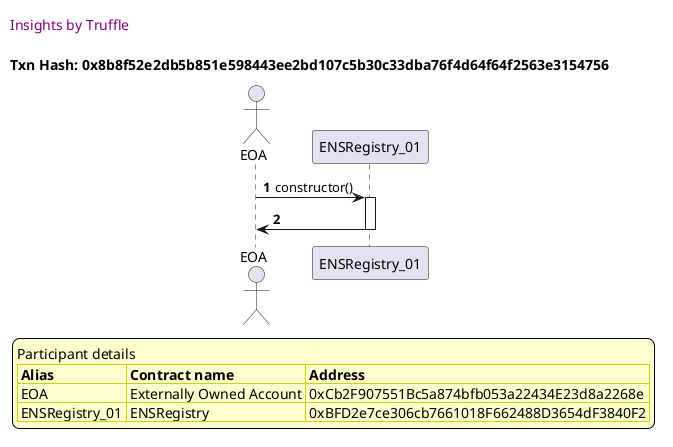
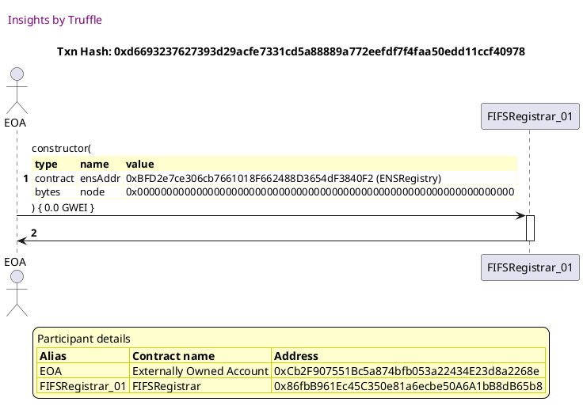
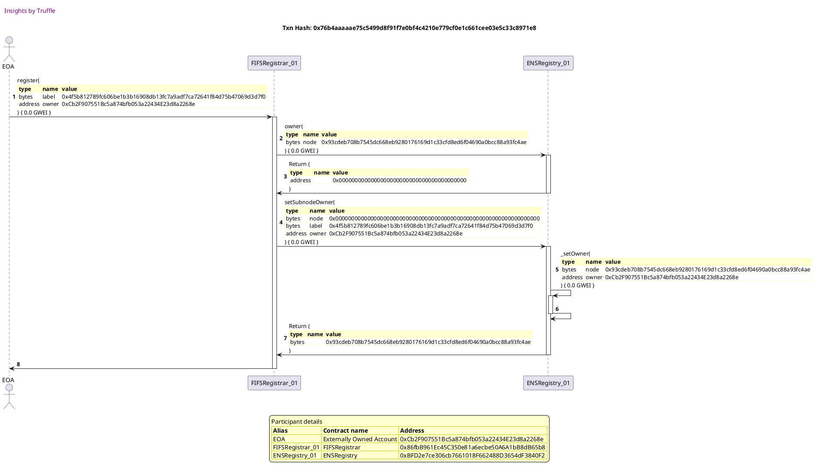
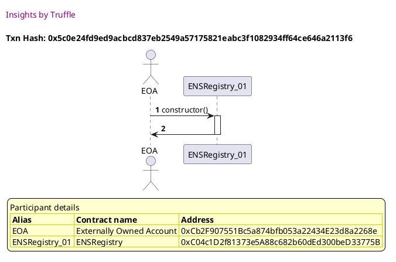
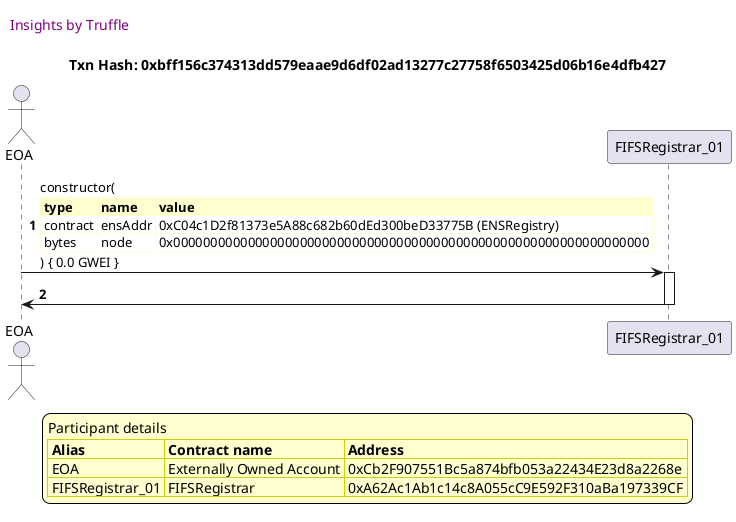
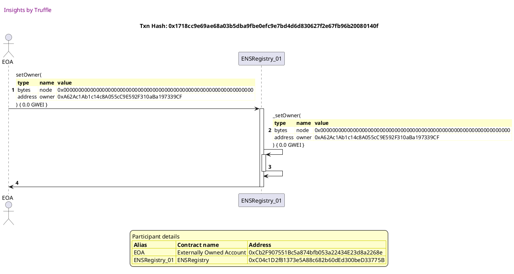
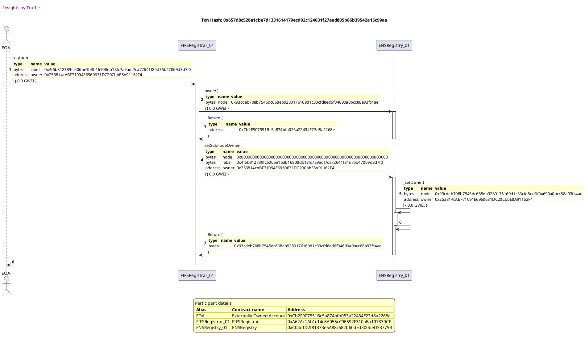
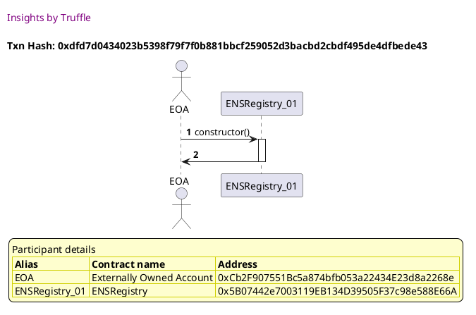
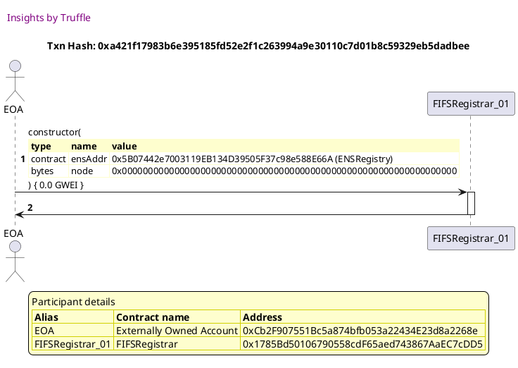
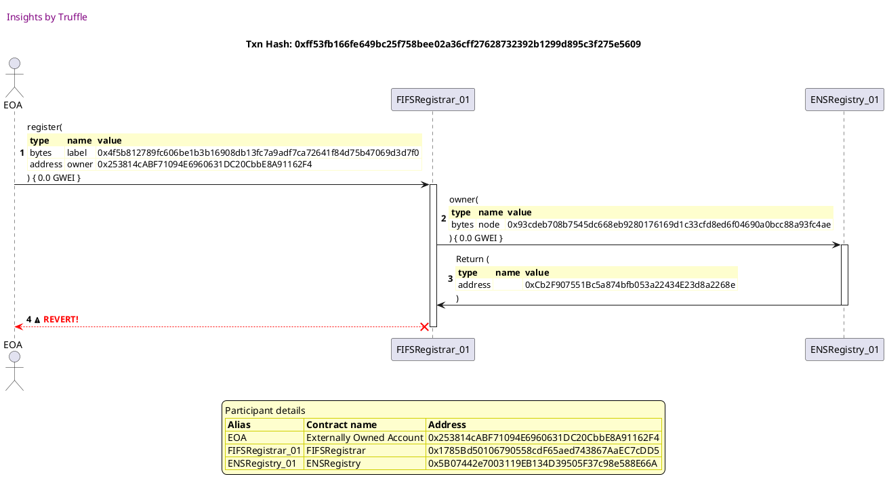

Test date: 2021 Feb 19

## should allow registration of names
[link to test...](http://github.com/ensdomains/ens/blob/f5c6357c01b907c17cff63a76f7760ed88775bab/test/TestFIFSRegistrar.js#L19)

Tx: 0x8b8f52e2db5b851e598443ee2bd107c5b30c33dba76f4d64f64f2563e3154756

### diagram 1

[SVG :telescope:](https://www.planttext.com/api/plantuml/svg/PLBRRjim37tNLn3jouQkc6n9jXjaGNEnqRsinThtGRBenAWZ1xAC9MttxsCT8rXMGT3ba3mY3yNORHUq3_ssOKpteNNzrg1dtNFjTjhhBJIuHcSNkdnU-xPtTjashOVB8Y_oPSxOj0k71cSCXh51RT73wtW5k6jz_TAwe9jvKw_T5bqWnYgS70eo7YbtlTyrU6Puh5yG8dd27hIrjLj3n4Vepx1Fluv9iF7zxwwhrvlGWJd0a--hYdXPg4E3yBHtSAUxpGJuFZDPfMAChL4cKn6gcqnAWHWR6_6qL4RmKWXhT9fKqYQoeXchHA28b4nLmaYoCb3g-VqST0SNj5ymaYtKPRtJL6h-u_4dhkik-CCl7Xrzpg0BneOek9vzCC7LrGJArj6zVt_cqsVsmMK86-Al9y3OiLdiuPyKB0PTDnsRZYtxShdYAyxvxEqRK4ye9JeiIMnFjO3JMtm7vjPwxCXsYfkz3MNIkW_edMwQ0zp_TcXXNfRqCGAP-7vfukA6fqf5YrBfB9McCbm97STIo3mMDgDZak5_nESodG43xQ9OnPYMA7XIcZH98XvbHPB4CijM8b7I5YAJl8Y9bkeVLM2tjDB7_Wi0)

Tx: 0xd6693237627393d29acfe7331cd5a88889a772eefdf7f4faa50edd11ccf40978

### diagram 2

[SVG :telescope:](https://www.planttext.com/api/plantuml/svg/fPDDJzmm48Rl_XKZUW5HMkVBIH1TiHz9uL9GGUe5gNBioHAHTLQEq-x2zhztDfj5GBdL1yzundvjFnupTjuwQLstg1cJdMjCjoZGilQXCajfvG9gdAFH4waUvhRfZ9usTMFXGvxbsJHZxAnrwnf73FfsZrAZXQTX273HsEgnCKxMuxgQcmKQHugbUvwGKt8dkUpiiiPNYPlg4S4BdsFNKklApC7ZG-XFRyy-3uTWm_wNfgtczww5OWstjYjBqcMkSZN2xSh0XMplJu6lj11fu0UnyECW3RIVIbLY70IUqf5CgAKoZdt4KfTn6PPIHXorzZobof2dSS88cN9qzEng3BA50x87ZB2vIbLBILVDB_ERxpYlMcUb_SczVjRRu05Z_Keu6RsJXEFZKr2DeK2ttUpmpjoniu7_ny6EDb_0hPS8P8rSzFQNh3jojjCtMm4IL0usWAOTQst9uwj9FlCnLXXmeOfO28zxIIw47oR9B11HgFCW2Ndkms7sRN-izT5Uj5WxR4d7D1fxEVwVRITy14_0Ft7u-YExf1T-1yaMr8xOoIamjYjHTlq2l4Odgxfz0Mh6PxJ35XHL8Zq3ETCzb3soBHTiAVUyRhJf7vVwbKDhP5sluUgtGGrZfUWxkFxUqyBFKnv7aJTHL3bnM9G5ZmBf-s4GPdwW4t95Wg-5_ocEDw5UEX5bCKc5bwamcWPKW8ad1Qe28puMOw-O97eYeY8XQM8ma63drDEN_Wi0)

Tx: 0xffcf287b31e5d0b1fb0e55b35724778d0f26d676aa07daafb7b8e6445513e219

### diagram 3

[SVG :telescope:](https://www.planttext.com/api/plantuml/svg/xLHDJzmm4BtxLupefHMbTRuSW-YA_KWAbu8AKYz8o8udIqJMMJdUbeNjV-ziDgnsYpZrMXyypipunUzvneoTjLuvlvZLZAc5R-nYfj6nzg6oS-NK36gSeZKZLJnCNREmPjpKZODtUPPduuonqzOlQnmmwCOzAeCEdljFWFF6LK-DzQeUrjNKpj1wGYpzDY6du0Pold3p6lS2rzKJGX1lVLVAcCfE8U2zwtTdJp_tXs3z_oziMqtlVGjw2JTkKPQ4otpbQuIRHmldghq_0VvObaKPobH70IQ6ww3K79D4HqaQncag3Iz3OKGgbEAfKQhKgPOeuZX9WWZ3u9YHP8MdesUNGr0j790zO2IRhufgheXgzktwEqwhrhlb7GysENkk0yQwNN0qU1M2myCJQD5V_hBetj_QMtRQo_wnjuFL5_3BEG9PgsQT_Qdg1ItMwIlYxx655TZ6a8yeytySBy1q4GxRDNIpFbs7BKMfHySYo8eu6KS9HnaeWON6X0_5CD0ZQKOYqNA3yG6UWN_YyFL7Ta7t-8hyMuBS_LTartTq0czaTbMr3hDD2xEhdS8qw5LLjplwJVY4sApreqwbGgN5c5hGKOLlbHo-SDpk6wowugVvqQEpggwNiBuT0yEYeEV2TpgCTPWVyvJwPbGaIgQnfbPB8XM6SHHdOMGaBON4lu3tcsVFqS6Eyac8QO4H5uLEXGXu87CXmbZAIIIIsEIHZ7aU4YpnxrLWPpJJS_S7)

Tx: 0x76b4aaaaae75c5499d8f91f7e0bf4c4210e779cf0e1c661cee03e5c33c8971e8

### diagram 4

[SVG :telescope:](https://www.planttext.com/api/plantuml/svg/rLPTRzGu57tthx3A2oleOYUExLJTYfdfPEaBHHI95oJaZ-jfH2OpIXpeGFU_SnCotSxi8C62ziCFiNDj7zzxxdLE27dQHjF4RbaHOhgughkbXOQqxyfwRHgpf1KieFPJuzujcbLN-zcgMZNqGJ4lvhCv8QTjt5HmHkZGhi5uQEYdyPNIPwkc_BYgewacLRcebr17H0pnRa61aryWrrsphc1dughy29IBEziButrPBoXde-cFeJzzCZf1nlClwhPSNCUMsWrzrNGX82w9PQo0lhgfwJFJNfzGTgEa5QPle3ANYJptEkGyA60s22SIpa2ft0K6t4d97G1B8NDfwdIkE6Y2bBc8hiyl9zIqz0Zx8uAqnTALQuEX5XV5rKjOb6riJFEMyM7Lld5to_pvTdAptR1hEY9aE8WUdnt0eeyUdT1ci43py4tzXfoEkNeyzcUtlz6uMGF5lZRBeNzlgWu7_V9R92r2IszfPInKsBCR4JAhUQ9q7fnaqWAtgUKoPzfRdWQdJ6vyKCweH0eUjF0giq8ncVlKgy2so9Y-1jeUU_MXnZprs3ER53bJMSQdBZDQ2HiiorAJ928LyoJr6eTIZzxzGZzHzYkZlx-UNs3s3yJVix97sC39SEAF4LAlF0m-vwdpO1NJLcKYyrWS6coUQCQLH5eyxsiaU0rU1YQG9yEiSrgR7CaIvYknx7jzEB_7noVq9SIkgUdVY-RF90oni6ziey_VGtaByQgpFMkNFv5yzeFj_rZcXqhZ4EDlaVBB_roX_rkCz5Vb7xjMM-v-vWVYgvTj-FptqP4lyanUt5CG3z6KLNilX7DsZeNVXu0gZ8g2WndAQuFgTHVCP9kYktrdjuEmuVC6jQGsLRMXVN5vEd4EVmNYTwRnFl1VX77FD41h6UmqbtpkH3PBCmQQ6mdEGiOcSiBjLFkfn2kxv_EkWEuO1jXfSPw0Sf0owQn2OMTS5r8cGklpL6R25waMh4WG5gaT2IPFyOb_IPy1)

## should allow transferring name to your own
[link to test...](http://github.com/ensdomains/ens/blob/f5c6357c01b907c17cff63a76f7760ed88775bab/test/TestFIFSRegistrar.js#L31)

Tx: 0x5c0e24fd9ed9acbcd837eb2549a57175821eabc3f1082934ff64ce646a2113f6

### diagram 1

[SVG :telescope:](https://www.planttext.com/api/plantuml/svg/PLBRRjim37tNLn3fouQkc6pv6cH1St7GlQp5slT1bcX7g2C7iembRVVlOnqZM5Ozw7987f67PEosyzBvVjSm9dlVsdvNecFTix5xwUGE6gpHwgLKpxLhUwjNRTCwkDeKcs9LC3Rh_B71EODXRL5gTF0wFW7kMcTUMkjbisXCRNTeFJ5M_kom8UE9Sj-xVOCNXaVpWX14P-n1Qcri3G4VeJ_3EViw9i76_x_RpjHRtq5vX2VNLnNnCczyW_1qi70dk-qK-25M7CEeqZdgNAfIwKoaM8PnbCiu3T8u2mEKfH9LmBCm5r5L9P7294fa60IYIXX9fZobNjmlG7OmeNF2I3PlbDbBAhNuyVWJQzDvT_p5WvFF1JHXR8Y2c_a74rnVJq6rbjxz-pUVFhCFBaFO47yp1SPEpM8F_wIWqKlJT6msjkpBrPglEUVpjsz0FQ6KwB8YiHtL0bRky1rOQEsm8zivRlusb4dxmQEpiccESF_ReeQ5KZGOdapyi2h3JSxJE0wMAfPP6fLLoMCXmp0IKH4AdT4roV0_uakPBe0JBOzKi0whB12fm7YHPIh9mZBXkj22ynBNGgHfl2HQgdzKWTtIJeFz5m00)

Tx: 0xbff156c374313dd579eaae9d6df02ad13277c27758f6503425d06b16e4dfb427

### diagram 2

[SVG :telescope:](https://www.planttext.com/api/plantuml/svg/fPFVJzim4CVV_LUSs0k8iTbnVbPTHTecWvU11j9Ua2R7Taf4wbIEixNG_U-xfYa2njiinNUvix-sFpuJSjuwOLsth0aHdMjCjooq9Ur3PLR2YYNKUg6DcWhviB1DPzIigHiB7_8ipsOP8UFMRMez8T2tUosKjl0q_09SDBPwR8mJTLfN2xFKng5YwPu7v9ZSIwuwkwhrgyHDzQY1-S-nQw5KPHR0w13wqzlnvs4JP5Z_qhJLujwrK6pWrdPbYRh4LQxMSBisS27Q-n7GTL6MB0WbZtpEk591b6WXTA92LL9FACQzA9Bu1N4P1fJxNg1eMB1G-weiV2yYY4mwt7fsbO9euGZj4K5ihfBLIk1HyylyvhjULAspmlwah1_rDdX4I3yJpYRl9E7qT0IoCHZeTeiTtvaxCXxuVnpiPFi5t6Qb0QqHozx-4dM7pcxuTYU0WjB15hHfKwKiUdGzexvaSw-C6O-u3j8ubc7i5I5LcUAK5dhEEPv_2iVPjyEsDYS7qMBZT8iwfb6wbwF_sVR29_04z1E5hp-oIxpXTv3iGEs9dOs0a7s9akiNu9LseghR5w3cT8uhx41X9U8re3CxG3aWst7HBUQUvqss_ULYltRQ6b7N6xZwRRI2L4fy3cwFiV3oX4P1mAOo477a5sL10ouyp-T-vd4Lenl6-hNmFyNn9jHBfw6NIfOMJ39VnYaD0ZbBiY3nSiwec0gMH9mdinobaS50WfnZZq_wBm00)

Tx: 0x1718cc9e69ae68a03b5dba9fbe0efc9e7bd4d6d830627f2e67fb96b20080140f

### diagram 3

[SVG :telescope:](https://www.planttext.com/api/plantuml/svg/xLHDJzmm4BtxLupefHMbjUDy8heYkvijN0egIBqW8NzbYSWwAyTfMTZ-zyvcmuejujHhVV0uC-CNl-SP4tBQUk5yjwW94PrlRBUGnf7slh9BuSG2QZCtLe-5kf-xfhDwqjIDWtUpObPC2a9EMh-gpOX0F-wCqCR1q_09SDQuwh6nNjHvNStjmbYFYANV9Smmk8LSTcvPcxt0LVLeW8KxtwNGkh9pO7Hm_UxjoUVX46Ju_xbjg_cTRq6kuDfrPOcun5U-Dd3zOE5Cj7V7G1zOmbAbCXDdmiIfe5n6Megib8QQ4ls9rA6ETSff72HbOEAab5ai0qfJoa9Q4fHCUJnwSP63QE40xG51sNobggL0giMtg-zcNhNUhMufs-RikGu8wNV1qUXL20uFZw4r_kANDUxzZRqX9uFi7mSxMdy1lreQG6l5ehS_HTtXOfE-HlxUjB06ssZq8MNwZ-CP62_2cNO3tMnErsFdSP0hbakcMAZId4QHccH5b0KppgWO2vObd6UJsHRZ0pm1_KJXwu_Y7E_n5Vct1BdzhyXBtz4nl97PLzKcJBOjJ2vV5AOsNbHr-qA_APqYcur-sAbOgBYOO0iwhF2Talapnzs-qRelVfmVl75MrFKADhUZ8LSAdmlVwp2HmIoZIHIniOf4ceIob3JY8WX27XO1roakuzJy1RpVF7kEBImD5Pi6PSfumasKfwcAqq36L1UQKohDbFCaYSO8Y_m75SWfplZS_G40)

Tx: 0x48effc1534606355852fb875ab012f9fda90d32bcbc9a3840c5776d629843a1e

### diagram 4

[SVG :telescope:](https://www.planttext.com/api/plantuml/svg/rLRRRjGm47ttLrZb1GG5EuvZfofLqssMzeKYMeaN9EJhDYARNIKETDloxqpIREakMubBnSKF6MTi7y-SiNE2q7uJL1tQQOcGQiEiQgVQrQZvM5HpLQifBjt4LVP0cO-JUjPMTZGhPpL-DCx7-IX7QBS9YzBj8TotSwUig_7Ly8hnqQmkBcTLK6LM5fDgwge0Y3xSJXZ3u0talAtdfLiPE2qk7QRnhU-DihQe9fYImVMbjxilXY3GiFznrHIJyz1WlS1dTUizuA9GXDBXiuiA7wdcV0UJYrWwxmtbB4v8mZYNFF9Q2guqeP5FlLKfiIpIHfjKCHaJmuL8R1AbCcQA0YPI9a3e-Kc6LOEtm6uXe2qKffWhI7LyF3vzwoP54sfLVo2qdxNkN5sIlruEBfOBLbrR2FKRuUsz3LZuwTCTNFSULpz-Nxr7kqEjdWrsx_eb3ekvms0hDUtj9rMsqEccNmDfmJNu6fTAkn8i4EMvbZGIClK6gDAEQgPfaX9fDMNU29KgwuLH8afYwcLi1TUn84bgcHMUB96XVBLhEkpPvmhgr66FT3HEYU2S7XYkf8YrruGp5KKnY_E8MGdTH0xHFS5Nc3md-DMx_1Yglo7_ZfKrmdfE-Xr_Zv1gPbqVSygCTLeGgGMFkJK9nAVJI18g4g35KiEOyLOwctWI0q-AQ6EaL2cG5QjxSbcFUdDzjxTty5iNshh2lvRDjoBqkP0VR4FCFqDvuy9fgplMJXwGVFARxNyyvfkEnYR6Fm3b9__SGVzRZ7HNvOzTgoLt3_c1kFUozP__BZjq8y_epHq5iIweecpkf7183k7WToc02eEYG6S4ybg3UjqcaorBTBjkxxeNDdXUW9PKgYmNk3jS5cV6mAz0-CaotWN-JXZNN3rqbaIPePccXiP6PeHpCqfpdaPZHeawK3GLZAMZyLhCgmAwuhY9cCI67aPUKYQOuvcK9f6HJeZDBID4kqF6XE0700lK3WIZVNZ2Nz9N)

Tx: 0x657d8c528a1cbe7d1331614179ecd92c124031f27aed805b86b39542a15c99aa

### diagram 5

[SVG :telescope:](https://www.planttext.com/api/plantuml/svg/rLPRRzis57xdho3IbmrTEbv5CiY2ohQqvgKfcW9xAL3m9aUeB1iIlSLjzjztfDXPx7aFlQ3Tz21IX-J7yttda4S8FU-JxT9wqI1arsdPhXSkTgX_NxShsza5Rk8yjc5Y_VjvjrotORfibXr-KXPbCIqGEk_JfeaN28_FJRGXTlZZzXFZ5ykk_h1iastoffwtYzWcGApImuGI1kyXL-jkrSIzWUlwGyHKFDXUsH3gTeufsPh-7DlpdxTEeEt-bsrVpszIZzq6l-dMLGMuADMfYVZDROjVsFxc39FRJAgWlMJQKk-Y2fHpcb51bOa-6EOf4uJJYYaRWoRIwSnn8mMpL7fZh4KWcK_WUd6LOzlZ4sXF4CYMQb-lB50jBylhrt5UzwcptJj2nrc7nlqbnSlTu6QtODzqWj2u4JwzE8A5dpuzmzreYTqFRzktw7mRgv-sxSNTBpXjLX53szh5sFvkcpLqXkbt85gAFRx3ZNMnWPRSYWh8KwQqgNn6CXUfuuvcXkZWAA-yiiQ6IdchM2PefKLGqWb5CXDuK1NP8KFukjWFsCi_MeZJWCqarrJuV58gIemeCWCxS3gRCZ9rhj2veJHZfRZ7-15_nEGPmR_-Lbn2z8_m7rGv46pKPDpnomHfbo6EFXlkGtIAQAUaaC5dcOxEC4seoa2MG3tdlWewXgmY0dIon7cljJKWbh3nE9T3hu_7z_Jq3B-EQTsr-FFO_1s4aSlKiT8G9IMTU6cr4gvoH7BBcE2YO3new0A_hS-V8daVq_NQ3QfTVKNnoHS-_ySqFvOQnnH_1v9V_USI_NifCXoLRtQiTjfzpGlYNm_RUFqFxD1zUKQl7bMG49Ejc_uHXHcPGU8F5A0AGqM1pXJAQmVLwu5ClWlHmxgBkx6mmViMQabhcsQ3X-GAEFSUVWNI9zuVZu7_KHWFJ2Dqdh7SqznH3tcYSoAbdvf26bPoIkp4KgCuDzFomEVz0hfdkFUO24zdhDAKAnvbhhNFD7CP2KNWXBWuurmfEG5Oa7OhC7eER_XB-Wi0)

## forbids transferring the name you do not own
[link to test...](http://github.com/ensdomains/ens/blob/f5c6357c01b907c17cff63a76f7760ed88775bab/test/TestFIFSRegistrar.js#L36)

Tx: 0xdfd7d0434023b5398f79f7f0b881bbcf259052d3bacbd2cbdf495de4dfbede43

### diagram 1

[SVG :telescope:](https://www.planttext.com/api/plantuml/svg/PLBRRjim37tNLn3fouQkc7nHR0TPq5mST2zhiVPza2p94IhBWInZITlz-rZ729RLW4M9XwGE3qN8RHUu3trZ2U5zQ5tV2EL9zspSddlUW5MrSdB5g-VQjxsJwzQs7gwsvRPSbuJCkt2qQa5W-7QAI-NXTJm2tBNUlBGkSBkqfdQDSW4hwd0Es29uAhdl_Twg2-3Hl2Y8qhFlWKjfN0qH7Lr_1Zl_Ef8Wu_tVNMVgNUX07E79zrfZNH9Ci0gU3WxkUBUR0Jr8BJD9qoIbSI9OKkGwAtIcgSZpI8XAnwoWB9Q9u9MGCVuwBPXKgTH2eKa8IbO5f5xUBu5tC44x8IXRC9NPSsor_F7uKzMc2_xuYqQdc0lNX90X2suM7o2ulfv1rJeyz-_NVFfCFeGCQKF-pGm8EGsBFFn3GQh0ZUt8V1pPbwiDtL1A5s_V06U2b72pHh4zzWAED-hTiPJIgmwnSzxYRMWJrqDGtd5hZt3_soa9owh2Xn4GeeUrYBS5pHYBLXNZUPOABIXBU1oZp6MSo1otqrpzL_XIfWl7K9QjQ9QciSeeJQAeA5THacwIWb6sJRAgo1NByt8wHNe4-nzL8BUuuiF-2m00)

Tx: 0xa421f17983b6e395185fd52e2f1c263994a9e30110c7d01b8c59329eb5dadbee

### diagram 2

[SVG :telescope:](https://www.planttext.com/api/plantuml/svg/fPDDJzmm48Rl_XKZUW5HMZk9yu7eYlr82fU22b8lI9LZJvQ8hBDAd7ONjl-zizai0igjFdZ6C_Ph-_6OiVFMgSPrYuenrRdQTeiS6zO-b7Qf6hM02kTepKJfXtbJTzPCwwfku4EMPkaqPUoiTUiAHmpwTe_AO0DFmn3WecxAnzewLOshScuNQ1qf5kvvGaR9dUIoQvOLlahSb8y88dYENIjZIZi7mOVGdzwUVHuEmORzBsrRpkzT2_aQRfkkA4YNkT9L2BSh2nUglJy5lbA19meH9R6VX-WdKiIoCD93hn3Q2_qa2LI2FXU2wyXmaSTQ9hwNO2wDCZcI9bFQqT7Jgp6e5Wx87Z32vafTBXLTDRlCRhxZl6nTevgVNFIptWOF6EjNmidedIGS7v-2hYq5kkrcXtVsZfqD_3yEThJv0cwzH21hrQAtlrJLaRETljaAaA1si06qxTYOXZo-aXCU1O674UU-44aw4Num8n9SPdwaanXb7ATXE8R3zDl-MEkZlMY-TjYIZgqDzdByFzjE-0YUW7_YyFL7Uaal_0wIBQWTiPDJO6nNekpw1NY3JfLL-mBKZCzeXoqegaHw1dAcUoXxP5iks5BkUTreqpykzIk7ZLLLjOQhtnODZBMcx-3wUqzpBqju9AMOQAdYACYBd4jVULxW1wddcvZSCCRNmlyKnvjGBosYM4wCv8A7KSAbZBN9GgdGH84VXz5OfTD8psQIf8d1G8ATKqzV-Yy0)

Tx: 0xf6c902f8e2f993406767f42b8369ad2e016135af9176c308bb96bd3f496c7fdf

### diagram 3

[SVG :telescope:](https://www.planttext.com/api/plantuml/svg/xLHDRzim3BthLn3TPKFNJROioGwoeFbmrbxMOYsmIu52jkJKg2C7ihmrRVRVnpXkqApeQTVf8D8azKm-aIBajF7A-NPP4Q9QNzjscHb7cllIhfHJIwZCmbWzKVdzmjMjrTEwgXsycwVpT9eICcpykZ8Z0jswCqeR1q_z9y1PxSh7sdfLZQjoOPV6UaGi_3vWZiuTvAfrgyeSEAxAHmD1jBTTAgrBku20zgRVdHn-xfCW_V_FRLCkxdm3sHgkNLiKY4jywIi3rmyMpbHpDm3wK8WyeM4Hcx184XPH8OKieZ2BcKYK3WqDHC2uAf90YfpHECiIaMbMH8d8PQ4BWfJb7bDFByQW6ZX2UKIGDb_cvKfXgUctg-zcKJRUhMzfi8ivC1qHqfs2az4h5nmV3w0n_kANDUxzZRqXmvxsZxqSRRw0NwyCeBHgsScVgcfHsOPli7vl6jY0hJNQi6JwZ-iP62_2cMOBNM-pwx036VE9vZH08XFAUPphkU3AQ1cnMCYnIgSodytu3kC3F07zHE7hZ_GSx_5LyMyHSlkVaPUsam6y4TbrrTPDTYDCBbyqfZPUbLNpWhyPdM4rM_vmKh5HKPdY23hiy3sJu-SQz-T6cwxvSN_mnbbLLMlOtew6SPxZS-4x7gPPE4-ev3oOv5p5CigAZ7AcmZ1YKHeo7QCgOlCNyE7m71WwM3wXCef28obbGP2aau15CvPmokTCvabiU1odGc1w1EllMI2dkEDpzmS0)

Tx: 0xae1fb92f24c8000fdccd3c79dba6bd227d8eeb3f40ebb5003eeb8aad5612639c

### diagram 4

[SVG :telescope:](https://www.planttext.com/api/plantuml/svg/rLPPRzGm47xthx3A2mWATdocAXLxPA4l554aNf2GhsmZijbLua0Nodzd4hAbkomIbpZyuB77zdZcct6-8FIeYQQExQ94oBHnMRKB6shKl2cgbQdD0fTX7Ye_DkxDl5wsbPyiosMDRysoMJR943fkuheC9mZtxI8O7shyOPXY_6HP5--NLJJbg2pcrI9K4IpcyNh331O_crorzQeCMmldnVk0AR_MFJFU5zKSKpAeFlRo-C7W11hkFwsQOduH6spN-4NTvZdOHR68PS0lBYlyn3GNHvXSca1pcoPvmfqcXEJUES-SIhqrqleaKLw7O5dEIR1M4C9WfetnGj94ijGXWCn5S3qx6s7Ju0EG1mXWYuKhLWP2dPtEpf-7UT74sjIl2UrtxIgtZsHFDulhpO5jrG52_KNuy6IFBNptxX6kUqseRx-gNg7Z8LVt1dbozH37zIfWa9LPzFAjALiOTDkl0BGO6do5IsD32P9SybnOJHEbqzn98csWbbagKwAzfIntogJ6vyePbKXESysz4fOh8bFFlCh9nZAahmvDPtlvhe8yTROdDfcbH0b1nquOhRZDBH7C90bdF4kOrp2KUl3k3lw0oNs27x_CJY7xU-BlKDa1hCUal_7N0AcMFlG-fypvO1NHLWakl9FW7nII9bH9WCLJnvZBeNgyp0a7d0onpcbjKW2Bcs_4iklr_lmU7XxXvo6sTOL_BfelIUXZ8T_P1fz_1F8cnFFMTgYT_KRmoI-s_x7CzvN6FiHV0-Hd_roX_or4kgVonvxL1hlV-O7uvcFhF_zTTEWpFQDdDnZ4XsYAihaHmfHCeV2x4825WL5WC05whO6zheCPRL9qVUxagYSsw2-1IofJbclS5PV78-VWLo3-O1fl6lwA67TKlMcgj1XxGIYHAYL2QETdKfZW5MTQgf799ifDfsB7vsq2tLBqPiMOACwJe83HAKspCMLyob91n8mfb-eWjCwaXCWHG3i0Z1v13tz9dm00)

Tx: 0xff53fb166fe649bc25f758bee02a36cff27628732392b1299d895c3f275e5609

### diagram 5

[SVG :telescope:](https://www.planttext.com/api/plantuml/svg/fLNRSjis47t7Lw3EJATnwWOWxXvL4rsenYz9nl6q3qsdWwlC2KLfI2YH4lVViw9brrBrqfOFN7017EmvYrqYzAhBjithHOsGNUTbirwusABkOzMiR6iNk8xps8InzH_dxNBTXCcoNhRusQoSbPCIeK6NjtKS8jm_jz66sEAl-q-CNo_RwikooROUrTMyMSGc0sBAZmjcC7aFkLgtgpeUJBollaHC-QFldGsXQkQOahthhzuENkw3GFlphvgkcj_c3hijlcdNAG4kobMk8xxPDFYrxMulCTca95XoLCeK9JVE5o8feLsCfB1C-fGA9GkjMC5CuMXXJD16U0Pk4OKa1e5aFaFevTiHjXq-0tk6GBPS-MfbWUhiQlR-EiwhBhUs_PFGVjMnyt1B-UPXSlkmuT1rXb1_4BuOdi32BrvSuhRtnFQ73yq7DDZdwiUz7TxzZFDs5J7OnYvw-ydMQnZibj-1Q3bs-0xNriKQBDdm99ocXT8cUKcaYzGnqCqG7HnboIjhR4ZAMrL8JfFcGGd75P4ciA0IUK26zBMnss4lFpUGfnrs8PYct8_6CqM9uQKqS0AZqqb19iwLUcGebSMCtsCynryn-OdWNtuhho3x9_ZlL3aIhDUaF_7_2T8iG-nZDio7w1JHJWakWfTIHsSAJQYI84kWdZ6VWev19i919qkSzrfR0s9n6qzpEOxwT7ulBYxnTSphji7_ZStVIUYvJ5mnCqG9GSTUMAsuIuu8Pek2CruMB6WO0hzzpASatrpy_goDuOzU-lvcGeo3xp_Rje5g7UA1l-yPi6PuVdvT_bfUttntVZvusVk7A4Gee-gJpV5KSQ3x3eJUFIcI4BEjwku9-IcP4a9svA7HGD70O08Tf0NaHnb63ymVzmtl-jg5zmRAfR5rlSLluQ84FF8Ukbt-brVqAV0_Ql_8rKDJfSKu24A9L8O8eNsOIM5ZK9nfgKQsd2W_dOgZc0zxn86ZXnLZeZWleYA4KMhACMLyoemWOiQKDpeAhKifWJa2QVS2erVmXX_1Dm00)

