Test date: 2021 Feb 19


## should calculate node hash correctly
[link to test...](http://github.com/ensdomains/ens/blob/f5c6357c01b907c17cff63a76f7760ed88775bab/test/TestReverseRegistrar.js#L23)

Tx: 0xdecfe7cd116a879a42f4449694e8d5c88b0bfe6bb5d6bce4eb5e0f7621f64e00

### diagram 1

[SVG :telescope:](https://www.planttext.com/api/plantuml/svg/PL9DRzim3BthLn3fPKDNJ4haho0BciGskijQhBqFiaGxHXqva6KiQRl_FjOnWcNrGRBU8v_8Hp5sstdbVBzh65EzRss_Az2nxhcsU-NK3Xgiq9grqi-LQtjhDctJEhZAippRP8mjEdziSCbW-BQe33fu7Oy0TwshNrhhLRDgwihkq7fIBFqv82Vo9BdltRx12-AnVa4GyemzA6DgMu7W8_Hds1TVnoBOUFztszNLrdTG7E79zML9kipNla5uEbYuKzrs3lnWK9SOQID4gE8eKN9QIYcJC94Ocq37SS6B4iEY24nOQ9HO1CZBA9oACfJ8EIFBjAVIi_iLg0ucj4yOsUPhNUyLjPhzUFo9LTrvT_p5nIdc0femDcJ1pV831TVNSz2jfNF_Visdp-n3o90svD_CWR7JiDZ3FoKOzAfkEhOOH_RbAkKfvtpvzWre9bGI_Mp8R4UzW5KxV0TMnZZiY3ldBT-6DcazU7HMDSqHxdzRDB3IcXw69ueVGfcMKaH14YEFafNHQIGIdg2KOYrA8TPvBCDfAFyJlhJf0XXafohVHEj4JqMQhnEHplWqdz7O0ZER1Oa9aio8E4e3agN-HnVOBQtqiFy2)


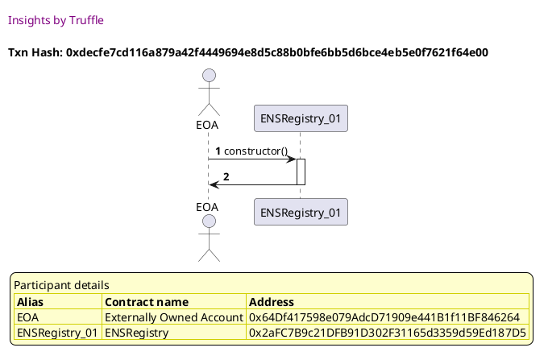

Tx: 0xcea15e1b890ed50ec3e79628ff8402af0d6d77dd856ba10f573e926f5233cdda

### diagram 2

[SVG :telescope:](https://www.planttext.com/api/plantuml/svg/RLBBRjim4BppAnREfKKQbDHRXcl4jYIafmHjxWLDBcKX56LGL6kdwR-NbWMZIQC3ISti3dTdISXjxxXrGwi9uOFhpD1kqPB-gJ5xRdaB6ciqSit5KssxmSXDfpiBLrLPbPkIa4NlZXgN1CPlXroYXT_JBy1TPvldpZYkLxgfJOl6UKNbBW6L9y-I-y7kDRuYlZVF22owO0zSoiRKmEW4_HdtnUUf23BT_zNqJRrpFMoFy6W7fRmkSOtJ28y70tUytys17WHo5YFRPZb56LCK8QPv4cHAPH4DkA8oaMagPHOdMyweYjCGyo1HSH26GafEl6N2-TBB-nNm7cP-dn5lcsj4i-U-rM9es-Ctx3lz4-qFoiQej-2Ca34JRfRla71zFGVHcTxPuNJPXu_adQ1JwbdZPWw4d8T67lufHQBZZUx9OXhTfwk25fJIvSiNyBFnXVd3nfjkVKzWU8idO2MbnTvpbxpbozYkNmyEhU5Q7-7-bq49Ao7y0t6UeeSaAbJ4qZZFaARvIeeYPJdDCOhOcYd6rbKM9K4IlHR-pwutq2YjmZGA6AEYo5bLPLKKntcLXq72GXwkop3Vb2fDHE6blGUJ4-JMh_wH_mK0)


Tx: 0xbd3fe2314a91533ee86393e3bc373055a4c64d60d50c81e1eb8ecc47c775eb0b

### diagram 3

[SVG :telescope:](https://www.planttext.com/api/plantuml/svg/tLNHRjme57tdAr3s9LMRBXW39if6dHdRsxvigwHINo9L6AudLZruX74taqp_VHdNYJBPgRIRbqhbmHTVu7BECHmZzAOFseTXrIAaXz2vOLM1H_sNngsrrolSmXASdMlpPUcxmTb5rtOU_rOMPR4e43hhmwQ5SuJ7TWtQWiTtqol6RplVt7Okw7RMDakt0XTYnJeyJ2ZZuFUIwy6lMzWRk6nk0TFq8VT1Mzku9QPaIdqRuzdl4mWqxV_EzStoElIusk2FVgZhM1U59hI0Fzuu_5RtrwUOt5IMrP0mccf5EMC0cM2A0QiCaunmhbCZKYk8vSHa52XK6HYJIYCbXufKA4fcGeHUl9zXtUEZ68zGb2qqfbdhIFK2leBluGAMJH-yzfy97ISUoEylBFwwd0OtzslsKqS8ZTlXa_F3vV3BbwUuXt0vLAwpyFvl1_xuobsXi-dRlPhY-VOF73Phm34wlHhZLzqEiRERliKcVWaVYU8j1jVFhFMnHsuINIxaN9c4vkLSqPoHf6IK2cuPuyfoLLYQoPpZuqV8Nnmewg7lsaZWeNBDP9fGIaokQ5bcPSgvAXLB16MQpGkc5aKjXSdnSJwiLfkBQVrK-mM-m-GrmNz-Ajx50t9Od9rgJmGT1UkUBrEr2T17_3krHngAMYfZosYMfPOmBIINEYDCAG4iiv3eD552rXMJ0DfecSX49PAIX6i5oM4wJr7_sanEJaxZ9Gg3T_XvNA9ZnFErOpCo8V-nJOWFWpnyedusqX-Vyz4c8Zo4lfiv-l38QIm4tRJz8xmvoMFT7TxesT5vOcTnVrllaS_kmJwiEz-EDXYVDm6yqssxmJlJiNXcJFnnX96LIFCwfPAh38XKCsjoIHLHaAPqJcjAvsMMYaIa-uKFsUY_i-C6L5cX64rC2YKLcHA2SrA9w4PS4baGcx2wPim-GRvljtk9_sTsMnG5dcH6R-8p_bd_0G00)


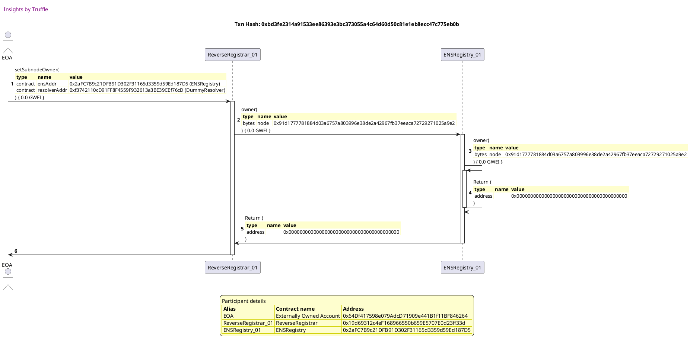

Tx: 0x4e249b2687dde5d0f92fd99b23b88cdc4ac1a913a3c5d0bf5127163f5e033b93

### diagram 4

[SVG :telescope:](https://www.planttext.com/api/plantuml/svg/nLHBJnin4BxxLrZqKaHfxVM-Z6X4deLBGO3K2nBoOnnMR9nerzicaFxtJZOX8aKSAf3gWyUU6NyUVvuPGaxgeAhGJ4f2L1Eclfbeg4XzN_YPgjI4bZ06RtlAt8-hQUDjVrfEA_fXD1mD-qD2ZkkmAA53Q3lkG5cewEDcI-dfj2eUfZweibiMOpy17n3HXQt328rho5bJpKhOCLmL3q1vlDLTA6iBFwQSRLI_MtdyPHC4sTn_vkjYV1TggXVqkcgSGrmIYb02lPvxUghgkoFAvZ54iTHHccVMGcAPav6p4ZL2vxcn9bQ6Ayc54WQjsYKyodWgN09C22q5GSfCmD27vrsgQhg7SeyWRQ4mnKpXKuVVhovXNDIXMjmollRPKUqHqfwYXvqN9dfmS4Hh25UDzbCBvxyyL1zl_0qvth3_QICxowyqB6P0KNerQULFLJQuMBalaOO0DLtI5GmADcTl77y3bqf3sI9RC2mtqcfjBSib0y4Ow8Ib4UvqP6FDJOpQD1DQ6wEJE18kqoApnaabpHCo_dG5zGfxkdftYvt60nVpB94vi4nshHbaN389SSnxt77U6-Ln6gNn6cEVFbBscT5lFuPdc2Wls7sDyLka_3svLancBiqYRY1c7B8aipoAXCemay1X0kOwSP9fpVCanKpKUUfin1BhNCQjYFyl8uU7H_GLppPjqNm9eQayVHjTxqZLFY7hfaKkdfMYXQ2AiduMuO0DC9LN4M9lmjB4HH-RJeKrlOsr-qJwzbndsPOxplC0bLTbkQ2hTB6qQmmsoF2F7xC3lDikTXGjRAH6_QmdJSG7evxa0y6YaU0yJQmGYRI975gUPuC4OV7z6nR82SxOuFy0)


Tx: 0xd2cc4ad70d2816e6983867f70f3e4301adcbdb6243162e4233d0f567bca73c36

### diagram 5

[SVG :telescope:](https://www.planttext.com/api/plantuml/svg/nLHBRnCn4BxxLrZb0eA2tu-gL4sQXFP2Arg92nBohiVfgfjDjEk5fYt_dSasLBIe9v3OWySx7d-U-UP1o66NGvlxHKr8wFEowHS5jAIxgffLQCE2rZ279ev3UJLlbtqJZvRrigKlPjFPz6XAo7wNrpKS43fybn0YjFHs-qlfyRAjRfPD3lMehkRD0fgCY2a_6Cpmy1vorRUh6XuTd5StGBbwq9s56AjcJZdRgduCSl_TrWcoVV-awQhvPUveiQONRPyIuf9SvHhenNL3ZqDtkKVPTHHbgKAqB0h73HZlf3CsMPOaACbuY6KH2oEKv4Q04b96bhInHHciBAKXI5cPqVNfwOY6ZkwWt258MwxAQXKmrEd7yqymhxhShhyoVc_pIBL3o72BxXxySKHVlzwZ7UJplcYM4Kw_Dz2-_D9y8VjRzjzivS7TUvhNAw0ecx0OvBTGzxZPcDyX3HawUaStC2ZOTM3U9cC5Bq4n3bRRo8MGmHgP82bVk48dpug2EumtniAP50NJCINBerHFWUjGG3qWWmQkbBE5TSdf5881xfW3vuKoPSA7yBgJN2kNaW23ZaZ7edUn49gfy0iPCzr2jy5URk8UiBcFnaikIWKpRfmtHcjM6EsdsZ8xnJJAb319znYlw2rbRndzy7bwWeNo1xlFCVuLAV-NN7iUkSNFSUTKP38Of3iu9hqt85q44PJmM7U5j001QqjOuONbJEZWGVnVHdPtz-WpbaFPul4do7tRqB-ZwnzIzOgG-w55pdvhnGWvL7NtcuSJDc6CRJp4sOIjYPiZ73ejzlI3hwDVf3_SExWRsXtNwmnj4-fwJJVb4kceB750vY4IeoP9SQkz0sRzA9OJoptpe1GVyyJvUEQK4KOz0NuyBXuf1bWHPaTsx4l19xEnvnF9n4noRdIKKlk8UO_SsOb6M8n_om8vn1K7_4y0)


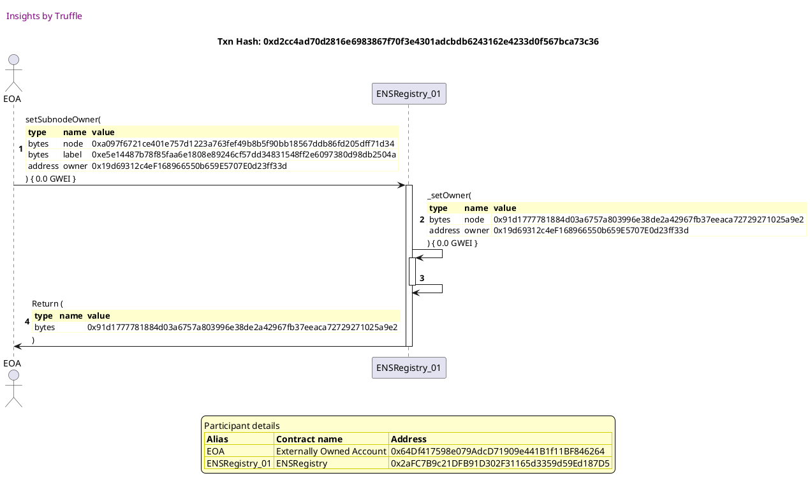


## allows an account to claim its address
[link to test...](http://github.com/ensdomains/ens/blob/f5c6357c01b907c17cff63a76f7760ed88775bab/test/TestReverseRegistrar.js#L27)

Tx: 0xbe178927ef46375dc3d840b5a67e533124d7664d16e29ef688ad502fce82e45f

### diagram 1

[SVG :telescope:](https://www.planttext.com/api/plantuml/svg/PLBBRjim4BppAnR9fKKQb9Ieb-4QaLz8BqtGv5vGv4ecGbC6HQ5salvxQLamwaO7KfpP7UxEaf2xpWld-wqXHFI-jVssGaUw5srtmeaj66pGghcGBurhUwiMhMaTNAzNwzLYHSYqymU3CmB3jq6XqC7RU0IuRvr-RQqNfZIwiLkqFYZM_Xom3kH9SjUxdS4Buac_8Z1-nXw5KjesmEW8_HdswTUn23BU_zrskjdu3ge3FBk-heCkyTeRXEUzXNlHRIP0znMoB2-Y36kUnbcYPAnoJgj4f1acSSmYhh8qvOgb61LOftakL4AZMc8U8Kzg4YoJFfI-UYX1T70LzYiIRFDQwfq8hQv-FFt4HdVU7NvHTegvWAu86RBWTlQ1WfkR2SZMXdD_lERJP_8XP4WRycydGCXfMEJndn8KUg5DHwRZoBvSB-cIKZfx_mPX9g6ayBC8PhlG2rYnnIDGAkMm2zmvR_O-j1dMlKTdXJ47UFXjKK4fPNWOFb1qd_9bpLcM53dIh2YLN6Qie0LopkQiPco-pdaQfVm_uKkRBe2JR1oZokEShSiuOPGMaXPfpF8m61Q9BAbacPHLVPGD_OykaBkmXeVz5m00)


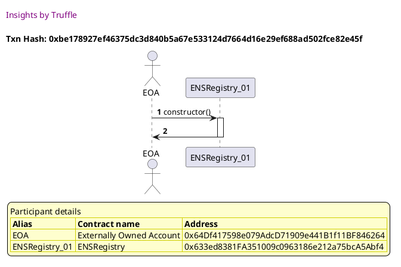

Tx: 0x97063120f401d9b92b15bd336ead842307a2d4341bc3b41bef7822099c000cac

### diagram 2

[SVG :telescope:](https://www.planttext.com/api/plantuml/svg/RLB1Rjim3BthAuZqig4h9jcARGLPK2Tnq9rQRBqFiYGdHcKvaEKjwRf_7-COmTfL1qfw99_8Hn5osmNfGzzOGcGVMjStfV6aUwhTNdhPW3LRu_HIggUjRtkdLwrjFLnjYasnAWYPT-5epOB0i7P6QkFXztW5k6jz_Tow86rkwwrhZ0l8M8LBm0QTPyfzx_VMl79yhvyDC7x17gJMjTi2eoFqPzZddySYoFZ-LzVLsrtee3p2e--h2db9g8Cry7XmS2UxtGpeGQGqYLb4AqwP5gM8IZOjTHmdo9BnAAQfZ3IFEIjLNA8rLPf54HL2KKgLL0GbKm5BB-vpa1rCS9yGb2tKgjvBR7NTDytnc-bQ-zFu7vGDKM_12I539jmitd72zVKCLEkwuFlJOny-adU2JgbdZfiP478U6ddufnHjWgnjH-RZw3vThUaQ-rYyV06S3HQ6XnMAxh4dSB8n9o3NsfiEVPUynSlGBjf3CDv9Quzm_yiP3RbI-442kkWXuUkAitGgCaDJaMkrJfcWmd3EbgnYRBd9U18b_3NnVtAzWGRgsB2YI5CsHKOPPpHFyumBcOjOwpIcAqNbfgXKWTIemQW4kKMBd_ml)


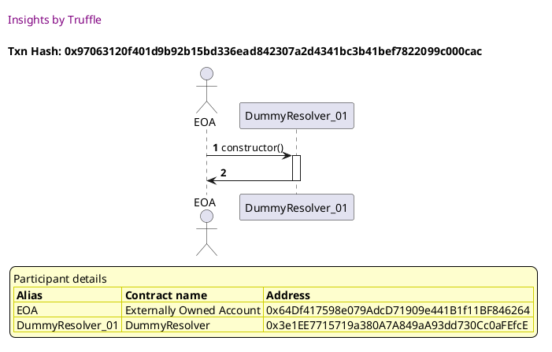

Tx: 0xc6f82617588b5c0d4a826081e1a5db5ca1fd08051ab97ccd1ebc6b18b17485e0

### diagram 3

[SVG :telescope:](https://www.planttext.com/api/plantuml/svg/tLNHRjme57tdAr3waghDBjZOG9IDwcGysxmqLLAfBvKg3DSJgnuymhYRQQV_tZkE4sNIgRJRbvNAWo--mFKvnt0Wv5KVJOZ3iYN43B7pmxA2GFfFZL-PO9QqXGLuTsRifqNe1k_EkxOBzDcyd9Vd9I4dVLotS4hes6x0E0Zqw_HAwUikD5yw7qrRjCt2By57h5Z7Xmbp7BmhkHh2geMTWUlc2r0k7d9lZNEDNr3EfjItCPxyEO4Wq_SlVDyiRc9FgpLz5uQwnheaDh45-kxMqzUclpccxDRcjKfoBZEbgimo9mo-CiM1cynXnl3QCSKoRYejhNKSAfjNN5LS2fK18oYPZGYzl2oewUa1nWE2iiN6DYk3LA_WCuGUhc3Hz36Oy97nSUAU_Ex2yitrDBY-NxEREY1a_1mzEjrVZhvuSKnxYDT3vJi7b_zu28SV_0ToClsxbrCytVn5ute55ACtop5-Dks0dUtq3RNu9m8IfHiAlY-S2zXZjtcQWbEfulCYpJXZsZATfrpbaF34oAooHLPKjQ27Zv0_trCqGD-rIE2XSWgyBANacUJQf8eLib12cqAdpicKdLjcvcLjIteu6vRBzTMqVghzd7wbx0z6_tvVNk06sI_ELhKdWew2TRykKxMEq2F-hTeZ3SqTbzWKLqeubffSPj8ebcgTGweS94OaEfTrbKe0OurCPA8JoLcI6Gt9VZfFKV_UJ8wEZl4GnI5u-cjSq35mVstPZ4pOlsmJulqWz--e_nlfp_VvQ1C8Zv0xCoTl7pcDWsYQjd-4TyPcM7UB5pqRdGSxv_UdzHvvSG_sOTtfPhH1VDv62DwqxPfkJSVHmbgyEEATQOXPBT1njG8cTU7i3Cyuqo04F-CrvsTp9V8a5xk5zzdeZzaxsSGigp8jTPtdPr9N9XTYpXal6IYTiahKR3kOF46-QxSxYVzcTXk20ayoarVun9lrEm00)


Tx: 0xe28ebc2b7a2d47cf0c9fb6621d58c56d22558e88094f3dd428971ec565556cf8

### diagram 4

[SVG :telescope:](https://www.planttext.com/api/plantuml/svg/nLHDJnin4BtxLrZqKaHfRUzwxKKq8f2aS2a8a7f1GluOXnKRRxJhRHD8_tkTJOX84OSAfFhWiMV6p-FdcK7eg0cg3ksaH4YreVBjH4EDcll2JrMj9hY4CNXxhCpzkAvQRq-gighnXz5mD3mP8dJOX7a9FOIxSGVAGeqVrrkCJwkwUAXyK6M_BCP-0Zv4H1Ss3gDeN45EstfQmfRXgdW0JDEDxa9PM_WnfcIj-jt9mo_h8D3w_ZFV5EExq60znzTrwrp4HQ489U3hcSUdghaxm6G6J88sJ0l5R2gC8oPtEiiOjLmQdbd6E9SW9SbJbrYRCfaB2j72ES-CaoXIPa8CVNZUnwh1Er7ke4XRA4mnLV6fm-zNbp0kcb3FRmbT-MofTX3gJk7ztWiJtjixm0s4grRxoiBvBm_rnnj_WmxNx7zQozxYAmxpAU0elPfqygSgsxXOkYyY3G4QlC1Bc2Z8ZBnn_0rSAWrbXsp146bogxMrHEO44a90SvAnkDEHPqrD6hMPIBGsHlEK9KxeH5ZZSfMR9-JuqpKqI-ng-UuEEqi7BgM2vnA8oFlM30JDIGvfIe-fe_Hu9DECPUaAOnS_OlAPu6y_XcSnKLwm-nhZjv7oz-HQaLouJ31g82KK11UMCfOeaIKEN9fhgRdBYTPKyanOgsNcB2FSEYUeJTB_oyZ-_W5-nRDBssY-XD3M7h-DhdUaQXUXLTD25yzAqK9GHTayYt101Z6Lbn76tXHBCovEOjEfOqrlOkq_aRuvrrjqvHxdMO3QgxASusMwMDmt9ZR8y8yVimMytIws52lO904h4qb7_OHJGd93yYoXCWD6cH9ScpxlQxU4ZUzViu2EuXmR_1y0)


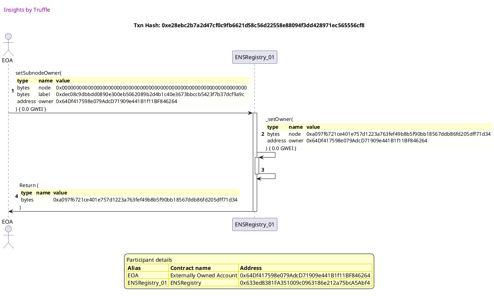

Tx: 0x8c22cbf907cbfe674383eca3445fe2c45f7b0163172b010ffdb0ce4170e29a46

### diagram 5

[SVG :telescope:](https://www.planttext.com/api/plantuml/svg/nLHBRnGv4BxxLrZP2uZDRldHVaGXOfAP0IuB8aXxGK9skpnfqTCpwdP31hB_VMjwXeY0E2tI-b3bhYf_hlhQLOmz6qheoxXk6GjZsNJZEcBFXWzDjmrzMFCMLzYbor1_MFMRiKjNctRJyz-MY-NYQi7O-L1sBLumFgqR30bx_kNuoVcBJTzytdGbjBEsMNLhx0eXvd8Vi2Jd0N8xzjiM7pYkcy_8XRwtlGufDTsA2pYQ_fdq-P_79DZn_fVTqAnkoi3ZZh_jnvm9bvMcjCZVtdRyHHXkpZZSkbhAEcOFbYGQgvLJM0UbTPLHrYHj166Ki98qv9mYrAY51PG-QCE8ihfGwejNCnu6VaBwX15jfQcRRQ1I5tzTly5LCvH-znx48UQ1wOInwHG_lVZ1nPyyEUC3bkinTfk4hpvrs3zwrxrZvqVsVp_gYxkdlEoso4btOJtfZw4TQRCFloCQ2WxyZkzXIC5j06-piL9GEI3GLZO9ALMmHcNCsaSNA-8bHk4gOrEApkGaeKevMv6K_Xwu3H7R2Hah55ex6wtBhieX61GE73eljQapNKJ7dHALTZbBD9I8Sf2yIr5MeCDNPFhJFGvxxCs-xWaRzBoAbRS-6tDfVGn6wwK0iG22Ln1rXhrJ7Z0UyoyS_W3-_E_5IteeFx3xCyRV4-M_acilah2qd71E9r314Dt1WVBUe789PT3I6vkZieYX3bPQwQKL8AlWKVw_Z9oUdl6VH4xFbjnli8nzn_yRNR-GgiUC7OOMU_rDAoOieMc7RpASmnm0zXdIRABMfCqL3PsUUle-rzbNqk_FNTnDxKxojc3VXRRTyVrpINnMrpGWorI9qVDCWwBo3i7wMQhdLdZmgBMu55c8owNJHXhz7V33SV70S81L2fDJJYndgX80lWPFyyaPb486MyLwLirYtiDI_KSMs3EIDE3_1G00)


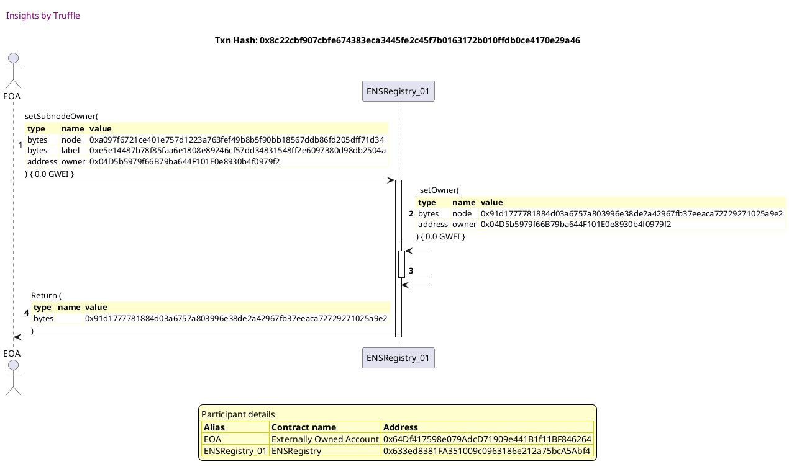

Tx: 0x7f6fab59d8b87c3397b4c05d5a5607f72e4441589152750171db74c4acf1d13d

### diagram 6

[SVG :telescope:](https://www.planttext.com/api/plantuml/svg/xLTRRzis57xNho3IbmrTDjulGHRKrwKlJP4Kw4k1WfSZMwWi6nBTngtttqV9IX1d7hQqsTA7yK6a3ycZxto7FFgSPI-QQEkuNfHPPjTnMQqN3kgi-L1KArlR1IfX1bKOMlzXLY_NLHWjosMDdaqdqybeacMdJToKS9QXhit11gZHb_udGkVBklYyhA8j1sKngnPGnUGnZxSBfcbovtArhbSbx4rS5Py14NvhUsr3AAeP8hWt_Txrfx_q8BB-_I-hffZDOuFS1hsfrtcU_6QnY2MWDzSLEhVD_0JXQvNBt3fXWdPQUSQCSjnZ4OGL4gjSKU2S4w4D4LG9J1G9Jd7FhSz982naYJ8V4_J9nG3P1Xsb_YXBjCN25okRGhs4Zr0tS0cpeecrhTzZqYqyOD_VE7brrKzkRlRicuwoh7iTEZuxx0uzVtw2V6cBnG_lgdVPQP-nd_h-RFihYfiLeDHNTj7r7ssvJeDs-HObgcje6hH5oqzLudJR4YR7HaafHceenfmRnhKo1eHHbiaHDvnnGeB1Eny_eYy8_upHRsydBrEc3gFyU_XlYpY_X6PPfaLF5SfT7tMFfNE3_s5xB4QQkMNdS3tOeVbMEjfH5uRauvmJ9Om6hCmW-B4Y1fjq_icGv8GCfvfBAla3mxXtPBi8kXHy7N2tYT32hfO1EjWWE0sIQAeDSyoOT9qrU60OMt0-TvmhIhqY4bklWlM6Q-SD8TZYTA-PFHpEVTH_cP3ZuvDqm-Ewhj2tPk9h3jC3YMyWNgrTozt58wR0f4geKjD4Qnumir89PJLkim5C1w2MKoDLxfW2iDugggYXYc0gh05wtt5f7PITPy6rv88mfuWAe0bnEgMPK6u0H79eSiCbu41bIcdAEp1bARKCSsQm8lhVAsI73iWXnjydoY--k-F-L8oqj-M_l5mtz3rcfNXeoVu_Y2S8OYUBlalGsKvDPw_lIBq0qHPbSmVX68zJbMyH9j6Sf5yQZ98QhfFOlCKwkBd3j_lEjfqEJS_h27LbotA3skeJqC3xfDpZ0x_qTnqVqh5_jku-OdmiagPM9fTog8opalCfmMI28P677SznEqdl8T_Nktk67Mx686YcoNJ01C7OU6ma8re29TGguVn035pUuau4zpHdBz8p_RNv0m00)


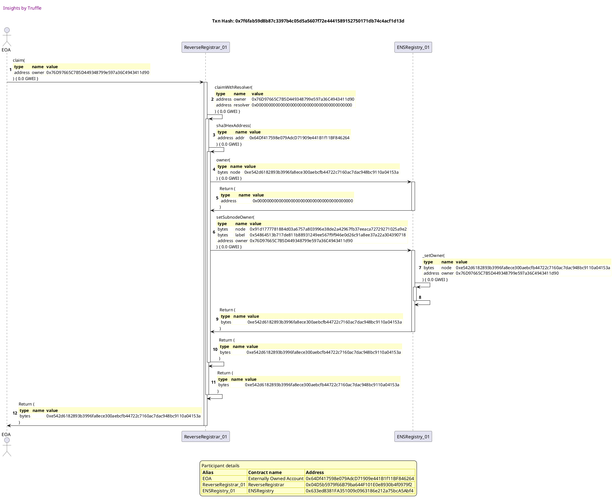


## allows an account to specify resolver
[link to test...](http://github.com/ensdomains/ens/blob/f5c6357c01b907c17cff63a76f7760ed88775bab/test/TestReverseRegistrar.js#L32)

Tx: 0x0b35e6349eddbe244a803f800e74985e9702a1932b9882ad67c702bc43f42431

### diagram 1

[SVG :telescope:](https://www.planttext.com/api/plantuml/svg/PL9HRvim47xthx3IbqrTDHiCc2YBIa9Gzx9MQzydWmzYbPZ862rfk_--Aq7Hil9Wu--x-tptdGcvxRroVjYrXAZ1TtRObU18_spiNZcreoqqOFLALS-DwmQhrrtRENfLR8hDUaF8elV75fQ4ZjyMb0P7NwSZfNUTCo-TzQhDMjFO7LYFYhK_1nH8dYJtWzktS44ycXUWN9on1wMriGtbR8B-ZFlYwrG4cUx_RdlJR7rFooDzSaDTeoxnnhT0dmwMtgb-EwVimCemWZWKAMXTGY24aYoi9MEGY5H6a2OiK3mDWpALCb0wJYf4oag4jGX4o0bQLdaiVNEVKTNJ6UupWhPvKvczmbOtFnv_GcDwxuw_63_5N40pGiOiUhFyGD7hwpcjEelduVsQJv_9Xv0nRSo_cLD2JiCY3_-KeC4hq_PaCOtiorNESiROykqRnPbWIVYpHhCTzaAjsi4xa6dje4VkdBTy6zl4zU31MTMsHth_suAcMLNXm_18iKCiybhm94ebi2JDT9KdF6Kf2C5NlEPyLKWH1x7uJ_ZIfWjWb1KbIrIOI1OKMkgWM4Sib54UAPL9cKLCX35dgSvH5lkVN22tkEB3_Wi0)


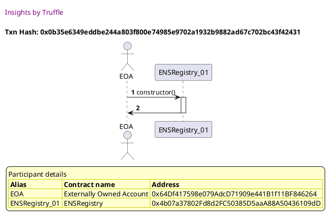

Tx: 0x5a2998b3c445ab23829d8dde490ea079cc52c9466971557cea199ec6ff7615fd

### diagram 2

[SVG :telescope:](https://www.planttext.com/api/plantuml/svg/RLBBRjim4BppAmZdqY8DIihKWuPhHBPifAS4RUu5HQvi8HHbK5Hhf-c_ToqBHfD61vAQsHtkpfAGsoue7_h64gBwqBg-AS6JxgbsU-LLGorimPcbqazRt_REh5hRUdgrMM_MgpKXyouSBIm87RuTA0EU_Xv_ARrhVVtSkg1iRkkjQy05LAp29M23v5bot_kzXLV4z_ePA1SNx44PKxijvMo4_Wpx_FDO11dl_-gwUhiB7IsFzD7tLOMw9DJ10dqyE7gdkjsCiaEi8YcpSgg5Y5KPJRD8cimO49A1OgdKEewq54aYKnx7gGR5fGITL5MQyBWo12tJ0KjVt-TKTNI2-uIWRQ7MzLvXgqNVDCTlqBNs9_WVZ0zHRy498KCclLcyGzBhwndLhUk2xq-NVVX8tWawfPurRcQKaFFGoCC_fHW8ghOTcO-Z-tHLi88njdZvGd4sM1WULcYwnvweKmsSWDmO3nrobxp5oz0kheS0tYbhZ_J-bmD3SwtnWGIas24HHILu6iiCqCZSw2BbaaaGWYzvnVboauaaIiHhuV_iUWCDqX5ZKyPNQyatgcGnoqKSnR2KQOQ8p6EHi2BAL8RIwC7e1Bd55H_vNm00)


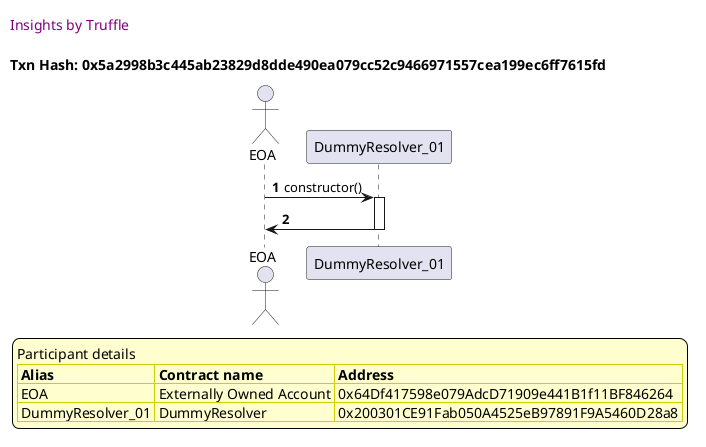

Tx: 0x5c5d0ae370ab2019de8147425f4e950d7584e0a6c19126e190f00e0f9897f247

### diagram 3

[SVG :telescope:](https://www.planttext.com/api/plantuml/svg/tLNHRjGu57ttLrZbfOWjN3jsR5Ub8ft9BBm0Qf7s1GavySqq8fEC78VjmEo_umbfrIcp4l22X1zYvzg-FkVa-eIG5tsmFWohXX0xXAuTLWLwqd-isxNrTaKRN6BhBcpvSUcxeNMphkayVRJ85_ai9-Ii3vi6pmaTspLQXvv-cLufVTdv-dFN1jjaJRriLzY6cB4ATmiMSV9RolNWrmtkJLpLdv4oSHTxQvshsoLbC8N-6_kpPnC8Cft_gkthvNNeQR6Xx_nGLJ4l2NLeaBwxQUbBsr-VKhYHfNHWCL5W2mxCEDHCAC5b9T18S4fgWM3JaXd6KsG6AW24ocYZAYuKYPAL8KBFtsJKzlGezaSaoXRgibxRIFKIFw7lyHANTH-yzH-0ZGiFnFStvg-lfidDxPxzq14Xut7qvFnmElhaoIdjCLmDHTivVFDlY_xuVVkUd4tVxg-fFzy-fs6pHXhxrgx6_fDjXZZOBT_ICdu97udIBSMspvppSGGteW1b4wM1BvnsV36Ja6WvbzPcMcSIH98oC6vEZ-yXVtmWgSU-QoA1kymS804somrRs08aP49oYHT6wHWncHGfpBcscXxFXzLgSpdjdt8_fbyeF0Nwzp_vgrWWXyNPgVP0q56mxjTbAZO1-uX_f_P8mp37L6oQQIqS93PLKbaDYJ4f9jeXjuARL5L5eX1jQHLNt735W4jha1-cyn3rdytavEGqNg8m-9R-6fVe6B6-Tcn69l23RK9y6EJXYlhTIF-_paURYF08-MRcvEqzft4ORDtqz_3EOHxpxl16puxE4mUpszjwYpox1Nktxtmxsc1ytWJqhMsQ3TsPZgDPMSOVHnXPfM9U2QQaqGZAPAwSgsYh1eLW5wnYx6AXHSfJiP_ua8r-7nqFaCoaCX56SndhbQi2JCcvCfendUleKHR0v60U8D-tsxt0pvdTbaI19vd9Y_YCVzQl)


Tx: 0x7a308a6b7136e370193be760f54225e7a834339fa0a504a9d9ecc0bb30affdea

### diagram 4

[SVG :telescope:](https://www.planttext.com/api/plantuml/svg/nLHHJzim47xthx3Oon1Zi-CaZX6hABGTl0m4I7j1GdPyBX6fKoNEraBtttTDIqM7U9X0cXzyzldyvVpbxYFag0cw3ksa94IteVBjn41Dcll2JtMj9xI4CNXxhFFxSLsrtfvKPLNJ3wFXQ7Wo9EIm2VCIUeHsumwqXPe-hhUKdbPryL3veCj-MOpz17n0H1Ss0ICyN45EstfQmjR1LV40bCSRtuMsjl1ZojdQzRkpXr_MIP3rzyzyKuplGaFDd5xNhNE8Iq8HIg3NCqzFTNDtGDbCQi4odHh9HGf2Cgw40PaobyHHb83KcOY5K4updR1OAwiWpvanWcddB6Y2bEK1Kn-Uzwbkw0xQ7OAqXI8lfXgVEln-TGdZeWdr_9RnLSoMQuUGxXRTxxquedjx1xI1SDKQNrau_-MX_dZZRyZXclrFQzjRVALXFWMArkj9Pt_giiN5Cdo1D0Hew88kOT2m6NlZ-1kur0RA3jb2ph9SMMEiPPbY81W3ax0qmfs9R6nu7gCtbSAOF3T8jN3I26bpfxJAdv3nJzVGBB6hvRixx3GUk9ZBH6N0fEhRV22vOWhYc1zpn_dnA8lJA8rN6BlqaRBFZ7xxCJp3Gdd1xckCtoBbxycrPagwL4OyXvXna8cqF8g4bgbmu69bCfCuXMN5ioILrfeiTJPYYNLESYlY_yl8_lu1VIMoAriyleJGrfw-ZQvtf6gNa9LeaOjdhMWXwA9idcKuO0CivMM6g4tOchWuGT6fiQStkVQVID_SwoswTiTv5g3skYpdT5akblRp70Ko_EEFsGBUbeijHmSR6uQY9JCMZMncez59maIM31Aj-rdMHv4IAMVA3X0MtxzcWHpXZ0B_1m00)


Tx: 0xec9cc29b80467a68a8999ce77a9d1ff54a6f13aaea51109744c6ea5422b423fb

### diagram 5

[SVG :telescope:](https://www.planttext.com/api/plantuml/svg/nLHDRnCn4BtxLrZb0eA2xVLdLIhI9W4kW6WbBfNGx7gShjXiebqlD53-EvDjg6XHJrJ21uyzCtwUUVOCOw_w35qUbWrZCEHLEonBx5Z_fMxNqC6IDxZ0DXv3zMNHhOOsdgoQLSSVpMVpsScCiSC-RneyOdmS5mWHE_vZj-NypQghlw_Q3CsagHVj4jjCY2dVECp9U0sv7hfrWxSCf_Ltv5BVw3v0Z7Mxu5BiL3z7UVXY5mJRtV-sxUl5HUvvkU5dtP0IuR9SvmRvsMNBtq1_SS359LQXgbGelT3MWVNWGmWLEWSXofIC1fja0O1Wf1J1QLrPMckbIgsAL3AYhCeK-kpzX4FFzqZkCQ8jrrMz1afrzkxq8oxgFdURpq9U-znIxJ4sdkBxHt-P-DEd1xp7V3gKxIhY-syjTe_FstDsk6F_sKuUNRtaURD6JhA5vIY_GZFGOkj-HJHaxFaLtyAG49T0sIJhbAnG2udEk2YLAi3P8c7IH4bfKX1bARsnBiRIsnILC34b9sEXxm8tK68p8gD1gRLtfVF9cmHWKNhXqGUbRPNe8Zhk2scqJqcXfK0ABsBmiLH6QFYDJ2_TOR_5Nctp7h6D3DOKEdXbdFFAbI9KIhdWfVGpVs84215c8bnZFE4_k7Wk-EjFixVqKVvYzpx6FnFb3ybra54w6bvwhwCem1BTu4KHWiN2HrIWLR0kbOL3X0gSSYee9uKo453zNqRszm_uFPxZjoNpHyn3r_9_e-i1gNh2s7NJOX_-ACM86Ugc_oF2gPWA8ROHKc-YqgJ52JMTZchw9jR9Rz9lpXrTZULEysN6heMcsV3jTubyKbNK8FEOYTNJfAKpmQDmOHAhgPD11DHQ7iiavV7SQwkilWDykrtSKeomkXGE2kU5caSVrPnUkF1cQW0cta-eVWfBZIfE2PRotx70Nj5C3VuN)


Tx: 0x929693d42bb57a279ddf7097c870b9a2679ae4fecc4233bb2d97b1dd131b5d0f

### diagram 6

[SVG :telescope:](https://www.planttext.com/api/plantuml/svg/xLXTRzis57tNho2obmrTDdwAP905zUVIbwL82lIbG46ALxPGMGeagejRxx_lMd62EFMAkccteAiUH9cY3iyzb_UIrqdoj8skYTsYJ1BNnRhg5XwQf7rJL9UkSGjImWogC7JPcrbJTrKOrMNTa1-ca-baD4cIupOkIpX9I7_DmGLeoFlDJq9EwwPuLrVHbOEoc5KBg28Yvl5sm1HVNaDUTirb2LilBeftG9YyxNlkGYYg6M5qq_LNtnx_kY6HREP_LhN5R1vRufVaHTFbEU8ciOWba1TN5JbrxVo8q2lBRMf5aDnxfHtNDeHSKwipewctZgVQEf0vP9daGdZFWzMUXS04yohGF479ieZK9sS3ubfoWEr1WhB58Yik7Pfw3c-XQU4SPaKR6zUyfgmVkAD_-yF97nURbykRRxQx3fAaduuSdko68q-U796iTCNYPH7dvz3M9GxwyLNrAZdUUE_dJNko-et4vIKGR2ktwDkthkpmOJryHL3s1jgMh4ZzPuNwhb0ydOwjJbCrqaCrbj8AQRIreAns8Xr9AuLaB5Zw8KQpuTB3k8bH0OPiQCOX4yFfK0FAwqPgb39Z11SZWyuH-Xhc9_AUq5ye-Vtbv1awVxVX7rMadJjn2bU3QpOFbMFzr9kHod4kcLRM0DLs4BAnPfPQa98DMSxOS6faobEvfndtVDvRqBlWyuZxPOGrxQeEqDC69Nb0eRcnmWjhqzmPo41Gwi1dkPTISvvfbbANwU0oAutFB6FKKScKSBlDkS_w7nroU7Y48HAxfY8FzKHl3lt4QqDxJ-6R1yNGT-qVedqByQBpQ-tElk3ojommZPV1L2C35IxLk14OklO621E0EubxXCwzq00kSvfhRhbcb2jdWTy7Bfs7iaTMqgHICU4rqm4COzwWcncN5a0XeCsjJ846dg9BqUyWS0FYJb0fBDNCV2ppAcPJ9QGrN25rhZsr6SVT2sSn4pDIk42edL3xwGjab-AlKVApHvTg_Yj5rj7oRmRNZNnVCbFi7tBdZp7ZVQMZn5w-_PwzFZjxxNTk_3zahw-lo3UUlRwD5DmNSu-IT7Bz7q3o_4w16Y2wecplC1pJCHxlrWonrCU25Hz6MCCtM2BVSXtSBF_RxqvMVVMCzwi8JUNASadMWHl88Clg3cVQhxow2xoh-lwmTyyJn1RpxIfzgwE7bPvY46j3-JIOmAS898mQA-S6nWmKvikKKHl628i2RsHEdkAzMvH_0m00)


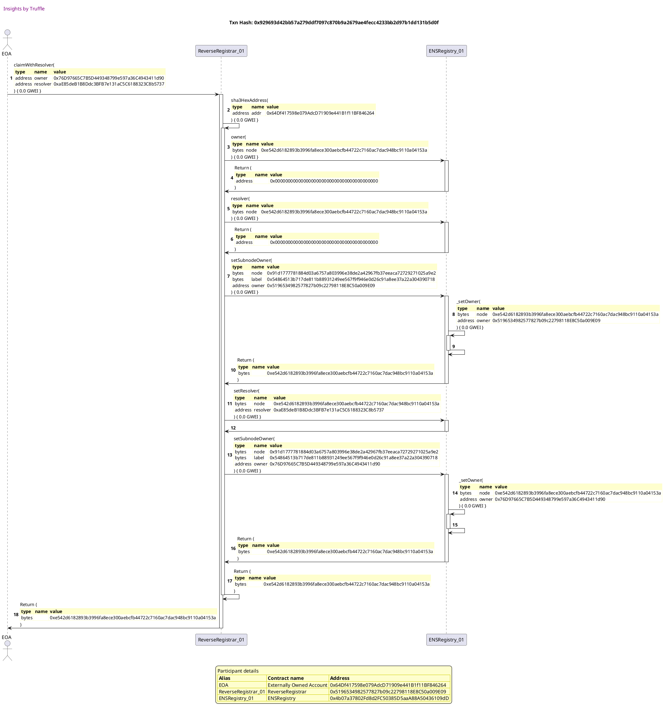


## does not overwrite resolver if not specified
[link to test...](http://github.com/ensdomains/ens/blob/f5c6357c01b907c17cff63a76f7760ed88775bab/test/TestReverseRegistrar.js#L38)

Tx: 0x72c353b4cc435a1aa341143d69d888d8a34f024346dca60fb8f885d13a8d4163

### diagram 1

[SVG :telescope:](https://www.planttext.com/api/plantuml/svg/PL9TRziW57tdLrobBvkwQc1Z6qTPLETBtSjQhNsVC607rS4HnbhITlzzjuuLBIiFm3tdtiFzW93RBaWV-br3YEn3w_fTQJpfdgtRIoztq9ZQEBsGwhdsRU_qicrQ3rURzMQzN1CowyAnCNC2mzeQgOs7rz44k6kzVMbTa4tHsDhjZ0keM8MpmmR9a-I-z_l6N12FziK0usViGMfjNGsCZj2VuPnz7PCWu_lVNMVhRUYWFCAJxwiATKcmeJ7mT71m9xlj5EWXYrISn2LNYiU9P5B6d34UwpJNGWWjqAven6EUQYLJMfMY4YBHB9P2SvR615kc0gQ-lYz0TZ31SqAmRS4gkvTOwlh7uqzJsoxuuo_AJZuNq8IG8GfkvXyekBwUWceTsltxCvy-amykGzWGVpC5Gax38W__fA1DaBRfo6mSsPUh5LrHIkTltm1dWYdXPOdDzbWBEBapxq2XjJSTSkUu-TjG9kw7OBoJJNE4-z_EQ2YKmeyHaAA7bAygph8a5uPcUQ7LAcCvpGtdRC4gnXORmTCevVy9NxRf0XXairI8I6iHiuYN8a-BJPmKKPHboKfgohN9eb9olK1Ph7_i0hd57J_sNm00)


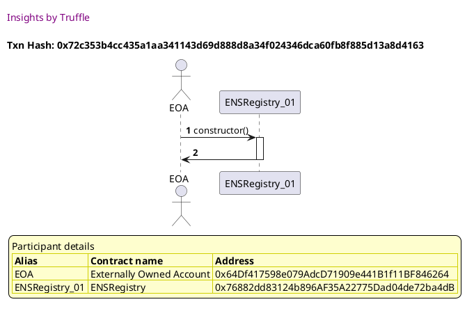

Tx: 0x2a9245e2ed2618bdde4d6ee220eee9c5e84c3973d1085249b219165221050b79

### diagram 2

[SVG :telescope:](https://www.planttext.com/api/plantuml/svg/RL9DRzim3BthLn3fPKDRJ5Bb3mLPK2UEqPrQTBqFYaKdHcKvaEKjwRh_FiKnWhMh3gB4HpwHZoBajlFA-RunXAZUjxPlrkX8zrpRdNAg0OCRj7gXokUDQtkhbwrf7LmKgsArN14ow_p1u9p0iBQeD3huFLu1xbfNlxJMAvEPUcCRj3umLluSK0JmHBdhtSxW6-1x_OB0nDdteBIkxGOO7Lr_1ZlxCXP1nlU_sQxUR7q7wmCykRwg0Y_njJS8JtiBTwhRJe7kkP9SHCXHyvYbQwrHw1YHSug8iemm5UMDJ6uqesd4XLnp9baSSSveHDU9946oqeVIL_SPg0ucmKv8aCtNPRrJeTMyRvh38tQj-Odk1sL3r7ldX90X4wxd7u1mUJc5ihMTT_tniK-VoGT1nzGJn_KK23aDZJpyKuf6hshJaTaukgkBdEQKqldhLmYp2OM5mpA8xa9FO5M3HqUcjSCkOEUy-UlGRjZt7frLnXpW_fT53LbPXW_Y0qJtiSWhmP98faWJcUaoJvYa4eLW2rOnjYXI4VDOl2N-Jwvthe5QYgIG2QzomOj4BJbT9XLb8eqNCXYMKHaNCS-Fr463KGbo6_RmoVy2)


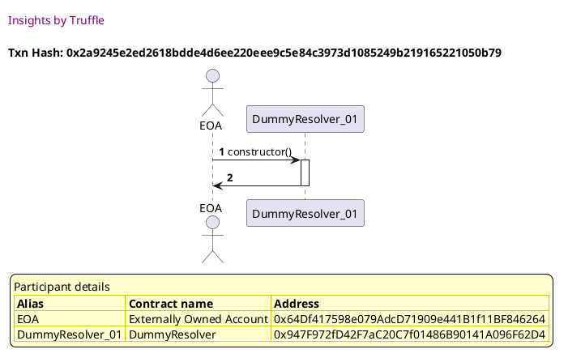

Tx: 0xa3e96231d6cbb8ed39cf48e8aff4bb0d70b146d7c49f25416ff24ed7a55bb31f

### diagram 3

[SVG :telescope:](https://www.planttext.com/api/plantuml/svg/tLNHRjCm57ttLrZZPHCCRCUnusbCIvi6ziBGXiJB9EJ4Drr4wbIE0okKVyVDicaTHOAz8E67NEVQlZxdn3v1wBJpslb-qI2aUz_QVb60GztdsYwrqmlSm1oicUZoyzorlJNJjcaTVfRFyjbqXj1nvrSDd20yj6lG1Xp-FhvY_BPrzRVMUjsaJJst2x0-LApy_OGy3DwMNFPksS3Mm6Nz3J3bzxdtsfZQpZ4bO-h748zVZI3GkF-PxUhvjUzmiS8VN5zLeIxojMy0VxYn-AtkheymkT4HAC4YQaHP50cOI9KLJo3HLSMBWXX92ig5aILN5Oiv5LN5E1YfuxWe8bgX85df0_JPUOfrX_T2t4D1Db-NzL87gXVm1Lm75p2lE--q-qJeC757VdlXxDtbEBYwMxETsaDes0uVdkmkXvy_Fy8T-Ck-iAs1ywyMtFwLlKB7uxTxCSQJzMliLql08Lgz6E8NtVIXivc-ncNu4YuGnMiCjakDSQ57RgH84cPC4b76YqI9D8_Yb34fuqmRmWr8LcXk9dZ_0VA37KKTT6qJ2DnNLbpcIh8guooNUih8L5Q4yaHCL0Wq9KhaWcKSxsVzOh6w6DUFjG_mTqnU4lpcu-mi793TucnKUoJe85ZxT9cAbOSkuD-eVKk36Yf3IsYIS4CYBMGiTK8YfGH4YG6cELD2LaKa0NIf9PDCCKa9YxK2jflEOzJ_DvF3mwDmYNplB7uQb-0OuNnjs0nCo1-s4V5kaBjFrBz6-ljpFjX4W8VGhPcZzm-Sne3NTTCzm9kHBDJTu0sU7PmdTAPtj_KEUNe7zdxToNgmmV2yyU2iRfeLtfYEmMbPXX-77rW9dbMSobWbGAHAJPb9geW2pkc4LfHEyeGB9lXsuLqs-cjss22OER0u0rM8dBA8H3D39zB4H5Iod99i9epIF5MFa6_RxLRYxynkZOB0eypeD3p3d_Kd)


Tx: 0x955840b3052242762c6056239b62e8024ee7aae0ea9a26d504c4642fa03818e4

### diagram 4

[SVG :telescope:](https://www.planttext.com/api/plantuml/svg/nLHDJnin4BtxLrZqKaHfRQ_NzY8Q4KXIk1G4IBqW8N_CXXKRRxJhRHD8_tkTJOX84OSAfFhWiMV6p-FdcK7eg0cw3ksaH4YteVBjn42Dcll2JtMj9xY4CNXthEtzkAvQxqwgighnXz5mD3mP8dJOX7a9FOIxSGVQGOqVrrkCJwkwUAXyq6M_BCP-0Zv4n3ni74RHk8ASjlMqX2t3LV40cFADxa8xL_WnfcIj-jt9mo_h8D3w_ZFV5EExq60pnzTrc-SH5uKYb82lPnwVwkRk09DPbgQA4vEGb37Ef61Ma5Im93E2WIAC0qYjWO3ED1Ck9TnomLckIQAe0euYPJR4q8VdVQmRl1Fb3egqXS8MKnsVEln-TGdZeWdr_9RGbS-MQWUXxXJUxxqmuRsz0zn0k6gDhnoS__9GVxpnD-XmpVwdjUmjlk8mdmAEqkj99t_giesBfViYqX2WmGkyX8c2pCWRnz_0fJPGTiWEB54sSyOuHrH68244J4e4Ypl373VKygWLCZ76MfDobkJI9DBPFDEPVKAEFrr3iyIkbk_ki0KVv9pAD5D0PDPtTY1fHZBWd1xJdDBZaUA22Rx2sCMFc7mc-DkFuLbCb1ViliRuRQJyFRdM99Eva8nQu8I2JAMZZ2LQYYI7d6T6cJJFY35KfK8wPvJ87IEfotD9NSB_BoFx-mVu5SykRQFv4a9RU_mskjwHgbs4LaqBNJmhHGT15sNpBC816SHKNaOOUrCipRWuYKsdZZMzYRN_HFhcN6_HbNkSPm5ghyjoZfVfud3VsjWWmpz-p1RmThlOKdImKYZ5d5C9PToeJFH7ITfdJCfqe1tX3YGpchlZ21lVlsO17SKvDlW_)


```plantuml


@startuml

autonumber
skinparam legendBackgroundColor #FEFECE

<style>
      header {
        HorizontalAlignment left
        FontColor purple
        FontSize 14
        Padding 10
      }
    </style>

header Insights by Truffle

title Txn Hash: 0x955840b3052242762c6056239b62e8024ee7aae0ea9a26d504c4642fa03818e4


actor EOA as "EOA"
participant ENSRegistry_01 as "ENSRegistry_01"

"EOA" -> "ENSRegistry_01" ++: setSubnodeOwner(\n\
<#FEFECE,#FEFECE>|= type |= name |= value |\n\
| bytes | node | 0x0000000000000000000000000000000000000000000000000000000000000000 |\n\
| bytes | label | 0xdec08c9dbbdd0890e300eb5062089b2d4b1c40e3673bbccb5423f7b37dcf9a9c |\n\
| address | owner | 0x64Df417598e079AdcD71909e441B1f11BF846264 |\n\
) { 0.0 GWEI }
"ENSRegistry_01" -> "ENSRegistry_01" ++: _setOwner(\n\
<#FEFECE,#FEFECE>|= type |= name |= value |\n\
| bytes | node | 0xa097f6721ce401e757d1223a763fef49b8b5f90bb18567ddb86fd205dff71d34 |\n\
| address | owner | 0x64Df417598e079AdcD71909e441B1f11BF846264 |\n\
) { 0.0 GWEI }
"ENSRegistry_01" -> "ENSRegistry_01" --: 
"ENSRegistry_01" -> "EOA" --: Return (\n\
<#FEFECE,#FEFECE>|= type |= name |= value |\n\
| bytes |  | 0xa097f6721ce401e757d1223a763fef49b8b5f90bb18567ddb86fd205dff71d34 |\n\
)

legend
Participant details
<#FEFECE,#D0D000>|= Alias |= Contract name |= Address |
<#FEFECE>| EOA | Externally Owned Account | 0x64Df417598e079AdcD71909e441B1f11BF846264 |
<#FEFECE>| ENSRegistry_01 | ENSRegistry | 0x76882dd83124b896AF35A22775Dad04de72ba4dB |
endlegend

@enduml
```

Tx: 0xa8c48597473acb4e6a6eab5711915f77bd000635b81fd38e3ab44e4bdb04651f

### diagram 5

[SVG :telescope:](https://www.planttext.com/api/plantuml/svg/nLJVRnGv37xFNn7rNa1Sxv9CVbQbOhUx2xmSY2BT2n9o9ivsnEpiQYO3NUZzx-UTBXK5yNH8buSuOpjVx6ziC_PiAD2NSTCo1cFPTkCcOi-63qstWnuslCKrTcaEzOTrlnsxTBbjjpt_RRLSBI-NZ9qFPT_Y1UFJkaP8sFClnq_ENspxvlEsAz3EscRTRR0hX9ZBlSEAZ7UGkx7VjVZ0SDLyHYxrlUurfDHqQox5KVNF9C__F0R1Zk-_x8PcVLq67lVyRJ_cJBYiDAL5_lQcuozWk3xZuWPyhRq9JhiAwgZHWaM8naaPfCdEnII4i9M9NkPKUQmWQeqwfYYqDJ8pegmk5FhorOp3m4z8dZ2YhJHrimDATVdNrHjSDqFfz--5lFDve3fXRBh5Joz-CF4dJyxuWELgZDqsuQjF7VQFtdNlsFcH_T-FykBsAI_x7NAI7Mmc-H7QaGu7zrkYeU30R_a1XWHbBeBBrYbPenOIdN59AbM1irN6h4FqqUGWOfJUM9TIz3Od9KpAsSbKwU-1MuZOJiXeK6hjNNG-UvE1A9LUUFH1QLjdUeYk-qeQxNDMQ2cGoeiKV8hA20rVaUbFzpWSiBU7l2TicImgiy0GxKggIbJB9ESk6M6pgo_5OcbJ03qBTnYF-HSk_X3y-T_BbrGeFx3xCyRV4-M_akiWatIqlFHU9r619Rh1Yoe4YvLFg42hO5sEbKE46fnoAYWdXJ8GKFs_Z9oUdl6VU4vbI-OtMCQ-u_-Dhbz8rMF6xeOMU_rDAoOiqBJ3Dn4kn8Bw-n0XpIPgJJfSqj3fgQVlOvrz9Vt-tiNjrEwqtnJiEsZRFJ-KI-ApkgO1MQPCh5vaBPq97eKBirGld0mYeDPoBhEKyvNNLbdz7V33SV50CS4wwxrAYVf7wUY3dQqgCrFAERE097H2foBeD2TOol_80dj6EmtuVm40)


```plantuml


@startuml

autonumber
skinparam legendBackgroundColor #FEFECE

<style>
      header {
        HorizontalAlignment left
        FontColor purple
        FontSize 14
        Padding 10
      }
    </style>

header Insights by Truffle

title Txn Hash: 0xa8c48597473acb4e6a6eab5711915f77bd000635b81fd38e3ab44e4bdb04651f


actor EOA as "EOA"
participant ENSRegistry_01 as "ENSRegistry_01"

"EOA" -> "ENSRegistry_01" ++: setSubnodeOwner(\n\
<#FEFECE,#FEFECE>|= type |= name |= value |\n\
| bytes | node | 0xa097f6721ce401e757d1223a763fef49b8b5f90bb18567ddb86fd205dff71d34 |\n\
| bytes | label | 0xe5e14487b78f85faa6e1808e89246cf57dd34831548ff2e6097380d98db2504a |\n\
| address | owner | 0x1d6e25De9b6F12303Ed1B7d506f7cC0DE6d9a4A9 |\n\
) { 0.0 GWEI }
"ENSRegistry_01" -> "ENSRegistry_01" ++: _setOwner(\n\
<#FEFECE,#FEFECE>|= type |= name |= value |\n\
| bytes | node | 0x91d1777781884d03a6757a803996e38de2a42967fb37eeaca72729271025a9e2 |\n\
| address | owner | 0x1d6e25De9b6F12303Ed1B7d506f7cC0DE6d9a4A9 |\n\
) { 0.0 GWEI }
"ENSRegistry_01" -> "ENSRegistry_01" --: 
"ENSRegistry_01" -> "EOA" --: Return (\n\
<#FEFECE,#FEFECE>|= type |= name |= value |\n\
| bytes |  | 0x91d1777781884d03a6757a803996e38de2a42967fb37eeaca72729271025a9e2 |\n\
)

legend
Participant details
<#FEFECE,#D0D000>|= Alias |= Contract name |= Address |
<#FEFECE>| EOA | Externally Owned Account | 0x64Df417598e079AdcD71909e441B1f11BF846264 |
<#FEFECE>| ENSRegistry_01 | ENSRegistry | 0x76882dd83124b896AF35A22775Dad04de72ba4dB |
endlegend

@enduml
```

Tx: 0x0bb492a8b8a7bc32e4c15412962d6c13d907ff9334b4bed1174fd2d619010d63

### diagram 6

[SVG :telescope:](https://www.planttext.com/api/plantuml/svg/xLZTRzis47_NNq5aBnkwRFmIFu8ig6tPIr-M8YdGbmB5KJpPGcKfq4SNjzx_FbfHWZZrYhffjw0h7qJwI9v-zplUYUSeUjgqKBVTieWYwDggx9OEwwXvavUNKCEI53Z7qeyXVJElgwxqawgeQlB3R3gRJgPHTDoqgm9F8jAt1OB7chmVVX9oMjNvkwfieHWL-RnSOja6ZLbxks0M9gzLNdRrPO5R4nVvEoHCtigUW_TvEIUC3gA_-lxurm54DBp_MTdayqNR4BSYB-ekouBUgCtR0icBgvASGhCu8lIAEYSj1-CCQ9SAZZ9biMJSAkvLoeItL6UP5K8wwT0pfcNcmnIpb56lH1GeIzi0VNes8j2GWz0VH86sDa_pImYcdkDRh1iyntdUj3NKhodh5-wGRs-S_d4nJAvkzcoB3gAeVnqvFDcjZZnvSaJI0lBboxnTd6DJ5M7HZw_ALz7nuBsVX_va_HjfLvT8Gb_2ik_VGj65mMRvcWJQQsmQiYRLdsNWTnt8qognMgbueiTn8gKLqcXhCROQX9f8AuLaB33ueOvwmDAhWQc9FOxPs2G-5UFPM2CJ32RnH35Z11SJus8jzBMQdyXxGd-XvFUNqsV1-RiD_oWZpGB4ALwDhj4yb8xDg3T3oIIJJCVM8DLsvDD4XrDYKKesPXbZuvcHYYkvfndtVDvRqBlWyu2xLOiRs6NbiOUDiToSPyED5KvOgp8mcAAW5D2bcPDISvvgfYYasaDgfN6fPOm2bImMiDkS-wZ_qI67XqSXHDgkBib3FT6RGp-n3R3t9Bv-K0nzv_uXt3VONdHkmztP5pp-bdccGpCXrKXF1IWTQp1qumqKnYC76Ru6EdD28q8AccjkkMQKns2HtrTSWCEYrnnBesJCXDDCUpICEHFSpBYqY75GQ3Ch5LBFLN1fy3iA3Po3e5A4Zmup7ykyp2laSOBMgHdZWegfPsFjOweodKveCbNUWXpPJpyWknX_7IW_UtIfvhzYP1Cj_sPmtT3t9JF5_Y5t_XWptbUwIkpbs-_PwxEprtxtnlz3zlhwZ7pZsUlRIC5zCVSeGKVN_m54p-yKg1vRo8lc3iA49k5wjq4OIlrGi8R19DJmTIYHRx6ERex_xRwJTLyzX-TLYtK9HR4Ycy3rP9IcLHVUj5zvTLVnhkhxG-cUDuWjvDjL-fPW26rZkFTcapkTiMeq4_68SwtZ13oL7ZLt8Fqug0q43pH7JyEpMnP_0m00)


```plantuml


@startuml

autonumber
skinparam legendBackgroundColor #FEFECE

<style>
      header {
        HorizontalAlignment left
        FontColor purple
        FontSize 14
        Padding 10
      }
    </style>

header Insights by Truffle

title Txn Hash: 0x0bb492a8b8a7bc32e4c15412962d6c13d907ff9334b4bed1174fd2d619010d63


actor EOA as "EOA"
participant ReverseRegistrar_01 as "ReverseRegistrar_01"
participant ENSRegistry_01 as "ENSRegistry_01"

"EOA" -> "ReverseRegistrar_01" ++: claimWithResolver(\n\
<#FEFECE,#FEFECE>|= type |= name |= value |\n\
| address | owner | 0x76D97665C7B5D449348799e597a36C4943411d90 |\n\
| address | resolver | 0xaE85deB1B8Ddc3BFB7e131aC5C6188323C8b5737 |\n\
) { 0.0 GWEI }
"ReverseRegistrar_01" -> "ReverseRegistrar_01" ++: sha3HexAddress(\n\
<#FEFECE,#FEFECE>|= type |= name |= value |\n\
| address | addr | 0x64Df417598e079AdcD71909e441B1f11BF846264 |\n\
) { 0.0 GWEI }
"ReverseRegistrar_01" -> "ENSRegistry_01" ++: owner(\n\
<#FEFECE,#FEFECE>|= type |= name |= value |\n\
| bytes | node | 0xe542d6182893b3996fa8ece300aebcfb44722c7160ac7dac948bc9110a04153a |\n\
) { 0.0 GWEI }
"ENSRegistry_01" -> "ReverseRegistrar_01" --: Return (\n\
<#FEFECE,#FEFECE>|= type |= name |= value |\n\
| address |  | 0x0000000000000000000000000000000000000000 |\n\
)
"ReverseRegistrar_01" -> "ENSRegistry_01" ++: resolver(\n\
<#FEFECE,#FEFECE>|= type |= name |= value |\n\
| bytes | node | 0xe542d6182893b3996fa8ece300aebcfb44722c7160ac7dac948bc9110a04153a |\n\
) { 0.0 GWEI }
"ENSRegistry_01" -> "ReverseRegistrar_01" --: Return (\n\
<#FEFECE,#FEFECE>|= type |= name |= value |\n\
| address |  | 0x0000000000000000000000000000000000000000 |\n\
)
"ReverseRegistrar_01" -> "ENSRegistry_01" ++: setSubnodeOwner(\n\
<#FEFECE,#FEFECE>|= type |= name |= value |\n\
| bytes | node | 0x91d1777781884d03a6757a803996e38de2a42967fb37eeaca72729271025a9e2 |\n\
| bytes | label | 0x54864513b717de811b88931249ee567f9f946e0d26c91a8ee37a22a304390718 |\n\
| address | owner | 0x1d6e25De9b6F12303Ed1B7d506f7cC0DE6d9a4A9 |\n\
) { 0.0 GWEI }
"ENSRegistry_01" -> "ENSRegistry_01" ++: _setOwner(\n\
<#FEFECE,#FEFECE>|= type |= name |= value |\n\
| bytes | node | 0xe542d6182893b3996fa8ece300aebcfb44722c7160ac7dac948bc9110a04153a |\n\
| address | owner | 0x1d6e25De9b6F12303Ed1B7d506f7cC0DE6d9a4A9 |\n\
) { 0.0 GWEI }
"ENSRegistry_01" -> "ENSRegistry_01" --: 
"ENSRegistry_01" -> "ReverseRegistrar_01" --: Return (\n\
<#FEFECE,#FEFECE>|= type |= name |= value |\n\
| bytes |  | 0xe542d6182893b3996fa8ece300aebcfb44722c7160ac7dac948bc9110a04153a |\n\
)
"ReverseRegistrar_01" -> "ENSRegistry_01" ++: setResolver(\n\
<#FEFECE,#FEFECE>|= type |= name |= value |\n\
| bytes | node | 0xe542d6182893b3996fa8ece300aebcfb44722c7160ac7dac948bc9110a04153a |\n\
| address | resolver | 0xaE85deB1B8Ddc3BFB7e131aC5C6188323C8b5737 |\n\
) { 0.0 GWEI }
"ENSRegistry_01" -> "ReverseRegistrar_01" --: 
"ReverseRegistrar_01" -> "ENSRegistry_01" ++: setSubnodeOwner(\n\
<#FEFECE,#FEFECE>|= type |= name |= value |\n\
| bytes | node | 0x91d1777781884d03a6757a803996e38de2a42967fb37eeaca72729271025a9e2 |\n\
| bytes | label | 0x54864513b717de811b88931249ee567f9f946e0d26c91a8ee37a22a304390718 |\n\
| address | owner | 0x76D97665C7B5D449348799e597a36C4943411d90 |\n\
) { 0.0 GWEI }
"ENSRegistry_01" -> "ENSRegistry_01" ++: _setOwner(\n\
<#FEFECE,#FEFECE>|= type |= name |= value |\n\
| bytes | node | 0xe542d6182893b3996fa8ece300aebcfb44722c7160ac7dac948bc9110a04153a |\n\
| address | owner | 0x76D97665C7B5D449348799e597a36C4943411d90 |\n\
) { 0.0 GWEI }
"ENSRegistry_01" -> "ENSRegistry_01" --: 
"ENSRegistry_01" -> "ReverseRegistrar_01" --: Return (\n\
<#FEFECE,#FEFECE>|= type |= name |= value |\n\
| bytes |  | 0xe542d6182893b3996fa8ece300aebcfb44722c7160ac7dac948bc9110a04153a |\n\
)
"ReverseRegistrar_01" -> "ReverseRegistrar_01" --: Return (\n\
<#FEFECE,#FEFECE>|= type |= name |= value |\n\
| bytes |  | 0xe542d6182893b3996fa8ece300aebcfb44722c7160ac7dac948bc9110a04153a |\n\
)
"ReverseRegistrar_01" -> "EOA" --: Return (\n\
<#FEFECE,#FEFECE>|= type |= name |= value |\n\
| bytes |  | 0xe542d6182893b3996fa8ece300aebcfb44722c7160ac7dac948bc9110a04153a |\n\
)

legend
Participant details
<#FEFECE,#D0D000>|= Alias |= Contract name |= Address |
<#FEFECE>| EOA | Externally Owned Account | 0x64Df417598e079AdcD71909e441B1f11BF846264 |
<#FEFECE>| ReverseRegistrar_01 | ReverseRegistrar | 0x1d6e25De9b6F12303Ed1B7d506f7cC0DE6d9a4A9 |
<#FEFECE>| ENSRegistry_01 | ENSRegistry | 0x76882dd83124b896AF35A22775Dad04de72ba4dB |
endlegend

@enduml
```

Tx: 0x328c452775d8e94ac3c1e058744361a2c44bd81b3fbe403797179b181d522953

### diagram 7

[SVG :telescope:](https://www.planttext.com/api/plantuml/svg/xLTBRnit4Bxlho3SIulKBTyFmpMYPvrB7TW1SWaG39UpqYAhbR5BfLQY_lTIgxLXkIfQDswTGtbOKaDo-CqtV7pAifTjX2Qk5bMMmIekwzN2OvEr7yhw6XfOa0fdM8SXv1zcpN9LXz6oMZRac-baEXbDikoqZUiAppBIbJb2m8PyxdyIShvioa_BEa8rgCfPlS0w9ez5l1imJPqxbzUhvhh2lOwhyXCI9kziho64ifuHHdlJRrrz-cCF8klNVrMtvMmUM-BNv4spAehaDujbh92ykQd9ERJp4q9l1BUvLDmO5Imw2Rd86L9bZPH2C-2vb3vOvaNXKL9Xd676UMPPK9mx9R94MHuJzCd5W41BZb9zb2NQOfcNrv12lSIFsBHuYREoZGqqxodh1Xwmxq-S_7BLTwvlv-oRZhAiMuuSdnrsHrwyE25v1UNYstVrk-oqpzZtVNss-Od4zJMILDUmwEgFKArIOpjyGnBL3ROjsP3bhtNYT9C8cx82-4WOXTOeEN7IC0WZfIKhnZptR68WIC_upiTtv3EXFr3oyzl9gvIfmoZ_6lxRCiuliLrMQT1pXNBVHzDZwTpGlrcUYf5s3k8SRmOxD5zAnxRLXQ7bk93CA6UH6ZS8-TWmHnrAoOQiO6mujL9pBHyPneCjsqNGfU2V0VVhY5lOzJ9W1nkLv44powqJNZYd2x2Oew0KqEU5bz9mdXkcAUGcGEwazRbZZ0ALJ0au7Cv3r7-QaEFZatJ2uwgfoPTceWl7wB4pMgkH6Qgnb4v8Qvn3vGm8FP9E2ibOSBURwP74jnYlLdxBtSKJfi2nm4mgbbah0nMWZJ9WwJORA6n03f8xRGel32BaOBZXZXj6kGA7_A7Z2ZnMdMSbhPQA2PzktO2MCMzJcXcN3b4bXwvmKYCDNAUKfhoZCC0v22g5euRPV-yYExH13Z7-Fb5-yTLjz-TYP7jQ_il3TKlVKzuKZxso_m_Y6OBOoQAl4dIsKzFPwtjIBs24ichl8HpJSP8CMuH9D2VfbngZf8QR93Rli0vkp_3TlBDDfqFJzoPYKqDLhSdszWbaaET9kST7llJt7H_IiN-qTWkme96hCJglfumBAYQ13KrGL1Sc7z7nH0S7Sk0U8D_Nktk6_csqbeTWjm-0jquFfa8D-5QxZo5G6T1m3p8Cazj4S4zpzZ9zqr-Rtm40)


```plantuml


@startuml

autonumber
skinparam legendBackgroundColor #FEFECE

<style>
      header {
        HorizontalAlignment left
        FontColor purple
        FontSize 14
        Padding 10
      }
    </style>

header Insights by Truffle

title Txn Hash: 0x328c452775d8e94ac3c1e058744361a2c44bd81b3fbe403797179b181d522953


actor EOA as "EOA"
participant ReverseRegistrar_01 as "ReverseRegistrar_01"
participant ENSRegistry_01 as "ENSRegistry_01"

"EOA" -> "ReverseRegistrar_01" ++: claim(\n\
<#FEFECE,#FEFECE>|= type |= name |= value |\n\
| address | owner | 0xF1fa2C375e8754E9471adC5641fD2cb1E7ad4b12 |\n\
) { 0.0 GWEI }
"ReverseRegistrar_01" -> "ReverseRegistrar_01" ++: claimWithResolver(\n\
<#FEFECE,#FEFECE>|= type |= name |= value |\n\
| address | owner | 0xF1fa2C375e8754E9471adC5641fD2cb1E7ad4b12 |\n\
| address | resolver | 0x0000000000000000000000000000000000000000 |\n\
) { 0.0 GWEI }
"ReverseRegistrar_01" -> "ReverseRegistrar_01" ++: sha3HexAddress(\n\
<#FEFECE,#FEFECE>|= type |= name |= value |\n\
| address | addr | 0x64Df417598e079AdcD71909e441B1f11BF846264 |\n\
) { 0.0 GWEI }
"ReverseRegistrar_01" -> "ENSRegistry_01" ++: owner(\n\
<#FEFECE,#FEFECE>|= type |= name |= value |\n\
| bytes | node | 0xe542d6182893b3996fa8ece300aebcfb44722c7160ac7dac948bc9110a04153a |\n\
) { 0.0 GWEI }
"ENSRegistry_01" -> "ReverseRegistrar_01" --: Return (\n\
<#FEFECE,#FEFECE>|= type |= name |= value |\n\
| address |  | 0x76D97665C7B5D449348799e597a36C4943411d90 |\n\
)
"ReverseRegistrar_01" -> "ENSRegistry_01" ++: setSubnodeOwner(\n\
<#FEFECE,#FEFECE>|= type |= name |= value |\n\
| bytes | node | 0x91d1777781884d03a6757a803996e38de2a42967fb37eeaca72729271025a9e2 |\n\
| bytes | label | 0x54864513b717de811b88931249ee567f9f946e0d26c91a8ee37a22a304390718 |\n\
| address | owner | 0xF1fa2C375e8754E9471adC5641fD2cb1E7ad4b12 |\n\
) { 0.0 GWEI }
"ENSRegistry_01" -> "ENSRegistry_01" ++: _setOwner(\n\
<#FEFECE,#FEFECE>|= type |= name |= value |\n\
| bytes | node | 0xe542d6182893b3996fa8ece300aebcfb44722c7160ac7dac948bc9110a04153a |\n\
| address | owner | 0xF1fa2C375e8754E9471adC5641fD2cb1E7ad4b12 |\n\
) { 0.0 GWEI }
"ENSRegistry_01" -> "ENSRegistry_01" --: 
"ENSRegistry_01" -> "ReverseRegistrar_01" --: Return (\n\
<#FEFECE,#FEFECE>|= type |= name |= value |\n\
| bytes |  | 0xe542d6182893b3996fa8ece300aebcfb44722c7160ac7dac948bc9110a04153a |\n\
)
"ReverseRegistrar_01" -> "ReverseRegistrar_01" --: Return (\n\
<#FEFECE,#FEFECE>|= type |= name |= value |\n\
| bytes |  | 0xe542d6182893b3996fa8ece300aebcfb44722c7160ac7dac948bc9110a04153a |\n\
)
"ReverseRegistrar_01" -> "ReverseRegistrar_01" --: Return (\n\
<#FEFECE,#FEFECE>|= type |= name |= value |\n\
| bytes |  | 0xe542d6182893b3996fa8ece300aebcfb44722c7160ac7dac948bc9110a04153a |\n\
)
"ReverseRegistrar_01" -> "EOA" --: Return (\n\
<#FEFECE,#FEFECE>|= type |= name |= value |\n\
| bytes |  | 0xe542d6182893b3996fa8ece300aebcfb44722c7160ac7dac948bc9110a04153a |\n\
)

legend
Participant details
<#FEFECE,#D0D000>|= Alias |= Contract name |= Address |
<#FEFECE>| EOA | Externally Owned Account | 0x64Df417598e079AdcD71909e441B1f11BF846264 |
<#FEFECE>| ReverseRegistrar_01 | ReverseRegistrar | 0x1d6e25De9b6F12303Ed1B7d506f7cC0DE6d9a4A9 |
<#FEFECE>| ENSRegistry_01 | ENSRegistry | 0x76882dd83124b896AF35A22775Dad04de72ba4dB |
endlegend

@enduml
```


## sets name records
[link to test...](http://github.com/ensdomains/ens/blob/f5c6357c01b907c17cff63a76f7760ed88775bab/test/TestReverseRegistrar.js#L46)

Tx: 0xbbc5f87637fb1a230b9ea6442055805ee0710e042e52d4a2141fc8646718dd76

### diagram 1

[SVG :telescope:](https://www.planttext.com/api/plantuml/svg/PL9HRvim47xthpYbBvkwQZOn1g8iAWc9kfUrMli-6NmGL68YOxIaxVxxhWH5oyg3ZR_lxlFTTsRijlFQ-NxNCAPxtzf-bwDZtNDjzzhf7JHOeJLBNJnNhksjMRLDw-1gizwiLsl6vfq_DhXWC7nRr0OTl8v7WBlMrI-jzRf9cxgoExIU54j_3jWGUPBSzsxVu0NnMByW27d67hGnjQr0y17wC-pphsCHRBp_k-tgQkixo8_mvFgo95tcQzyWF1qitEbkEmD-oFCYBED8JQCo5pgOyZn1hQGCU1Z6F4JaaU38PO1XOAGEX1Hb4Ikf8X4R4ob6bXMUIb_Vfw0xcD0-OMIRhujwhwdLzO_7drZLdNV7NroSOYwW2MD35jmiFb1mVJs3ehLqxj-l-VIPVGWPqeRycnamTXeMU_Yd18DUrqt7vkF8lbnbFEESBzw-0Ss4IgAV5Pdjg1UmUeVlG6gCmuwuSzxYRMYJreD7PtNJ7E7-jqK3QL7Gm_14yOEIMIb552OncPUafiWYaV04fHHBKGgntCHI1Kh-9tnfqmKmo8OY3bIfL1wADEGqXqogPJ8LgGWopJSeSX6jIXMHBFK_ki1kQQM7_HS0)


```plantuml


@startuml

autonumber
skinparam legendBackgroundColor #FEFECE

<style>
      header {
        HorizontalAlignment left
        FontColor purple
        FontSize 14
        Padding 10
      }
    </style>

header Insights by Truffle

title Txn Hash: 0xbbc5f87637fb1a230b9ea6442055805ee0710e042e52d4a2141fc8646718dd76


actor EOA as "EOA"
participant ENSRegistry_01 as "ENSRegistry_01"

"EOA" -> "ENSRegistry_01" ++: constructor()
"ENSRegistry_01" -> "EOA" --: 

legend
Participant details
<#FEFECE,#D0D000>|= Alias |= Contract name |= Address |
<#FEFECE>| EOA | Externally Owned Account | 0x64Df417598e079AdcD71909e441B1f11BF846264 |
<#FEFECE>| ENSRegistry_01 | ENSRegistry | 0x51826f66b51A50141D46B931A12Da0Fe1b17Cf67 |
endlegend

@enduml
```

Tx: 0xe83ee2ea0f7434b64d2a0a1aabab5e760f9cef481a0813683eb00dd595869886

### diagram 2

[SVG :telescope:](https://www.planttext.com/api/plantuml/svg/RLBBRjim4BppAnREfKKQb9Ieb-4QaLz8JmdQt8kLkBA5K9H1KQsTflzUMXQC9eqE93MxEvoT9MEtdKFh-aOpXhrhJTyKP5dtL9izMcn0qvQCMc3vjBLjRzIorQs5gyrwirwk6PjrxgXfpc3uTeIABFmUVm7kMbi_jyQXpdMzDGqPvnahTqdO-E2PSj_RlQPNWU_rCu6G5-m1bQhD5WGVeJ_3FliyYc3Z_LzDLsztheFY28-shohForpjDC7ZmS0TThify0Eb8L50oAj4XhA8fGgGeq0ii8WeYNcLbLJ9L21FHHZxx89pfQ8iIkCiJMFcBIkTbxw-pm4xcFXzmhnjhYxhFVfMLttJ7BzHr-gVP7zmCMIz1IUC3PLmCtyd2DVNKoXRqpdRdoxxy96zatGgFNFSJ86nyz3OmpzI53ciTSTcu-W-NQtuYdC-V_a2VZPUc3yilUdMzmG66pe1kLAMEX-xrCrVXdRzUd1a3MfzXFjVXXJaPUaVYFCXVeZbgf8YYRAKU9Bbgbmb8kCPIIaMeX9YiKbb7CJoDV5_Ths11kfWHM8JYp2loc0feeKI4Q8CAKe26OeqJhCYM8SBBv5v3qOdsArV_IF_2m00)


```plantuml


@startuml

autonumber
skinparam legendBackgroundColor #FEFECE

<style>
      header {
        HorizontalAlignment left
        FontColor purple
        FontSize 14
        Padding 10
      }
    </style>

header Insights by Truffle

title Txn Hash: 0xe83ee2ea0f7434b64d2a0a1aabab5e760f9cef481a0813683eb00dd595869886


actor EOA as "EOA"
participant DummyResolver_01 as "DummyResolver_01"

"EOA" -> "DummyResolver_01" ++: constructor()
"DummyResolver_01" -> "EOA" --: 

legend
Participant details
<#FEFECE,#D0D000>|= Alias |= Contract name |= Address |
<#FEFECE>| EOA | Externally Owned Account | 0x64Df417598e079AdcD71909e441B1f11BF846264 |
<#FEFECE>| DummyResolver_01 | DummyResolver | 0x2De1F613Afc2C15Bd15aa43e5724318689b2E3BA |
endlegend

@enduml
```

Tx: 0x96681e3badcd01cd1f0d0b26be45d2083af9c4570fd91372607cb53bd4f58fb0

### diagram 3

[SVG :telescope:](https://www.planttext.com/api/plantuml/svg/tLNHRjCm57ttLrZZPTCOs8vZnzEebZOjy09eG-9b4dBYcovQwbIECzPH_XqtPDKAHOAz8E67NEVQlZxdn3v1wBprslbkKIEaEz_ORf63G-rDPPVQwGMkOGxMZ7LnCtTDPysagHk7dysci-baYj1PwrSrZ13kspLe0mv_7LunVjEuwhwnNjTfNStj0gmF5Kk_dJ0BWpzABZkth65duBAw1qpvDlT16rFPEQPaI7thuzdB0GGQzdzhssf-xLkSh_17rvLbg8jyvMl07-yiVgFRwrDCxfGG2OKerwOmX1Q6biIGd8aSU6mOII9TgeB7afH6qKWoGMIHnr5kU1adPKvGaApm0VhqVOfrYmz2F411DbyLrL87gXTm2ww52vXNhNVQVIQqdxWdlxjm-kvo65mzhDbD7I3KRuTFHllBuUFZKzo2l-nosnXu_yM2ExooL-Xi-7RFXpXQly9-jGGSejMBFjxgkWkTpVGrBiANS84eNcEmRMgC2pro5zE4YLA8FAPfJ2Yd6HTZ5T6KiaoJ6T2Soaaf93vyXFneJr47RLC70jlAB0Cw4pHAou9DQ3msDDQQHn1BnYEQY4JbR1gDKtoOTOl5wc9OFzG-mbynUK7mwq_Jj-60x1TdezfFWlQ2DK-NALzvQ0F-ZTez3KKDbQ4bD4cu8P4MCfOw8P5I0gB40DESAI7BF980kj2IIQQOf8J5MW7RJ-TdrFytavEJqt29VESiVXgNu1ZXV6tOz4p87xO1yNwG-q_KlqRw-tFUsqI0Xz0FCqSV7ZcD0Q-hkds4DoDPgBl16pmxE4_eJ1vkwmFoz07iTjretTjWUDvvS5RNzGflJCVWj2Z2ZyFth0JFIavbh18WKgMco2HLH07dT4nBIiUpX0ic-6xXVJRwQxRVGCwouDZHs4WkL9eaqqXIFecPZ4gXU1Od4yKf3wwqYtpNRdSIVsTsQnG47cH6v-4P_gpV0G00)


```plantuml


@startuml

autonumber
skinparam legendBackgroundColor #FEFECE

<style>
      header {
        HorizontalAlignment left
        FontColor purple
        FontSize 14
        Padding 10
      }
    </style>

header Insights by Truffle

title Txn Hash: 0x96681e3badcd01cd1f0d0b26be45d2083af9c4570fd91372607cb53bd4f58fb0


actor EOA as "EOA"
participant ReverseRegistrar_01 as "ReverseRegistrar_01"
participant ENSRegistry_01 as "ENSRegistry_01"

"EOA" -> "ReverseRegistrar_01" ++: setSubnodeOwner(\n\
<#FEFECE,#FEFECE>|= type |= name |= value |\n\
| contract | ensAddr | 0x51826f66b51A50141D46B931A12Da0Fe1b17Cf67 (ENSRegistry) |\n\
| contract | resolverAddr | 0x2De1F613Afc2C15Bd15aa43e5724318689b2E3BA (DummyResolver) |\n\
) { 0.0 GWEI }
"ReverseRegistrar_01" -> "ENSRegistry_01" ++: owner(\n\
<#FEFECE,#FEFECE>|= type |= name |= value |\n\
| bytes | node | 0x91d1777781884d03a6757a803996e38de2a42967fb37eeaca72729271025a9e2 |\n\
) { 0.0 GWEI }
"ENSRegistry_01" -> "ENSRegistry_01" ++: owner(\n\
<#FEFECE,#FEFECE>|= type |= name |= value |\n\
| bytes | node | 0x91d1777781884d03a6757a803996e38de2a42967fb37eeaca72729271025a9e2 |\n\
) { 0.0 GWEI }
"ENSRegistry_01" -> "ENSRegistry_01" --: Return (\n\
<#FEFECE,#FEFECE>|= type |= name |= value |\n\
| address |  | 0x0000000000000000000000000000000000000000 |\n\
)
"ENSRegistry_01" -> "ReverseRegistrar_01" --: Return (\n\
<#FEFECE,#FEFECE>|= type |= name |= value |\n\
| address |  | 0x0000000000000000000000000000000000000000 |\n\
)
"ReverseRegistrar_01" -> "EOA" --: 

legend
Participant details
<#FEFECE,#D0D000>|= Alias |= Contract name |= Address |
<#FEFECE>| EOA | Externally Owned Account | 0x64Df417598e079AdcD71909e441B1f11BF846264 |
<#FEFECE>| ReverseRegistrar_01 | ReverseRegistrar | 0x7FD4573Bd7469A88E3714C5273f694D58C941467 |
<#FEFECE>| ENSRegistry_01 | ENSRegistry | 0x51826f66b51A50141D46B931A12Da0Fe1b17Cf67 |
endlegend

@enduml
```

Tx: 0xe5cd96b44c20359e7fa4bde9b1781627c81acd4ba981b41baacaa50b4aa9c7ee

### diagram 4

[SVG :telescope:](https://www.planttext.com/api/plantuml/svg/nLHBJnin4BxxLrZqKaHfxLtlUereH9w5Iq60r0iIycCshDWuqQwtJI3zxvriGaIAE5GWrGUFFJF-FFuyCuISr45NePcKXEWcJ7qpCL2H-hxmCrtf2IrX3DxrjBqVLzF6k_wqd5RqmsWu6lQ7X1pNOL52Xz1st85sKD77pPRIqsbLF4nzq6MtBCP-0ZuWOXws3YCqhY5dJJKhOSTmLJm0vMAhkz3E5NvCETkeVhVo-Cic2BAv_ypNnVWkrDGiw7NLv3dYab244kZrtDDJNTyTKJQ7n3gL6Y5inE94WSorC0wKuJBZQIHjnhLrmcYLSIEuqTfgdJ0Zj5PM0c8IRGE6FZplKbtJFPHx16aBXIrc6fyw_7vr2UEY3jNYbl6rpuvgZv3s53til33HWuCZMaEuQeoVEZZ_vQ7wUEDloF66_KyRsLb-fM4n0uhIwqahV-gomSNAVOaq1AZfagvWKB0vU-Fu6xZK1ieMsO5bcLNE6ETOfXZ4Z859M1hXpaJ89hS2jQcCZR7M92AASsbYwMokaDOdPFpf2keLzdJrxXOx5ODSS9ce39XKNMS7aYkcG0ZUupddlL4cqYWLQunz-aZPPqQ__HYUOQAyOFSrnc-HylVaMZCbyrH6t89W76GY7O-YMCiqpY4NocGcoHKpXcT9AfqpMPgxY2KkpoLtiVY_Z1mU7j5NFDkqHVCbXARoz6rqlIDL-uIicnQvU5QA3e8kolfPX0Csm5HUHOYz2KiJ5triEXNMz3RMxXFfstETPLlkECy3L5wNvOAkqiNHhhNO8CC_VimEy6wxs56qi0dFeZHFKvFmRiAuu0EHzbJCkpmQQ3O2ZgshZmmYBBv_mm8vmHaR_1y0)


```plantuml


@startuml

autonumber
skinparam legendBackgroundColor #FEFECE

<style>
      header {
        HorizontalAlignment left
        FontColor purple
        FontSize 14
        Padding 10
      }
    </style>

header Insights by Truffle

title Txn Hash: 0xe5cd96b44c20359e7fa4bde9b1781627c81acd4ba981b41baacaa50b4aa9c7ee


actor EOA as "EOA"
participant ENSRegistry_01 as "ENSRegistry_01"

"EOA" -> "ENSRegistry_01" ++: setSubnodeOwner(\n\
<#FEFECE,#FEFECE>|= type |= name |= value |\n\
| bytes | node | 0x0000000000000000000000000000000000000000000000000000000000000000 |\n\
| bytes | label | 0xdec08c9dbbdd0890e300eb5062089b2d4b1c40e3673bbccb5423f7b37dcf9a9c |\n\
| address | owner | 0x64Df417598e079AdcD71909e441B1f11BF846264 |\n\
) { 0.0 GWEI }
"ENSRegistry_01" -> "ENSRegistry_01" ++: _setOwner(\n\
<#FEFECE,#FEFECE>|= type |= name |= value |\n\
| bytes | node | 0xa097f6721ce401e757d1223a763fef49b8b5f90bb18567ddb86fd205dff71d34 |\n\
| address | owner | 0x64Df417598e079AdcD71909e441B1f11BF846264 |\n\
) { 0.0 GWEI }
"ENSRegistry_01" -> "ENSRegistry_01" --: 
"ENSRegistry_01" -> "EOA" --: Return (\n\
<#FEFECE,#FEFECE>|= type |= name |= value |\n\
| bytes |  | 0xa097f6721ce401e757d1223a763fef49b8b5f90bb18567ddb86fd205dff71d34 |\n\
)

legend
Participant details
<#FEFECE,#D0D000>|= Alias |= Contract name |= Address |
<#FEFECE>| EOA | Externally Owned Account | 0x64Df417598e079AdcD71909e441B1f11BF846264 |
<#FEFECE>| ENSRegistry_01 | ENSRegistry | 0x51826f66b51A50141D46B931A12Da0Fe1b17Cf67 |
endlegend

@enduml
```

Tx: 0x80235b33b057b8555699d330bc3a382f6869c3e783722258aa8b531ecb1a615c

### diagram 5

[SVG :telescope:](https://www.planttext.com/api/plantuml/svg/nLHBRnGn3BxdLqJb0e92d7UgKh5Fu0A88d51Gid4sOwOdLtDPA0BvR-JdIuLBU844Zd4YUryiR_49kHPdtsNXtL3Y1_ofXtM0JlIVwhRhU_ycZQumZPEVVLfrMs6DiuspQQZzvQBvMAs8EIqpxi6pmWTnmNwY1tzTjXI-cBJrLytRVRDfAbNxHhRN11Jld5O5kCrv7RejWtUCfpNNv62lD6zyJ7MxOe2EwY-Z_BqoI48ShZ_PTlNgulSqx2ZxxeXfO9BSfqRfEykM_h2znSdb5rQneKAGWIcJB1AAUrS58A5IdXXUT9MkqgWiS9mpfNrtWOb0Ai0NeEgIA6ioYNqnUi9zJqzAlA85DfoNTLRNr9Tl3f_Ywkwpztk8uDhdrkg8qB6K_Jux3SJVVZmXFQOpuVGRYA-_j9YT_z3-u6S7jX_T91dLqzftcsH5jdwzIW_-sOeYxtxLQ4XOq-lw1wc27RfcJD96muLIWPeb8d0kV16YuH9kb0IJOw505Pf4sEmEaNEL4p9G1JoBd3Z0pOZCYe4AQq9nYQhalSQmJABrd6fgrGkAiUj02LjIXnr2KHO5fsDWIic_K_ayj8TzdlipJxl4Tiivr8PCOr6QZUnTY4Co9dYHYJjv5pPcPCWjRd6U42_KVQOqUVl5o_BH_cDtJyn_h5G_Y-vTX31b671MXcPyBhGxIqJpcaKDYBtaZjjKX06qLVUSCCTDy2uyWxv_sNa-FY4_i5p_BR5_1RpqBNqx-ZwXrGz8EIwQP4tlvHYnEphflybmZcRCyRs4PRUL4gpB6QbwNIbfczYdVma_URSsTLOxcM-pDYrlcbsTFzT8frKLMcGUSn4otcIO9Ipo8oRn6fkm367Ki8K4i1qQQNcMju1ljqkRYb6M0MMwwHrK31H32JCfPuw0HFWSy-M207CBEtVcvJy3ooGPsKk3Vu7)


```plantuml


@startuml

autonumber
skinparam legendBackgroundColor #FEFECE

<style>
      header {
        HorizontalAlignment left
        FontColor purple
        FontSize 14
        Padding 10
      }
    </style>

header Insights by Truffle

title Txn Hash: 0x80235b33b057b8555699d330bc3a382f6869c3e783722258aa8b531ecb1a615c


actor EOA as "EOA"
participant ENSRegistry_01 as "ENSRegistry_01"

"EOA" -> "ENSRegistry_01" ++: setSubnodeOwner(\n\
<#FEFECE,#FEFECE>|= type |= name |= value |\n\
| bytes | node | 0xa097f6721ce401e757d1223a763fef49b8b5f90bb18567ddb86fd205dff71d34 |\n\
| bytes | label | 0xe5e14487b78f85faa6e1808e89246cf57dd34831548ff2e6097380d98db2504a |\n\
| address | owner | 0x7FD4573Bd7469A88E3714C5273f694D58C941467 |\n\
) { 0.0 GWEI }
"ENSRegistry_01" -> "ENSRegistry_01" ++: _setOwner(\n\
<#FEFECE,#FEFECE>|= type |= name |= value |\n\
| bytes | node | 0x91d1777781884d03a6757a803996e38de2a42967fb37eeaca72729271025a9e2 |\n\
| address | owner | 0x7FD4573Bd7469A88E3714C5273f694D58C941467 |\n\
) { 0.0 GWEI }
"ENSRegistry_01" -> "ENSRegistry_01" --: 
"ENSRegistry_01" -> "EOA" --: Return (\n\
<#FEFECE,#FEFECE>|= type |= name |= value |\n\
| bytes |  | 0x91d1777781884d03a6757a803996e38de2a42967fb37eeaca72729271025a9e2 |\n\
)

legend
Participant details
<#FEFECE,#D0D000>|= Alias |= Contract name |= Address |
<#FEFECE>| EOA | Externally Owned Account | 0x64Df417598e079AdcD71909e441B1f11BF846264 |
<#FEFECE>| ENSRegistry_01 | ENSRegistry | 0x51826f66b51A50141D46B931A12Da0Fe1b17Cf67 |
endlegend

@enduml
```

Tx: 0x4ea8960db356122b4ebbca3e6fb57665052c0026ff079151c5f5075f4e6ed384

### diagram 6

[SVG :telescope:](https://www.planttext.com/api/plantuml/svg/xLTBRzj64BxpLopSGrgaRlVzC5mZrAlE9Gxi0Ba4C9RaK292KGQvJAr4_UzTKfHWFLfOaTEwQ7dWhcPtHz_CDpkS2O9NbREbgwTv4DZQpOfw6a4PL1-puiwMTefo64EHz6pySLpEwYBfp_9PYRuR3KV3_Z08pYitp-4YGEqp0Pj0YRvqFn6wd9NPvrdXR1xcsRYOGk6ynjIjDupyubBbNLtUvR2nS9Dz1aJuMlRM9abMZ171dUZtTZp_kGCHTF__kgYoySHLA9gZTsMTfbvlu3AN0tftNw1BMqtE4BxdOBMHE8cOa8JIY4CKnPQ1J2EXf1HOq1XZAjCKAqC4YKKgi18f1ma9qppmBekTXpwy2f6jq8aVJmBlDfV5sPtrfbx39oWhk8PnLhdIbhUOj1lto3SF3j_ST8lprPbDqURsGJsTpg-XckLUx-h0jl0a25g4wFHYFmBqykKPgi2ziLFu_aFn8JZlQFwn6oyMlo0tlmFany9lQiPFDg_zfDc-G5vLmy-YMqKl75IkcRzOxlW1VK7u9un-VJzyxSdRZ-8luSMvpQRlCpTP6VPrG7qWbL1L7kBijy97pCA7WneDk52iboWkJQZra2d2-u8gbah31qBt3ITSgbqTPOUbLKC7G4QIi32DQP-8NaA4jPo1K9GpegKs4HsoNlXK7gacbbt2VRX4SwmxcbbhXkI3b1CbZ0OV_M4I3nGns03df4TIGdeZpIML_40pjgAujQ2buEk0HtCVOKsypH9eOOFWD954KsrOn8oHgTKG0yFOGXId4UUAqbWHYMsi4XiRhgFO488jvaGmkz-SRTH_IiZfwPc_zAuk2tGi4wqv-95F1_j0nvT7tQ7_VN-CxtsUlQcZndTNJnZ-XYH4-KSJhNc2cPLAAAjnmmOmdG2rd1gfqeWf01jRHHKrL15CXJL0jnNdDeAyrIoubbmG5YcY4j24HDhJJ2Wt0C8hDAdX4d12fQVKymvCMKejmvmPh8X-kipxc03Pv_5Rx_AhPvTg_YcFDBVbxxnSA_SzPQOu_CfTFyUCzurAYOEuFRJo-BV5mqunV7on-ysYOLr5tpwoZDurxZ_DzRB9UPQWWsKx7RnzqBmbu6oMLmyG3l30rnKDGjyr-rREJ_g-7Ivzjxd66gvInlhSnQ9jHFtxta5Ps3oVe-Pxbw0mZdthxWwiwnygtjV8xaeF_7Hj8DziU3S4o_h3Er-cKaQ2X08JJWPSzdm14X8wi7W492AgdswhtMcCjqG7fjd0SzSn6BpoxtgQ_m40)


```plantuml


@startuml

autonumber
skinparam legendBackgroundColor #FEFECE

<style>
      header {
        HorizontalAlignment left
        FontColor purple
        FontSize 14
        Padding 10
      }
    </style>

header Insights by Truffle

title Txn Hash: 0x4ea8960db356122b4ebbca3e6fb57665052c0026ff079151c5f5075f4e6ed384


actor EOA as "EOA"
participant ReverseRegistrar_01 as "ReverseRegistrar_01"
participant ENSRegistry_01 as "ENSRegistry_01"
participant DummyResolver_01 as "DummyResolver_01"

"EOA" -> "ReverseRegistrar_01" ++: setName(\n\
<#FEFECE,#FEFECE>|= type |= name |= value |\n\
| string | name | 'testname' |\n\
) { 0.0 GWEI }
"ReverseRegistrar_01" -> "ReverseRegistrar_01" ++: claimWithResolver(\n\
<#FEFECE,#FEFECE>|= type |= name |= value |\n\
| address | owner | 0x7FD4573Bd7469A88E3714C5273f694D58C941467 |\n\
| address | resolver | 0x2De1F613Afc2C15Bd15aa43e5724318689b2E3BA |\n\
) { 0.0 GWEI }
"ReverseRegistrar_01" -> "ReverseRegistrar_01" ++: sha3HexAddress(\n\
<#FEFECE,#FEFECE>|= type |= name |= value |\n\
| address | addr | 0x64Df417598e079AdcD71909e441B1f11BF846264 |\n\
) { 0.0 GWEI }
"ReverseRegistrar_01" -> "ENSRegistry_01" ++: owner(\n\
<#FEFECE,#FEFECE>|= type |= name |= value |\n\
| bytes | node | 0xe542d6182893b3996fa8ece300aebcfb44722c7160ac7dac948bc9110a04153a |\n\
) { 0.0 GWEI }
"ENSRegistry_01" -> "ReverseRegistrar_01" --: Return (\n\
<#FEFECE,#FEFECE>|= type |= name |= value |\n\
| address |  | 0x0000000000000000000000000000000000000000 |\n\
)
"ReverseRegistrar_01" -> "ENSRegistry_01" ++: resolver(\n\
<#FEFECE,#FEFECE>|= type |= name |= value |\n\
| bytes | node | 0xe542d6182893b3996fa8ece300aebcfb44722c7160ac7dac948bc9110a04153a |\n\
) { 0.0 GWEI }
"ENSRegistry_01" -> "ReverseRegistrar_01" --: Return (\n\
<#FEFECE,#FEFECE>|= type |= name |= value |\n\
| address |  | 0x0000000000000000000000000000000000000000 |\n\
)
"ReverseRegistrar_01" -> "ENSRegistry_01" ++: setSubnodeOwner(\n\
<#FEFECE,#FEFECE>|= type |= name |= value |\n\
| bytes | node | 0x91d1777781884d03a6757a803996e38de2a42967fb37eeaca72729271025a9e2 |\n\
| bytes | label | 0x54864513b717de811b88931249ee567f9f946e0d26c91a8ee37a22a304390718 |\n\
| address | owner | 0x7FD4573Bd7469A88E3714C5273f694D58C941467 |\n\
) { 0.0 GWEI }
"ENSRegistry_01" -> "ENSRegistry_01" ++: _setOwner(\n\
<#FEFECE,#FEFECE>|= type |= name |= value |\n\
| bytes | node | 0xe542d6182893b3996fa8ece300aebcfb44722c7160ac7dac948bc9110a04153a |\n\
| address | owner | 0x7FD4573Bd7469A88E3714C5273f694D58C941467 |\n\
) { 0.0 GWEI }
"ENSRegistry_01" -> "ENSRegistry_01" --: 
"ENSRegistry_01" -> "ReverseRegistrar_01" --: Return (\n\
<#FEFECE,#FEFECE>|= type |= name |= value |\n\
| bytes |  | 0xe542d6182893b3996fa8ece300aebcfb44722c7160ac7dac948bc9110a04153a |\n\
)
"ReverseRegistrar_01" -> "ENSRegistry_01" ++: setResolver(\n\
<#FEFECE,#FEFECE>|= type |= name |= value |\n\
| bytes | node | 0xe542d6182893b3996fa8ece300aebcfb44722c7160ac7dac948bc9110a04153a |\n\
| address | resolver | 0x2De1F613Afc2C15Bd15aa43e5724318689b2E3BA |\n\
) { 0.0 GWEI }
"ENSRegistry_01" -> "ReverseRegistrar_01" --: 
"ReverseRegistrar_01" -> "ReverseRegistrar_01" --: Return (\n\
<#FEFECE,#FEFECE>|= type |= name |= value |\n\
| bytes |  | 0xe542d6182893b3996fa8ece300aebcfb44722c7160ac7dac948bc9110a04153a |\n\
)
"ReverseRegistrar_01" -> "DummyResolver_01" ++: setName(\n\
<#FEFECE,#FEFECE>|= type |= name |= value |\n\
| bytes | node | 0xe542d6182893b3996fa8ece300aebcfb44722c7160ac7dac948bc9110a04153a |\n\
| string | _name | 'testname' |\n\
) { 0.0 GWEI }
"DummyResolver_01" -> "ReverseRegistrar_01" --: 
"ReverseRegistrar_01" -> "ReverseRegistrar_01" --: Return (\n\
<#FEFECE,#FEFECE>|= type |= name |= value |\n\
| bytes |  | 0xe542d6182893b3996fa8ece300aebcfb44722c7160ac7dac948bc9110a04153a |\n\
)
"ReverseRegistrar_01" -> "EOA" --: Return (\n\
<#FEFECE,#FEFECE>|= type |= name |= value |\n\
| bytes |  | 0xe542d6182893b3996fa8ece300aebcfb44722c7160ac7dac948bc9110a04153a |\n\
)

legend
Participant details
<#FEFECE,#D0D000>|= Alias |= Contract name |= Address |
<#FEFECE>| EOA | Externally Owned Account | 0x64Df417598e079AdcD71909e441B1f11BF846264 |
<#FEFECE>| ReverseRegistrar_01 | ReverseRegistrar | 0x7FD4573Bd7469A88E3714C5273f694D58C941467 |
<#FEFECE>| ENSRegistry_01 | ENSRegistry | 0x51826f66b51A50141D46B931A12Da0Fe1b17Cf67 |
<#FEFECE>| DummyResolver_01 | DummyResolver | 0x2De1F613Afc2C15Bd15aa43e5724318689b2E3BA |
endlegend

@enduml
```

