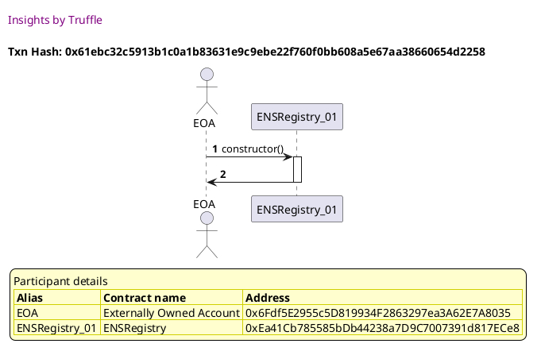
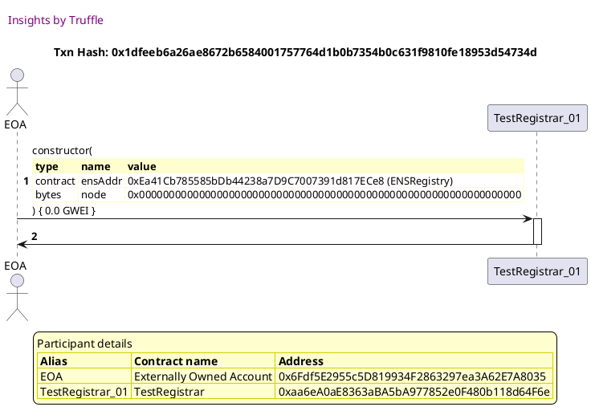
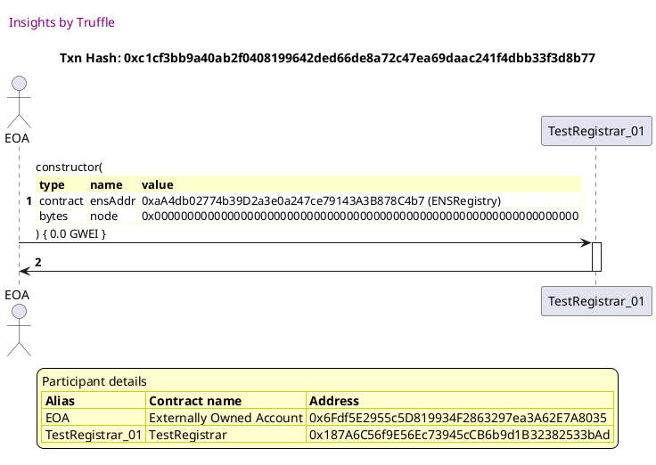
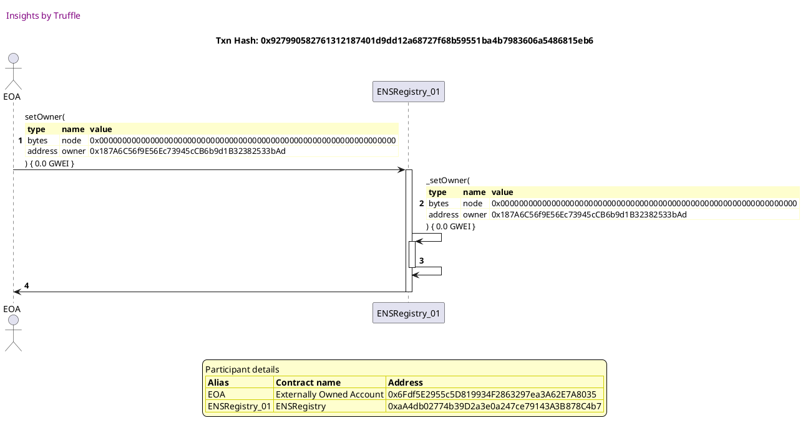
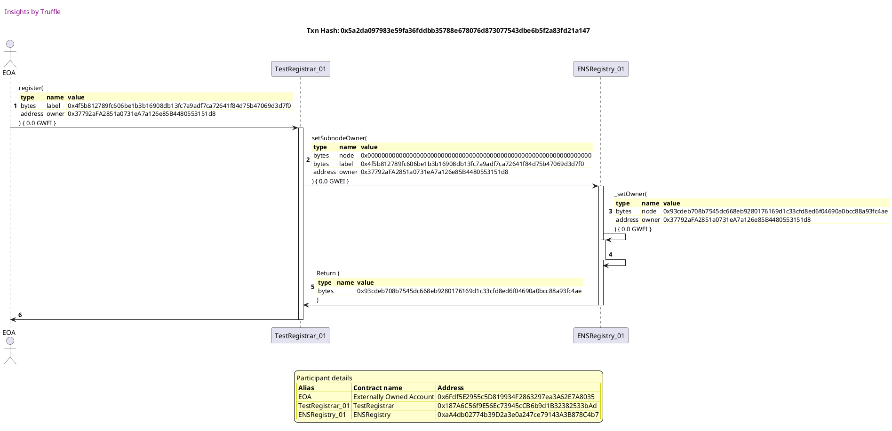
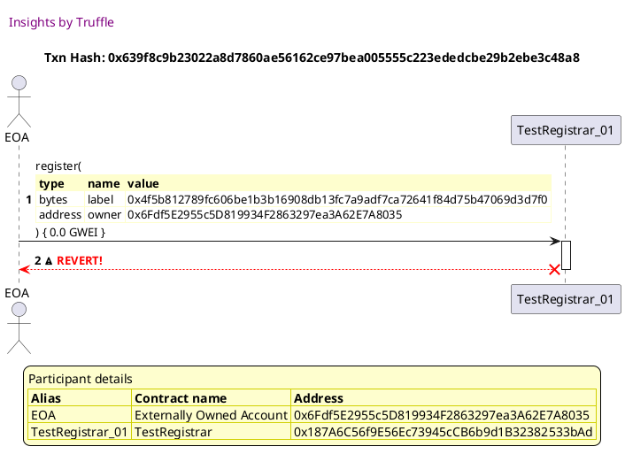
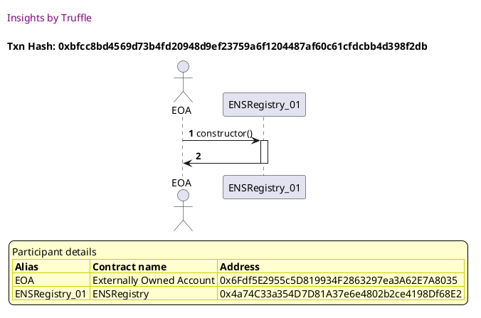
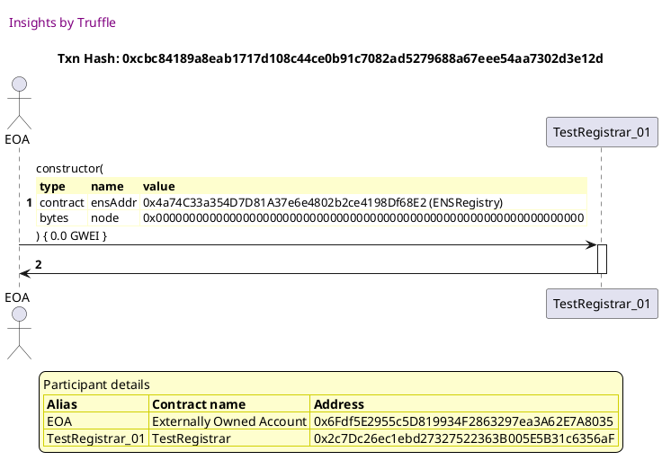

Test date: 2021 Feb 19

## registers names
[link to test...](http://github.com/ensdomains/ens/blob/f5c6357c01b907c17cff63a76f7760ed88775bab/test/TestTestRegistrar.js#L22)

Tx: 0x61ebc32c5913b1c0a1b83631e9c9ebe22f760f0bb608a5e67aa38660654d2258

### diagram 1

[SVG :telescope:](https://www.planttext.com/api/plantuml/svg/PL9HRvim47xthpYbBvkwQZPWC54MbIL4tSjQhNsV33u8AZ6HCLhITVzzLuAYPUN1njztz_dkEpDsstlj_B1h6TE3x-omAz2n_hcnU-tq3bgiqPglkdokNJTOi-hQpi7L9j_agvonHU-FBIuPZDyMjK47lwSZm5tdcfVEUjrcRLFR7LfFYfK_1so8F4dk1xTlyO9uR5uGH7J67hGnZQr1y0dwC-wBprCHRBh_c-sRUkjxA8xmv8Qg8btc6zyYF1qitEb-EmT-Y0KMPHYKCXLX8KgkHQ72E1IObYaM60HL4lEA5qNCbPOO9rg7AevvB2CJ158nigpqL7f-du7kOKRxZ95jlYcRlQPMy--FFx1kUk-EFxaunLn0CyR6BBXPlgFW-deEPMVfFBnTy-4ZUnSofetvDtDWx3Gizl1F2GQzRjgUBQQHVRfQypNdVFdw1MWcL1BzhCXiHxs0rJjy0p9Z7FR4dVEMhsERj1uyEglRzWZtlomQoCgI7eOdYYpTc4hcGIfbATTAf6aORG8LXq6Qe0wpECYJJF5G_YTyQTC5CChcEXAh8b5IAbciYoWAGgMJTRfAE4_2L1Wbado5YcIf_ya5TaihFUo_)

Tx: 0x1dfeeb6a26ae8672b6584001757764d1b0b7354b0c631f9810fe18953d54734d

### diagram 2

[SVG :telescope:](https://www.planttext.com/api/plantuml/svg/fPDHJzim4CVV_IbEx0N4sEmaZXt4AaAR35u66aXxGPgS-58YKgUAdQs5xhlFJGC2njlyuBFlxB_FlxC9ERLETQvVD8IethMcNnJO4NjVcwNgr08QdAFHPwgydtTjR_IqRTeEFkHPdaqpGawiMpSu8J2qErGQEtWSfm3dRLS_jCQf9ctgkLcWSLwnSiyBSX_SIIxxRjdWgy1r_O30ecVVbTAwDdDWT7Jz6Up9vp49Cfv_OMmzltCMYZNST7rLULtYQjSWtAmCd2jxTmnqnNI5MCGgY1NAM0H5p6L4AHDSY3ZIhA2527bKq38EMPL8HYjaCk6Xvf488qqyijBvrBFB59I5FM_tYCVcwh9UAd_L6xJkEyvhwphL_QHiMFNMkKV8i1EE9ky4uV3m6ChMU4U_FMp_rjoIav7_nz5EDb_0hPS8tXgr6EmlrVH-i5s-sGfumTB11j3OLElEZ-WgKn6R5a9oBdanAw8e2AKIisGgA1LXmhHa8fkYXFtis_MOrlhWIRHOExHUnxGQ1pdwdsqdV02FG3zH-FeZk_0LVWV95jIEsD4n4B9xekJg1NYDJjMDVG5gHcV-X2qe_n9z6VnW-WJb2TcM2reVUzutsGp5zVtAOMTKqwpXyhT13MbP-k_WXdl7kQvu5YISbtmcMPA4KHx8E0mIWIfCuo0JgQGXVotyp-DuungabOenfIgJOHogivGNQI9ylGAaUIHfmPZKSPJ7FdtY6OmaoAdl_PV-2m00)

Tx: 0xdedc32a232450a828d27c110c847cfff0e77c20bea412a491d5d1e42b915d129

### diagram 3

[SVG :telescope:](https://www.planttext.com/api/plantuml/svg/xLHDJzmm4BtxLupefHMbTPml1z4LOJSfN0egIBqW8IUUB15PP-KuBGlR_zxP45Pi4QTUwuDdCZD-cNcUCMF7dLFMzOk6CTMxrlIB0YthxcgpL5OjeC4v6dsYohkvRNkZfstJMdYNPtaspHWxwjogmGc3OTsYqcZXSVm4E6rj_T0QfvgqgUTcWSOHOkMs0Javdo2NlLqskEEuh1yGl61hkr1QrsOE7XzDlmTvz7bCWet_FpDTFRzr7HGhkB9zLH4kSxLh4Axk3PogxlOG-Br6NVf22Ly48LTII2tYqlDuAOEuhAgAOnoNWXUe0a-e8F5qg3qCH95uf8Y44MMbezIpynHK1tiaznZHvkgoNYegDVjs-HtdTUViwePxJp4xfZt6XbDmC7dbWltzG-ZGdVyoQDzVcsjsDDB-SPIJzHTmgoK2IQCMW_ofcfwKJVYQwdVOmHfCgyb69VD_NC_0T14Mkmrqkybkm5OgmfIhJFgHhqxIi4YJE9QXG9u7aXUU9tKKvD6Ot0Tu1Fw9mzSVsHdTuwlYtoBavZyZBsq7X_16vD1L6pTx6c5syQ8nDJfLDzqB_cPyHjLi-AD9fKObPKeZQAd3jqocppLkpqtMG_FJVk_G6jKqAzZSZeQqBEcvS0CFKQwhC1D969RXJ7f9uWUva94laXYLdqOYYrF9_V0luDtXsJ4Ci1dDvRGWGaCP5hCY28GlLJnBfZ7diK_ZAhqucw8aMAf_P84TqqxFtHy0)

Tx: 0xec8beabc6b944546ae9c7fcb0f80eba3f0cb19033a34850a9589196178d51e61

### diagram 4

[SVG :telescope:](https://www.planttext.com/api/plantuml/svg/rPLDRziu48Rl_1L4zjAYcoqfKlm8qg2gBMzxQOicm5uA54Dov0YLPKEYkd6R_U-b52U8lUbXaGABwg2HXyENd6Ve8I4l-mXT75OD8J34TJki77Qa_rot6-XWHHjSOXjUWV-yxDP36sRhPjtHtnRbefoLX9psSTlW6Q7JSuaGiAFVTZyfVRtkwg_hDa9JDFMoNM4Ras8Lxm8MQV16SZDqcmRt1ixhhqYvlFEzXn3gTaavsxd-cUpfyzqco6xzDsrVBozZJzsMNdH3LILT4klO8BsuQkbhw2zFABj2Rno2yyfPANEf0AtNbNUiCWmTY8fvnoqJ0eGqEGER6ykjujg4dAFY927pCMszV5TGwEbHiaSaOOkrhpUGKht0Fdx0PTt73hfFZ4zHXyxzAUNRyztWzdR2lkk8a6aXUdpsW1Pzzko4TfC7koSVsu_aT5UhttVsxFe5ZTiDqcHRM4ts2pH3-XZ3hnEqY3szfWquR99bLxBAdU6PDhRoYYc7t0d7bMKcE2ughy52gBG7dId9AoE3pftKJDaWWgxOhN8gNuVzgBt-kqrr6hNL8bHvcTayz_dSS6k5N6H6YSng156ehDI5OIA_qNXAlr7s1wD__bM-ITL_8F-HoW6mYKcFyNnmxJhWkt7jnw4PPQRTiqS-loBpGxe_8luf8V-PhAtm0PrcnkbSvi4hPT3Pp32kLG8Jk1V2Ly5WK1MJYHGmvxqnO1Ck2VZ_4Za-Fg4FHpvmXbFi1un3rzB7iVk9t9x-yCyszQ8nEt9pLv3tzzfPm0XrqzzBOSxcwU2FAQGh8RMtz35BlRvBhVGkcUAsH7VppgwdBflULwcnjT0qMpeUha0BxzEz5FzZ6UyB_wjB7xWcQG251OFI22NWLP6xmcfjyWpPGXhcE3T1oON2WptlT_CznoHRWkGpbuHoaxkvap8J1lJSpZHZMbWU3DVb34sIJMXtWCdBz4vNzdS0)

## forbids transferring names within the test period
[link to test...](http://github.com/ensdomains/ens/blob/f5c6357c01b907c17cff63a76f7760ed88775bab/test/TestTestRegistrar.js#L28)

Tx: 0x3287a9d06b251b4a56f3d05ff79c4c9805323df3f74bde56754561db42724102

### diagram 1

[SVG :telescope:](https://www.planttext.com/api/plantuml/svg/PLBBRjim4BppAnR9fKKQbE93b0pNY6BBI2zDqEHUK28b2v4fWw9GEqd_lHjPCEf61rASsHtkpfAGcpve7uPjIuWUGkU6RM4zwPyRjzDURw6rjNNcLfVFjUy6PvPTstcuNEVhV9aJCk_3eRKB0kEtiTfO3w_J4U2kyyrBvu9kixQftTQwW8fLE0MiaJnAxWQ_Q-qPyTYyM8Z42NlGnZIkXeXEq9zndt-TYY3J_TzTtzIRq4DnW2S_L1Ngaj24riBJti6TxZSpe7lE4gLJG-E2oQWGMiOLDrHMbKfBKQO9bPnnK_5AYS9O6IifP1oPGZ35H4GPGSlAWANdznde7Yvmlo1eMsZAPgUnrVp7uqzRDttmXryqEiQSGHU4Z5bmlVX0mTNL3ChEuNbul-RJP_8XP4mRywzdGCXnMEJXdnAC3RffUpAVHlRbSaLNbDB5spV0cM19-BD4ipts0avlxJkG6UDjZzmfR_4sjedhFbZlTDiUuFwtimQoiiI74P2Y-tXjAfcpLCfIhf8eJRbOioJcB5LMyonckSeIokL_mkSsdG6ZhCw4AIXJE0YUhfZcbcecL6bL6WcUyTj49KjHA9J5_YSNo0sk-B3_0W00)

Tx: 0xc1cf3bb9a40ab2f0408199642ded66de8a72c47ea69daac241f4dbb33f3d8b77

### diagram 2

[SVG :telescope:](https://www.planttext.com/api/plantuml/svg/fPFVJzim4CVV_LUSs0k8iJbnVY9MaRRfu6MWKMalI9D_fKIaJkKuMmlT_xvBcbR0U9iVVESx-slxupCXbutZrhNBYX3UkjgqIw4jQHvBi-AMBw7I2stKcCl7XQrReoPrLLluCCjd-IGdvA9ncqgF2FJjGNEbBJmFGu2hsfPFjN6yogfoOPRQE5Git67239CxoLLhLvL-bRWhdpHumI5sovKgpG8yEeJ-zFRYyt08Ckn_RPfoyU0Q41kOsxOeK9UuqbKQvci3LxnvE0Uwbfuic10f3oWNVa43cdXf6WM-qYgAb4vuxCiWrZnA5UVI3xmYK48mLZ2LY3WcY4mwF7f-am5lu0Zj4K5ihfJbYkDLvxfnt_MYR9pbzYVr-bblWqU4z2lXRFHE4avFpq7M1WDjjzdnlRad5mF_ZuCTRR-0swmqe3LysTjVl6hHwQPlEm4Kb0wse4sJAMNHeskUuOMe7yU1OEdKvqnJxWUnr77g1InZuoHE9e68uJZ_TZSSQtEo5nKRfnlKCRNIlHpzpxOJFe5de9yeVFsHN-CBluEa0xKZTdOEXEnAbDo-0A-qusNLl00rfLFSeGE5bOZFWCva3sMFhEEY6ymTress_UDYltRQ6bvL6xZvRRI2J4hy3gw_TpHJHPZxQHZASDhL40jcVX8nFyNYOLdavt6MK1Q-5lwdEDw4UcalYRDe4aP5ceTHBcEM1g6SZ2EHAc_CV9Ru8MCYKoYD30OIv19x_D9_0G00)

Tx: 0x927990582761312187401d9dd12a68727f68b59551ba4b7983606a5486815eb6

### diagram 3

[SVG :telescope:](https://www.planttext.com/api/plantuml/svg/xLHHJzim47xthpYnbqsCBR4JEwwwYhHD1oy33QIz824dTaj4wbIEir7e_lkkQQZe44zxdHzypjtvYx_FToRajF7A-NPP4Q9QNzjscHj7cllIhfHJIwZCmbWzLiNzmjMjrPEwgXsycsMpR98HCcpykZ8Z0jsuCqeR1q_z9y1PxSh7sdfLfLMvi4jZFIBE_JvXXi4TvAfrgyeS1AxAHmDXjFTTAgrBku0mw5s_Eplyt1-2zFy_jqsvkFCDv6kuTkryZhZ4bxuoSFrWuKmrTmC87YGLKWPnGWKFMKZ3H4H1gANM8LKy4LJCUPB7Cex3N4Mva0dZ0LTnbF0aZ4tE2KfMU3nwTf62Qk08xH51sNnPb2k5LBDlLz_DecoyMzy6uIxdm7L4IBSBJaQlGd1yF836-8jVrhZtD_Q637lPF_PsjFa2VhqoWDQgPMT_ggh5nJPzW_ozQM03jjReGyh1FuvdOBm8PvejTBqzNOUD-gLy4lEvp6AU5OB9A2ucOvvB7OuPPGcD6SjJlSFu04yGV0hWwu_i7E_n5Vct1BdzhyXBtya0tiZigceR9hiM9fSl2bCRhyggUQ7VD9WYcwr-sAbOgBYOO0iwhF2zakapn_s-qQOhVfmVl75MLTKQjhUZ8IqAV2vyfmEVwNcSKUoa8fucePGicj64Cog5KIpbD1Df4h3uB-33vZbmTB0gZNGUK26YdCafLSm4YaQYC4A64KlPE17911iNOP5_hm8vnHcVkpy0)

Tx: 0x5a2da097983e59fa36fddbb35788e678076d873077543dbe6b5f2a83fd21a147

### diagram 4

[SVG :telescope:](https://www.planttext.com/api/plantuml/svg/rPLRRzGu5CVV_Iciyh88olf-gReLcMbcuGKGhRGlIEZuacb49ZDA7EX0zxlZfDEAcIrFHKARXvpa-FXldv_jOuHUzWcwDAmQX618wtPOkTYX_bFTRg235MxYChPX1lxJibiFRPYlctM7dopAHJal4JhjqxQ9PmXFprM443lyRVUByQjrLtzTjmcQegcNxIgsAIjMwJvWaHjl9JT3jsdYNiD5_JLYAkvzxo24kbrYIdQkVoTx-kTk4cWt_kkshvTNgSTkYo-xeQgoBafrQYA-l6xnA-YlJZ2vbi024AkjuL7Q2hYgGd2EIsrCLDeGhOBHd6Wj1GykAYSh1ePNWL6WGgECpASyzV9jWQ77HzaUeOmjrRxUG4xrClRfVLpMVUgW-qZe57NetEzIlhdODMxlEkoxZX2Q1iB7PmzeuMVFJd0tUMBtnuVs0phThTNpdJsx-GkdxIRYR5jOJVOpD4F-6CDlChGKUto36t2noPPSYqewGvasjlAAA1UfuuugIqnmb5TUWuLGQG-QAK4h8uAMJcYYRE11L-HEEIzV5_jHU_sbpUiqQdEjBOD5mOoaG3IdiT10cOf6peGmH4fE9GtcLkCf_eR92uB__gTydLV_WVn7AWV09YPzJ1U3QzSXlXt7VXoQKMQQFNdaytzaVaZtPyG_PkI_ahNbFaIdYN7vFChWbJBHMMO8rIg32THpxgjWOb0L4PaK4EUzCM0pBW7nzn8vFZx13qS-i8TpxFkOXgx5ZsFt2xaz_UbXcshHc1swlIlGkn_AMOW9wgR_8OLpSfut_fX2lX9oUSiVyrphkrnAxvCfxfRelj_PpLHby_iw5xOMccQBnyqLSE5zlfVIbAfQX4gMp4hfvRcXrdAnO4PnPdK4NYXMwi8GBlU5_rEb3roJD3MwK7EfAbjALNhDhP1-FbCk0vnnnWsJdBiY7CnvlvhlEIPPA4HmX6aj7BVd37Wam8JsKLigUC5dHfkvS3hBPhGxmEXbVkSh-pi0)

Tx: 0x639f8c9b23022a8d7860ae56162ce97bea005555c223ededcbe29b2ebe3c48a8

### diagram 5

[SVG :telescope:](https://www.planttext.com/api/plantuml/svg/bPHHJzim4CVV_IayaAQjZCsn4oT1NKKewU09nAhjOKoJOrzAHEfMZWCjTDzzrxHKZF4oF_YSk_C_zkyk8UIuyShvTbeJebe_i-sq04UQsyhEbLDJMiC4h3bH-dRYPgqrmrazStH_b8_oOKv8l_7B6WQ4TkC6b0577xUFb9xDNFKmirxLMLrDx1IiHyNIxn966Dn8pbith-6lmDVg0MWGxdoNofZAJcZ0jgxVdUr_sXw2RDz_RfjgSkCRMYpfsBLbYRh4Lxu6EbvOUgQQcoFA5bAaPQBJWWl6kKfCd4Yc89A1v1hIk035M8H3Sox0WD45SCo60eGE4vKGHAOz7Zs_oAXgw1xQFOBOVAMhkSAhZg7nLp2f6k-K-yM2BkkbSu-GRYSz7BmIf0S7HzHr7d3lhkqrwM_XVzZQmUepzSivKBHMJJjxf-eM5-lq5LBmqD0LhLK1DLgs2CkeI08U9scf9PC518Ke0fcon1I1A7MiKcNAMAkOop0eaz34KH76JAP6cBXaJyfO3mVDMdjsRn7yMbkEJ1dbF4LkqMaIfAa8HpoHWgSnA959diTPmaIqqNXF7odxoEYNx_avblEL-oyEV-mxC3_NT3QO3eze_-szSXPxOK3xUjEHc3FezQxoR_dL-4slr__K-GV401QfkbCUNaM_wMzo-Qng1hogwkOPw5DsoXXRWyOsnXhYOeZzwL1vXpnxOh7RDrXrdO7p0cjdLLqlwGLoCZJJ6hyb_v-ydWl_qralN9rqaCIP74QoJFD8vZeMQHZfuOaiKXES22uI7WbHP0QbaS6M13d66Vy7Vm00)

## allows claiming a name after the test period expires
[link to test...](http://github.com/ensdomains/ens/blob/f5c6357c01b907c17cff63a76f7760ed88775bab/test/TestTestRegistrar.js#L33)

Tx: 0xbfcc8bd4569d73b4fd20948d9ef23759a6f1204487af60c61cfdcbb4d398f2db

### diagram 1

[SVG :telescope:](https://www.planttext.com/api/plantuml/svg/PLBBRjim4BppAnREfKKQbAAeb-4QKMqPwQK9cjmBYW-PY4mP58NQQVhltSY2KJSwaEBCxd1tbeJSza7uCEnQGiGGEZViQkr9_spTNdYnWrOtsgclGZutlXkSMdLjv-5gKssgLKN8eW_7LYy9ZDzM2wKz_9wE07UTjo-T2w8jMzkudNO15Kqu1soGF4dk1xzlzGNnQ5yqHFoCFGYbh6iWeXFqPzmNdwSYo7J_DzVRPXjwg8_mv0TZK9S46reDJmS7TwBVpe4UQYDbNYkUf8NAufeRnMZ1SrLem-8iAKHg8aOvppDXKYhJI1ebwvghkCWDKpL1osJ0qglx4aGFCznd16qBLjgzm5Qhxuy_T6Fxu8y_QNIAkO1cX8nPSBDyHy7rzHnav_0yl5tpuIDv5pAcZVatSo3aD2poy4y9IWTXsvuiff5zkbhJDQLq-Ve5S2PO4lwiq6oFlO0JE_q6b4fvtIDtpbk-ZctYUWZQEz6sHxZ_vRI2Kafy604fUaWtoYGLAv949kiyAegORrYUngp8j8ZBb5LPcTCu-K_uqgOBO9Jb8kEhE1PnmjSPwfPnfbFDSyfg9ZMFYdnjqhnYA8lzJowGMrpnOVy5)

Tx: 0xcbc84189a8eab1717d108c44ce0b91c7082ad5279688a67eee54aa7302d3e12d

### diagram 2

[SVG :telescope:](https://www.planttext.com/api/plantuml/svg/fPDHJzim4CVV_IbEx0N4s1mxYHF4AaAR3bu66aXxGPeS-reYKgTAdAs5xhllcWO4ZBVvmNU-i_-sVpupTjfwtVXkKJ6cEr-xRb5WmzhxqYrrenTGuHoTFTFcVjxKdRFZkgeR-33Df_auP-oazUiAHmpwTeVQOWEFmn3Wl6xAXzfvNMLLENSBT9uKP_vvmfIIEybbromhV9MuBXyGWl0vTgMjBTqS0Zw4_lJsvFDm23RiV-7QSdxdMoZMSDDqindfCb_w2k5cvU1SjtV7m5UcC4aO9AbEK1U12fGDU6B2q20lqi0edWXj8w7IE4bqh10n2hLMaWihCH2M4JBZwUZvPGQwXJsoUuom-TAKIqrNlS7MVyTvsVf6DpzvqCzw6znZh5y9HwDtad1uU0ocTXJejfljtxfRTZBm_pZOqUOB-FKIWQpJYzx-qbL7pdRwPYj0WiR31j2rcRKDUNmLQXMEfTGo2YTgaWIPL1XZc71H28DXa2QJMPpa0lRpRzV3iTO7JwB5scDBEgwssCln_smxuGDu1Fw9mzSV-GMzy3j8jg1sn8wEWR5TYRAh5-0jUbrMxGjG4pwX7RQWg1Bf6SWPFq5vGhRbWYtbdjUDDltZKh_os3XTLMku_EtGGcOCVGVVtpkUsbcKYpIAJ4GKqrI6Kv74KgGAjSnYaQiiuJ9wBVnFSRm9zTB2g8aHCPe02okK52eIGiRoZFCeZyvaO68PnNfAqiHW8C5EgQSl_HS0)

Tx: 0x1dfb8aaf7057763655196b74c6ea055582b87c5aaa37c431f7db3990e3412c26

### diagram 3

[SVG :telescope:](https://www.planttext.com/api/plantuml/svg/xLHHJzim47xthpYnbqsCpR7ZE46i8hJfu6MWWRGN9EGuJeb8dSfnDWhTVzyr3LKxnDDUvmUVStV-uk_pdGavRRrolflNXAZEDxQRvyQHzg6o2-NK76epCxOuK_fXvfhE5kEcRXoycsRJR9mHSjBwPMr61FfnRrHX73mFdm3dZQkU6kjLdTRLpCwDzOXO-ct258CRo4Nd5hNP2rnNJmQ2SEkxKaLHsHa4T73zxkt9v-4GPFZ_XMshsRrl8L_2ZUlA4d69htnjuERHmhbgxu-1FWP5cSTAbP8AAICU2H4aKIv37Hb5XH0nosEfXLAAIntoe9H5pfE46Xu6JBE8e6JQuz6ponHK2mTe3mZAvYjTBHHIpRvTVpUpglLkUKU3JSwUwu2GVXSSZLw5uF3m65hZBtzPuzxVsbjoCiZ-SR2ZrHVmouK1j5RDU_jJrHqkrkahvEzD2okmJO4-f4p_SRm0uqKuqwwXc_NfUcocvGHLCJemUS4aPr8mnYD-Hgd8n1aFTCH5fAORZ0_m3FGJXQy_iWkynrVatnBaxhyYkxwZOtWZiw-gTPXiMfXSxHHcORogwdP7lmcT89krVjYfMAYu66CBEgpmhPBf2yVjlj6gBtwS7xrnLjNr4jQtKq2gDJuNljSXcXQbo5WYX1QJE4WI7avP776MIADu6h5CfZ7buY_W_URPS_ImePBXc7F5HJYHY9joQI8JnfJbJ9imIE996SKPGrZaFwX0Jd76v-uF)

Tx: 0x20278f5bcf5ed9adb6d6cc39e575abf397ae2809c747ef1ee0edc6d37ec7d4dc

### diagram 4

[SVG :telescope:](https://www.planttext.com/api/plantuml/svg/rPLBRziu4CVl_1H4UcdHPik7-52G1bLYUTjBMoG1zbAWu6Fa29LbGw9supRxtJjId23sfgSKM5G7ZJGa_-JyE1mIyhPFhal3iY743MdL3aiF7Uc_rktQTMv96rX06qzT-BheLaCRprRDggFFvkMyF2i9EUxJfe4JGgVd2bo4ZdxV_bBwRjNLtrPjSatHr8js2Mr2nIhTTvXZuwtaUkZM3UmqNDJVWFBitlV9nLYt2yhPrlNlP8zVRnT1jlE_R_jwSPLwwZVqiXkg2dL9gbC3zFAwfUzSVtL4sRLWmjXA-L0fYBcBNaSTWin16ULy9NFZG5YM1vCPg3W0WnXqb0Q2YLaC1965X4ilFnRKzVG0xG51RAaEzTfXg9VGftDOr7tgNFU5yQdNldDtIFdXOjkukHkmwpeWP9g87fuyeaLVlZoYtUI1xlddzZCvtkxLgwqzkNb3qsOD56thbfFzspK3VepTRn1QWfxUqCPvQD2owmmXMOwmyYfefZrmBptNERFHSra5uv1UPO8pGcUyibaqocU6wJpAQ2fsfupRrq4_Qg_-QN6VHcrfJ2xSl11MSSUCv50OnuK6gqwpp3Ab95SysbkD5_GxPNym-kTVvNlS_KVY7wdi0PkOz90k1j-k8dmSvtuQcb5cMZrxulCxCj-d-pFYNn3vhsITon316sQzKPd2awWj-1mFA3SQmKGUf0nLj11rnJ8avPWFmLgN8wxCmVzBvF3mY3xUyv4Snhxda8QkfKzZzmkvlVZfOPjgqHWTkRqhoAS7vIn2SdNJFmXXncQO-6C8U2LWUSEFCwpr7PRI-s2Akosw7tToCrLPV5zZOMjTqspec5oH5Y7WlPIcKFKyLgeKkL91pIpFSvdDXTLIv0QSBBGeJM6PLBl2_wdIUwv9MWGp2vWGWOEFmaXXb11IorF6LAbE9GzQAktcUslUhUOxZjjZxans9gMJAfiPN7A1jui6p3ZXHO2CvtPMQLiAb4MqMy3aBRxnolu1)

Tx: 0x3b051991115099ced174799d098b511cb02caf9974fe9667165e45d990dcdff1

### diagram 5

[SVG :telescope:](https://www.planttext.com/api/plantuml/svg/rPLDRzms48Rl_1M4UscGkkM7I8g6QsJjrJQvD45ie9S00J-6Qo5QxKAYKc_Y_lUEvBNXtJg7mW6Awg2HXkHBpZFaa91NVNPT7bOD8Mx8wtPOUUX8_wbkDwvpAzh04jfuxiAdPRSUsdYnRjOT_M5HBQgBYf3JFcyRE2DqUgx1HUZerzqlfQ_NNVrbtMRNp9fwsQwWpQYOyaE71JRUIMw6RjF0NiDb_GKeBnvyxroCTRkadErSVqtsz9VT8iXk_ZTjNo-lSq_zbbvrGqgeItAT6w1NDorzxVhh4yfkf6UAMyivLypQ096RmbWRcIszuZnu9e9BrfeYWTNQSAsWKD5Q5aDCYHD45Z8klNexewwdHsYF26BBTQWt3aEzWZw_XsNTvyvr7ncVUXqwzuTKlr_k6hVt0_PTHuHC4z7ZioUqwCkN9xIRFD3z-A7zG4vtkVffPyzkVwLvkm6AjdMhoNvspO0VO_TRX9QXfxUqSHuQjEocICgNN9ZIfg2Pzi2zz5nRLaRFPGh6MHUJ2Su8NV1K5j4eNnYcRPJH97QlZEdhe1-rrt-scATHMozYKfMmIWKrBp4TibY8KajX3JWvqw8oiv99TQVnWdwbx6T6V_kZUeFPVoB-aSe1i8b93_boyEqwmjjnxkUX6MMcrRDdFlz7veTqlqNy8oB_dgoj316yOQKt2ezXqBe4RqN9kD489l8WPKYnXAWJAv2KOpw4idGMSHKE_biYnySdzEcUJ-nXxFiUyj2rz7dilYEt5zyyR5Cj6gCZTtS5UVUed4N8hcxwHo7CsHmt_XW2NWbOtl3Z0cjzXwNq8PZPVOeUnftTJbKMtpTOs5hND5iwRgv8Po7WlPJ_PHeV2_-ZIX-u9caHp3m83O63Zy98OPGGKijpnbIbpYKFMYhj5WThtg_cUuwxO-vCSI6bawgO6rpoJ1hGK9HCU16WuBQS9rrM0cKHxGumUOLllBB_1W00)

